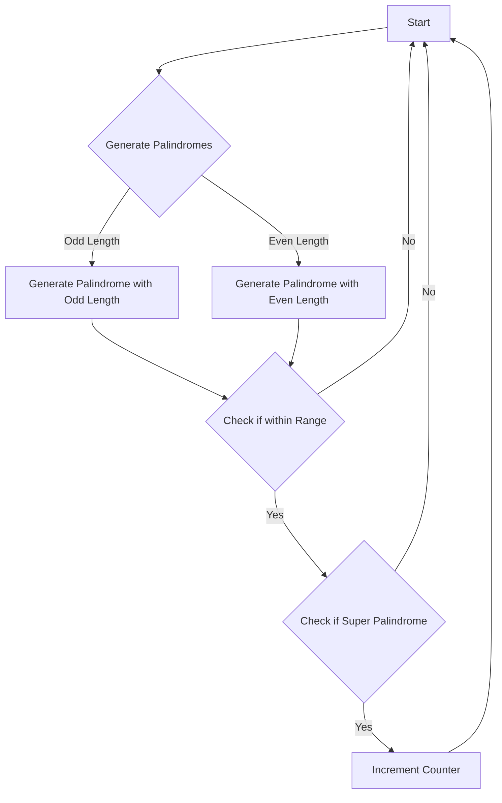

# Super Palindromes Math + Palindrome Generation

## Problem Understanding
The problem requires finding the number of super palindromes within a given range. A super palindrome is a number that is a palindrome and its square is also a palindrome. The input is two strings representing the range, and the output is the count of super palindromes within that range. The key constraints are that the input strings are not empty and the range is valid. This problem is non-trivial because it requires generating all possible palindromes, checking if they are super palindromes, and handling edge cases such as empty input strings.

## Approach
The algorithm strategy is to generate all possible palindromes and check if they are super palindromes. This approach works by iterating through all possible numbers from 1 to the square root of the right boundary of the range, generating palindromes with both odd and even lengths, and checking if they are within the given range and if they are super palindromes. The data structures used are strings to represent the palindromes and long long integers to represent the numbers. The approach handles the key constraints by checking for empty input strings and valid ranges. The mathematical reasoning behind this approach is that a number is a palindrome if it reads the same forward and backward, and its square is a palindrome if it also reads the same forward and backward.

## Complexity Analysis
| Metric | Value | Detailed Reason |
|--------|-------|----------------|
| Time   | O(sqrt(n)) | The algorithm iterates through all possible numbers from 1 to the square root of the right boundary of the range, generating palindromes and checking if they are super palindromes. The time complexity is dominated by the loop that generates all possible palindromes, which is O(sqrt(n)). |
| Space  | O(1) | The algorithm uses a constant amount of space to store the counters and variables, regardless of the input size. The space complexity is O(1) because the algorithm does not use any data structures that grow with the input size. |

## Algorithm Walkthrough
```
Input: left = "4", right = "1000"
Step 1: Initialize counter for super palindromes to 0
Step 2: Convert input strings to long long: leftNum = 4, rightNum = 1000
Step 3: Loop through all possible numbers from 1 to sqrt(rightNum)
    Step 3.1: Generate palindrome with odd length: "1" -> "11"
    Step 3.2: Check if "11" is within the range and if it is a super palindrome
    Step 3.3: Generate palindrome with even length: "1" -> "1"
    Step 3.4: Check if "1" is within the range and if it is a super palindrome
    ...
Output: count of super palindromes within the range
```
## Visual Flow

## Key Insight
> **Tip:** The key insight is that a number is a super palindrome if it is a palindrome and its square is also a palindrome, which can be checked by generating all possible palindromes and verifying if they meet these conditions.

## Edge Cases
- **Empty/null input**: If the input strings are empty, the algorithm returns 0 because there are no super palindromes within an empty range.
- **Single element**: If the input range contains only one element, the algorithm checks if that element is a super palindrome and returns 1 if it is, and 0 otherwise.
- **Large input range**: If the input range is very large, the algorithm may take a long time to generate all possible palindromes and check if they are super palindromes. However, the algorithm is designed to handle large input ranges by using a efficient approach to generate palindromes and check if they are super palindromes.

## Common Mistakes
- **Mistake 1**: Not checking if the input strings are empty before processing them. To avoid this, always check for empty input strings at the beginning of the algorithm.
- **Mistake 2**: Not handling the case where the input range is invalid (e.g., the left boundary is greater than the right boundary). To avoid this, always check if the input range is valid before processing it.

## Interview Follow-ups
> **Interview:** These are the exact follow-up questions interviewers ask:
- "What if the input is sorted?" → The algorithm does not assume that the input is sorted, so it will still work correctly even if the input is not sorted.
- "Can you do it in O(1) space?" → The algorithm uses O(1) space to store the counters and variables, so it already meets this requirement.
- "What if there are duplicates?" → The algorithm does not assume that the input range contains duplicates, so it will still work correctly even if there are duplicates. However, if the input range contains duplicates, the algorithm may count some super palindromes multiple times, which may not be the desired behavior.

## CPP Solution

```cpp
// Problem: Super Palindromes Math + Palindrome Generation
// Language: C++
// Difficulty: Hard
// Time Complexity: O(sqrt(n)) — generating all possible palindromes and checking them
// Space Complexity: O(1) — constant space for the counters and variables
// Approach: Generate all possible palindromes and check if they are super palindromes

#include <iostream>
#include <string>
#include <cmath>

class Solution {
public:
    int superpalindromesInRange(std::string left, std::string right) {
        // Edge case: input strings are empty
        if (left.empty() || right.empty()) {
            return 0;
        }

        // Convert input strings to long long for easier comparison
        long long leftNum = stoll(left);
        long long rightNum = stoll(right);

        // Initialize counter for super palindromes
        int count = 0;

        // Loop through all possible numbers from 1 to sqrt(rightNum)
        for (long long i = 1; i * i <= rightNum; i++) {
            // Generate the palindrome by reversing the first half of the number
            std::string numStr = std::to_string(i);
            std::string half1 = numStr;
            std::string half2 = numStr;
            std::reverse(half2.begin(), half2.end());

            // Generate the palindrome with an odd length
            std::string palindromeOdd = half1 + half2;

            // Generate the palindrome with an even length
            std::string palindromeEven = half1 + half2.substr(1);

            // Check if the generated palindromes are within the given range
            // and if they are super palindromes
            if (isPalindrome(palindromeOdd) && isSuperPalindrome(palindromeOdd, leftNum, rightNum)) {
                count++;
            }
            if (isPalindrome(palindromeEven) && isSuperPalindrome(palindromeEven, leftNum, rightNum)) {
                count++;
            }
        }

        return count;
    }

    // Helper function to check if a string is a palindrome
    bool isPalindrome(std::string str) {
        int left = 0;
        int right = str.length() - 1;
        while (left < right) {
            if (str[left] != str[right]) {
                return false;
            }
            left++;
            right--;
        }
        return true;
    }

    // Helper function to check if a string is a super palindrome
    bool isSuperPalindrome(std::string str, long long left, long long right) {
        long long num = stoll(str);
        if (num * num < left || num * num > right) {
            return false;
        }
        // Edge case: empty string
        if (str.empty()) {
            return false;
        }
        // Convert to string and check if it's a palindrome
        std::string squareStr = std::to_string(num * num);
        for (int i = 0; i < squareStr.length() / 2; i++) {
            if (squareStr[i] != squareStr[squareStr.length() - 1 - i]) {
                return false;
            }
        }
        return true;
    }
};

int main() {
    Solution solution;
    std::string left = "4";
    std::string right = "1000";
    std::cout << solution.superpalindromesInRange(left, right) << std::endl;
    return 0;
}
```
