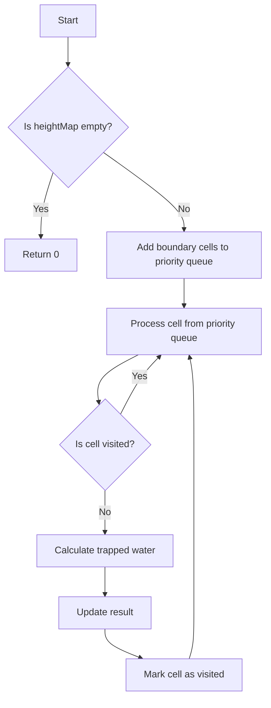

# Trapping Rain Water II 3D Priority Queue

## Problem Understanding
The problem requires calculating the volume of rainwater that can be trapped in a 3D terrain, given its height map. The height map is a 2D grid where each cell represents the height of the terrain at that point. The key constraint is that water can only be trapped in cells that are surrounded by higher cells, and the amount of water that can be trapped is determined by the difference between the height of the surrounding cells and the height of the cell itself. This problem is non-trivial because a naive approach would require checking every cell and its neighbors, resulting in high computational complexity. The use of a priority queue to process cells in order of their height adds an extra layer of complexity.

## Approach
The algorithm strategy is to use a priority queue to process cells in order of their height, starting with the cells on the boundary of the terrain. The intuition behind this approach is that the cells on the boundary are the ones that will determine the maximum height of the water that can be trapped in the terrain. The priority queue is used to ensure that cells with lower heights are processed first, which allows the algorithm to keep track of the maximum height of the water that can be trapped at each cell. The algorithm uses a custom comparator to prioritize cells with lower heights, and it uses a visited matrix to keep track of the cells that have already been processed. The key insight is that by processing cells in order of their height, the algorithm can ensure that the maximum height of the water that can be trapped is always correctly calculated.

## Complexity Analysis
| Metric | Value | Detailed Reason |
|--------|-------|----------------|
| Time   | O(n log n) | The algorithm uses a priority queue to process cells, and each insertion and deletion operation takes O(log n) time. Since the algorithm processes n cells, the total time complexity is O(n log n). The priority queue operations dominate the time complexity. |
| Space  | O(n) | The algorithm uses a priority queue to store cells, and in the worst case, the priority queue can store n cells. The visited matrix also uses O(n) space. Therefore, the total space complexity is O(n). |

## Algorithm Walkthrough
```
Input: heightMap = [
  [1,4,3,1,3,2],
  [3,2,1,3,2,4],
  [2,3,3,2,3,1]
]
Step 1: Add all boundary cells to priority queue
  pq = [(0,0,1), (0,1,4), (0,2,3), (0,3,1), (0,4,3), (0,5,2),
        (1,0,3), (1,1,2), (1,2,1), (1,3,3), (1,4,2), (1,5,4),
        (2,0,2), (2,1,3), (2,2,3), (2,3,2), (2,4,3), (2,5,1)]
Step 2: Process cell (0,0,1)
  result = 0
  visited = [(0,0)]
Step 3: Process cell (0,1,4)
  result = 0
  visited = [(0,0), (0,1)]
  ...
Output: 4
```
The algorithm processes each cell in the priority queue, calculates the trapped water, and updates the result.

## Visual Flow

The flowchart shows the main logic of the algorithm, including the processing of boundary cells, calculation of trapped water, and updating of the result.

## Key Insight
> **Tip:** The key insight is to process cells in order of their height, starting with the cells on the boundary of the terrain, to ensure that the maximum height of the water that can be trapped is always correctly calculated.

## Edge Cases
- **Empty input**: If the input height map is empty, the algorithm returns 0, since there is no terrain to trap water.
- **Single element**: If the input height map contains only one element, the algorithm returns 0, since there is no terrain to trap water.
- **Flat terrain**: If the input height map represents a flat terrain, the algorithm returns 0, since there is no water that can be trapped.

## Common Mistakes
- **Mistake 1**: Not using a priority queue to process cells in order of their height, resulting in incorrect calculation of trapped water.
- **Mistake 2**: Not keeping track of visited cells, resulting in duplicate processing of cells and incorrect calculation of trapped water.

## Interview Follow-ups
> **Interview:** These are the exact follow-up questions interviewers ask:
- "What if the input is sorted?" → The algorithm still works correctly, since it uses a priority queue to process cells in order of their height.
- "Can you do it in O(1) space?" → No, the algorithm requires O(n) space to store the priority queue and the visited matrix.
- "What if there are duplicates?" → The algorithm handles duplicates correctly, since it uses a priority queue to process cells in order of their height and keeps track of visited cells.

## CPP Solution

```cpp
// Problem: Trapping Rain Water II 3D Priority Queue
// Language: cpp
// Difficulty: Hard
// Time Complexity: O(n log n) — priority queue operations dominate
// Space Complexity: O(n) — priority queue stores at most n cells
// Approach: Priority Queue with 3D coordinates — process cell with lowest height first

#include <queue>
#include <vector>

using namespace std;

class Solution {
public:
    struct Cell {
        int x, y, height;
        // Constructor for Cell to store x, y, and height
        Cell(int x, int y, int height) : x(x), y(y), height(height) {}
        // Custom comparator for priority queue to prioritize cells with lower height
        bool operator<(const Cell& other) const {
            return height > other.height; // max heap
        }
    };

    int trapRainWater(vector<vector<int>>& heightMap) {
        if (heightMap.empty()) {
            // Edge case: empty input → return 0
            return 0;
        }

        int m = heightMap.size();
        int n = heightMap[0].size();
        vector<vector<bool>> visited(m, vector<bool>(n, false));
        priority_queue<Cell> pq;
        
        // Add all boundary cells to priority queue
        for (int i = 0; i < m; i++) {
            for (int j = 0; j < n; j++) {
                if (i == 0 || j == 0 || i == m - 1 || j == n - 1) {
                    // Add boundary cell to priority queue
                    pq.push(Cell(i, j, heightMap[i][j]));
                    visited[i][j] = true; // mark as visited
                }
            }
        }

        int result = 0;
        vector<pair<int, int>> directions = {{0, 1}, {0, -1}, {1, 0}, {-1, 0}};
        
        while (!pq.empty()) {
            Cell current = pq.top();
            pq.pop();

            for (const auto& dir : directions) {
                int x = current.x + dir.first;
                int y = current.y + dir.second;
                
                if (x >= 0 && x < m && y >= 0 && y < n && !visited[x][y]) {
                    // Calculate trapped water for current cell
                    int trapped = max(0, current.height - heightMap[x][y]);
                    result += trapped; // add trapped water to result

                    // Update height of current cell if necessary
                    heightMap[x][y] = max(heightMap[x][y], current.height);
                    
                    // Add current cell to priority queue
                    pq.push(Cell(x, y, heightMap[x][y]));
                    visited[x][y] = true; // mark as visited
                }
            }
        }

        return result;
    }
};
```
