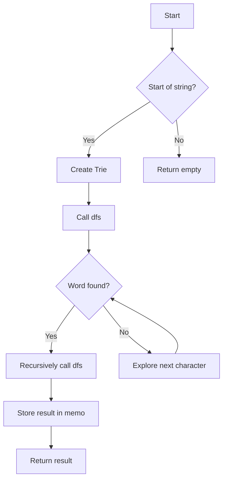

# Word Break II Trie + DFS Memoization

## Problem Understanding
The problem of Word Break II is asking to find all possible ways to segment a given string into words from a dictionary. The key constraint is that each word in the segmentation must be present in the dictionary. What makes this problem non-trivial is the need to handle all possible combinations of words, which can lead to exponential time complexity if not approached carefully. The problem requires a strategy that can efficiently explore all possible segmentations while avoiding unnecessary computations.

## Approach
The algorithm strategy used here is a combination of Trie data structure and Depth-First Search (DFS) with memoization. The Trie is used to store the word dictionary, allowing for efficient lookup of words. The DFS is used to explore all possible segmentations of the input string, and memoization is used to store the results of subproblems to avoid redundant computations. This approach works by breaking down the problem into smaller subproblems, solving each subproblem only once, and storing the results for future reference. The Trie data structure is chosen for its ability to efficiently store and retrieve words, and the DFS is chosen for its ability to explore all possible segmentations.

## Complexity Analysis
| Metric | Value | Detailed Reason |
|--------|-------|----------------|
| Time   | O(2^n * average_length_of_word) | The time complexity is exponential due to the need to explore all possible combinations of words. The average length of a word is considered because the DFS explores the Trie up to the length of the word. |
| Space  | O(2^n * average_length_of_word) | The space complexity is also exponential because the memoization stores all possible combinations of words. The average length of a word is considered because the memoization stores the segmentations up to the length of the word. |

## Algorithm Walkthrough
```
Input: s = "catsanddog", wordDict = ["cat", "cats", "and", "sand", "dog"]
Step 1: Create a Trie and add all words to it
  - Trie: { 'c': { 'a': { 't': { 's': {} } } }, 'a': { 'n': { 'd': {} } }, 's': { 'a': { 'n': { 'd': {} } } }, 'd': { 'o': { 'g': {} } } }
Step 2: Call dfs(root, s, 0, memo)
  - Start = 0, node = root
  - Explore the Trie from the current node
  - If a word is found, recursively call dfs(root, s, i + 1, memo) for the remaining part of the string
  - Store the results of subproblems in memo
Step 3: Explore all possible segmentations
  - cats and dog
  - cat sand dog
Output: ["cat sand dog", "cats and dog"]
```

## Visual Flow


## Key Insight
> **Tip:** The key insight is to use a Trie to efficiently store and retrieve words, and to use memoization to store the results of subproblems to avoid redundant computations.

## Edge Cases
- **Empty string**: If the input string is empty, the function returns an empty list because there are no possible segmentations.
- **Single word**: If the input string is a single word, the function returns a list containing the word if it is present in the dictionary.
- **No words in dictionary**: If the dictionary is empty, the function returns an empty list because there are no possible segmentations.

## Common Mistakes
- **Mistake 1**: Not using memoization to store the results of subproblems, leading to exponential time complexity.
- **Mistake 2**: Not properly handling the case where a word is not found in the dictionary, leading to incorrect results.

## Interview Follow-ups
> **Interview:** 
- "What if the input is sorted?" → The algorithm does not rely on the input being sorted, so it will work regardless of the order of the words.
- "Can you do it in O(1) space?" → No, because the algorithm needs to store the results of subproblems in memoization, which requires additional space.
- "What if there are duplicates in the dictionary?" → The algorithm will still work correctly, but it may return duplicate segmentations if there are duplicate words in the dictionary. To avoid this, the dictionary can be converted to a set to remove duplicates before creating the Trie.

## CPP Solution

```cpp
// Problem: Word Break II
// Language: C++
// Difficulty: Hard
// Time Complexity: O(2^n * average_length_of_word) — because in the worst case, we try all possible combinations of words
// Space Complexity: O(2^n * average_length_of_word) — storing all possible combinations in memo and result
// Approach: Trie + DFS Memoization — using a trie to store the word dictionary and DFS to find all possible combinations

class Solution {
public:
    struct TrieNode {
        unordered_map<char, TrieNode*> children;
        bool isWord;
        TrieNode() : isWord(false) {}
    };

    void addWord(TrieNode* root, const string& word) {
        // Add the word to the trie
        TrieNode* node = root;
        for (char c : word) {
            if (node->children.find(c) == node->children.end()) {
                node->children[c] = new TrieNode();
            }
            node = node->children[c];
        }
        node->isWord = true; // Mark the end of the word
    }

    vector<string> wordBreak(string s, vector<string>& wordDict) {
        // Create a trie and add all words to it
        TrieNode* root = new TrieNode();
        for (const string& word : wordDict) {
            addWord(root, word);
        }

        // Use memoization to store the results of subproblems
        unordered_map<int, vector<string>> memo;
        return dfs(root, s, 0, memo);
    }

    vector<string> dfs(TrieNode* root, const string& s, int start, unordered_map<int, vector<string>>& memo) {
        // Edge case: empty string
        if (start == s.size()) {
            return {""};
        }

        // Check if the subproblem has been solved before
        if (memo.find(start) != memo.end()) {
            return memo[start];
        }

        vector<string> result;
        TrieNode* node = root;
        for (int i = start; i < s.size(); i++) {
            // Check if the current character is in the trie
            if (node->children.find(s[i]) == node->children.end()) {
                break;
            }
            node = node->children[s[i]];

            // If we have reached the end of a word, recursively search for the remaining part
            if (node->isWord) {
                vector<string> nextWords = dfs(root, s, i + 1, memo);
                for (const string& nextWord : nextWords) {
                    // If nextWord is empty, it means we have reached the end of the string
                    if (nextWord.empty()) {
                        result.push_back(s.substr(start, i - start + 1));
                    } else {
                        result.push_back(s.substr(start, i - start + 1) + " " + nextWord);
                    }
                }
            }
        }

        // Store the result of the subproblem
        memo[start] = result;
        return result;
    }
};
```
