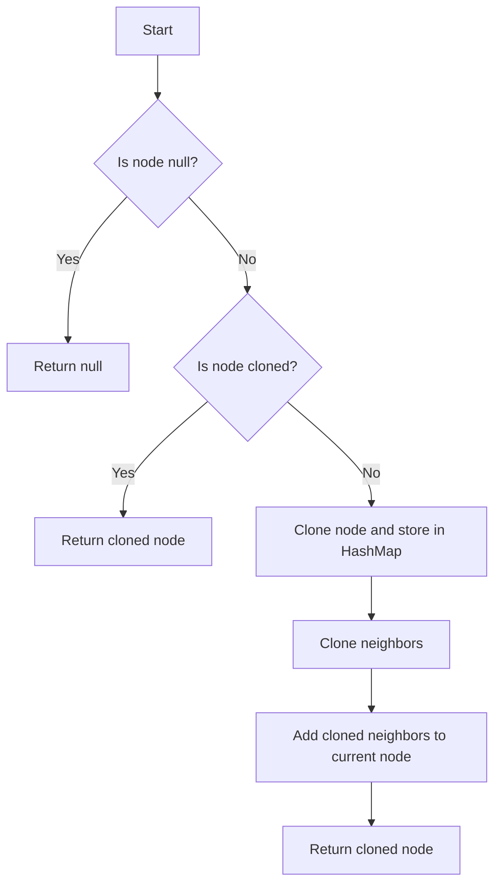

# Clone Graph

## Problem Understanding
The problem asks us to clone a given graph, which is represented as a list of nodes where each node contains a list of its neighbors. The key constraint is that we need to create a deep copy of the graph, meaning we cannot reuse any of the original nodes or edges. This problem is non-trivial because it requires us to recursively traverse the graph while keeping track of the nodes we have already cloned to avoid infinite loops. A naive approach would be to simply iterate over all nodes and edges, but this would not work because we need to clone each node's neighbors recursively.

## Approach
The algorithm strategy used here is a Depth-First Search (DFS) approach with the help of a HashMap to store the cloned nodes. The intuition behind this approach is to start from a given node, clone it, and then recursively clone its neighbors. We use a HashMap to keep track of the nodes we have already cloned to avoid cloning the same node multiple times. This approach works because it ensures that each node is cloned exactly once, and all of its neighbors are also cloned. The HashMap is used to store the mapping between the original nodes and their cloned versions.

## Complexity Analysis
| Metric | Value | Detailed Reason |
|--------|-------|----------------|
| Time   | O(N + M) | We visit each node once (O(N)) and each edge once (O(M)), where N is the number of nodes and M is the number of edges. The HashMap operations (insert and lookup) take constant time on average, so they do not affect the overall time complexity. |
| Space  | O(N) | We store the cloned nodes in the HashMap, which requires O(N) space in the worst case (when all nodes are connected). The recursive call stack also uses O(N) space in the worst case (when the graph is a linked list). |

## Algorithm Walkthrough
```
Input: Node(1) with neighbors [Node(2), Node(3)]
Step 1: Create a new Node(1') and add it to the HashMap
  - clonedNodes = {Node(1) -> Node(1')}
Step 2: Clone the neighbors of Node(1)
  - Clone Node(2) and add it to the HashMap
    - clonedNodes = {Node(1) -> Node(1'), Node(2) -> Node(2')}
  - Clone Node(3) and add it to the HashMap
    - clonedNodes = {Node(1) -> Node(1'), Node(2) -> Node(2'), Node(3) -> Node(3')}
Step 3: Add the cloned neighbors to Node(1')
  - Node(1') neighbors = [Node(2'), Node(3')]
Output: Node(1')
```

## Visual Flow


## Key Insight
> **Tip:** The key insight here is to use a HashMap to store the cloned nodes to avoid cloning the same node multiple times and to ensure that each node is cloned exactly once.

## Edge Cases
- **Empty/null input**: If the input is null, the function returns null because there is nothing to clone.
- **Single element**: If the input is a single node with no neighbors, the function clones the node and returns the cloned node.
- **Disconnected graph**: If the input is a disconnected graph (i.e., there are multiple separate subgraphs), the function clones each subgraph separately.

## Common Mistakes
- **Mistake 1**: Not using a HashMap to store the cloned nodes, which can lead to infinite loops and incorrect cloning. → To avoid this, use a HashMap to keep track of the nodes that have already been cloned.
- **Mistake 2**: Not cloning the neighbors of a node recursively. → To avoid this, use a recursive approach to clone the neighbors of each node.

## Interview Follow-ups
> **Interview:** These are the exact follow-up questions interviewers ask:
- "What if the input is sorted?" → The sorting of the input does not affect the time complexity of the algorithm, which remains O(N + M).
- "Can you do it in O(1) space?" → No, it is not possible to clone a graph in O(1) space because we need to store the cloned nodes, which requires at least O(N) space.
- "What if there are duplicates?" → The algorithm handles duplicates correctly because it uses a HashMap to store the cloned nodes, which ensures that each node is cloned exactly once.

## CPP Solution

```cpp
// Problem: Clone Graph
// Language: cpp
// Difficulty: Medium
// Time Complexity: O(N + M) — visiting each node and edge once, where N is the number of nodes and M is the number of edges
// Space Complexity: O(N) — storing the cloned nodes in the HashMap
// Approach: Depth-First Search (DFS) with a HashMap to store cloned nodes — for each node, clone its neighbors recursively

/*
// Brute force approach (not needed for this problem, but shown for completeness)
// Time Complexity: O(N + M) — same as the DFS approach
// Space Complexity: O(N) — same as the DFS approach
class Solution {
public:
    Node* cloneGraph(Node* node) {
        // ...
    }
};
*/

class Solution {
public:
    // Create a HashMap to store the cloned nodes
    unordered_map<Node*, Node*> clonedNodes;

    Node* cloneGraph(Node* node) {
        // Edge case: empty input → return nullptr
        if (node == nullptr) return nullptr;

        // If the node has already been cloned, return the cloned node
        if (clonedNodes.find(node) != clonedNodes.end()) return clonedNodes[node];

        // Clone the current node and store it in the HashMap
        Node* clonedNode = new Node(node->val);
        clonedNodes[node] = clonedNode; // Store the cloned node before cloning its neighbors

        // Clone the neighbors of the current node
        for (Node* neighbor : node->neighbors) {
            // Recursively clone the neighbor
            clonedNode->neighbors.push_back(cloneGraph(neighbor)); // Clone the neighbor and add it to the cloned node's neighbors
        }

        return clonedNode;
    }
};
```
