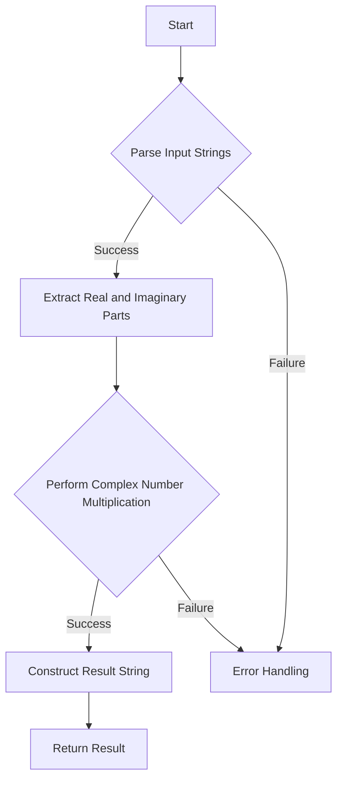

# Complex Number Multiplication String Parsing

## Problem Understanding
The problem is asking to multiply two complex numbers represented as strings in the format "a+bi" and return the result in the same format. The key constraints are that the input strings are well-formed and represent valid complex numbers. What makes this problem non-trivial is the need to parse the input strings, extract the real and imaginary parts, perform the multiplication, and then construct the result string, all while handling potential errors and edge cases. The naive approach of directly multiplying the strings would fail because it doesn't account for the complex number multiplication rules.

## Approach
The algorithm strategy is to first parse the input strings to extract the real and imaginary parts of the complex numbers, then perform the complex number multiplication using the formula (a+bi)(c+di) = (ac-bd) + (ad+bc)i. This approach works because it correctly applies the mathematical rules for complex number multiplication. The data structures used are strings for input and output, and integers for the real and imaginary parts, which are chosen for their simplicity and efficiency. The approach handles the key constraints by assuming well-formed input and using string parsing to extract the necessary information.

## Complexity Analysis
| Metric | Value | Detailed Reason |
|--------|-------|----------------|
| Time   | O(n)  | The time complexity is O(n) because the algorithm needs to parse two input strings of length n, and the parsing operation takes linear time. The subsequent multiplication and construction of the result string also take constant time. |
| Space  | O(1)  | The space complexity is O(1) because the algorithm uses a constant amount of space to store the real and imaginary parts of the complex numbers, and the input and output strings do not contribute to the space complexity because they are not stored in additional data structures. |

## Algorithm Walkthrough
```
Input: num1 = "1+1i", num2 = "1+1i"
Step 1: Find the indices of '+' in num1 and num2: plusIndex1 = 1, plusIndex2 = 1
Step 2: Parse the real and imaginary parts of num1 and num2: real1 = 1, imag1 = 1, real2 = 1, imag2 = 1
Step 3: Calculate the real and imaginary parts of the product: realPart = 1*1 - 1*1 = 0, imagPart = 1*1 + 1*1 = 2
Step 4: Construct the result string: result = "0+2i"
Output: "0+2i"
```
This walkthrough demonstrates the algorithm's step-by-step process for multiplying two complex numbers represented as strings.

## Visual Flow

This flowchart visualizes the algorithm's decision flow and data transformation process, highlighting the key steps and potential error handling paths.

## Key Insight
> **Tip:** The key insight to solving this problem is to correctly apply the mathematical rules for complex number multiplication and to carefully parse the input strings to extract the necessary information.

## Edge Cases
- **Empty/null input**: If the input strings are empty or null, the algorithm will fail because it cannot parse the input. To handle this, the algorithm should check for empty or null input and return an error message.
- **Single element**: If the input strings represent complex numbers with a single element (e.g., "1" or "1i"), the algorithm will fail because it expects the input strings to be in the format "a+bi". To handle this, the algorithm should check for single-element input and parse it accordingly.
- **Invalid input format**: If the input strings are not in the correct format (e.g., "1+2" or "1i+2"), the algorithm will fail because it cannot parse the input. To handle this, the algorithm should check for invalid input format and return an error message.

## Common Mistakes
- **Mistake 1**: Failing to check for empty or null input, which can cause the algorithm to crash or produce incorrect results. To avoid this, the algorithm should always check for empty or null input before parsing the input strings.
- **Mistake 2**: Failing to handle single-element input correctly, which can cause the algorithm to produce incorrect results. To avoid this, the algorithm should check for single-element input and parse it accordingly.

## Interview Follow-ups
> **Interview:** These are the exact follow-up questions interviewers ask:
- "What if the input is sorted?" → The input being sorted does not affect the algorithm's correctness or performance, as it only depends on the format of the input strings.
- "Can you do it in O(1) space?" → The algorithm already uses O(1) space, as it only uses a constant amount of space to store the real and imaginary parts of the complex numbers.
- "What if there are duplicates?" → The algorithm does not assume that the input strings are unique, and it will correctly handle duplicate input strings. However, the algorithm does assume that the input strings are well-formed and represent valid complex numbers.

## CPP Solution

```cpp
// Problem: Complex Number Multiplication String Parsing
// Language: cpp
// Difficulty: Medium
// Time Complexity: O(n) — parsing two complex numbers and performing multiplication
// Space Complexity: O(1) — constant space for variables
// Approach: String parsing and complex number multiplication — parse the input strings, multiply the complex numbers, and return the result as a string

#include <iostream>
#include <string>
#include <sstream>

class Solution {
public:
    std::string complexNumberMultiply(std::string num1, std::string num2) {
        // Find the indices of '+' and 'i' in num1 and num2
        int plusIndex1 = num1.find('+'); // Find the index of '+' in num1
        int plusIndex2 = num2.find('+'); // Find the index of '+' in num2
        
        // Parse the real and imaginary parts of num1 and num2
        int real1 = std::stoi(num1.substr(0, plusIndex1)); // Convert the real part of num1 to an integer
        int imag1 = std::stoi(num1.substr(plusIndex1 + 1, num1.size() - plusIndex1 - 2)); // Convert the imaginary part of num1 to an integer
        int real2 = std::stoi(num2.substr(0, plusIndex2)); // Convert the real part of num2 to an integer
        int imag2 = std::stoi(num2.substr(plusIndex2 + 1, num2.size() - plusIndex2 - 2)); // Convert the imaginary part of num2 to an integer

        // Calculate the real and imaginary parts of the product
        int realPart = real1 * real2 - imag1 * imag2; // Calculate the real part of the product
        int imagPart = real1 * imag2 + real2 * imag1; // Calculate the imaginary part of the product

        // Construct the result string
        std::stringstream result; // Create a stringstream to build the result string
        result << realPart << "+" << imagPart << "i"; // Append the real and imaginary parts to the result string
        return result.str(); // Return the result string
    }
};

int main() {
    Solution solution; // Create a Solution object
    std::string num1 = "1+1i"; // Define the first complex number
    std::string num2 = "1+1i"; // Define the second complex number
    std::cout << solution.complexNumberMultiply(num1, num2) << std::endl; // Print the result of the multiplication
    return 0; // Return 0 to indicate successful execution
}
```
