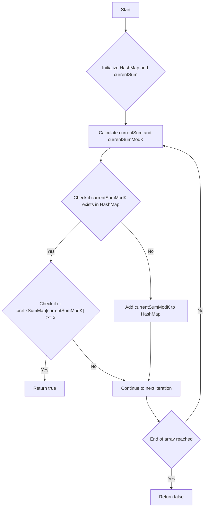

# Continuous Subarray Sum Prefix Sum Map

## Problem Understanding
The problem asks us to determine if there exists a continuous subarray within a given array where the sum of its elements is divisible by a given integer `k`. The key constraint here is that we're looking for a subarray with at least two elements, which implies that the subarray cannot be empty or contain only one element. This problem is non-trivial because a naive approach, such as checking every possible subarray, would result in a time complexity of O(n^2), which is inefficient for large inputs. The problem requires a more efficient algorithm that can handle large arrays.

## Approach
The algorithm strategy employed here is based on the concept of prefix sums and a HashMap. We calculate the prefix sum of the array and store the prefix sums modulo `k` in a HashMap. For each prefix sum, we check if its difference with `k` exists in the HashMap. If it does, we verify if the difference between the current index and the stored index is at least 2, indicating a valid subarray. The intuition behind this approach is that if the sum of a subarray is divisible by `k`, then the prefix sums at the start and end of the subarray will have the same remainder when divided by `k`. We use a HashMap to store the prefix sums modulo `k` and their corresponding indices, allowing us to efficiently look up and compare the prefix sums.

## Complexity Analysis
| Metric | Value | Detailed Reason |
|--------|-------|----------------|
| Time   | O(n)  | We make a single pass through the array, and the operations within the loop (HashMap lookups and updates) take constant time on average. |
| Space  | O(n)  | In the worst-case scenario, we might store every prefix sum modulo `k` in the HashMap, resulting in a space complexity of O(n). |

## Algorithm Walkthrough
```
Input: nums = [23, 2, 4, 6, 7], k = 6
Step 1: Initialize HashMap with 0 sum at index -1, currentSum = 0
        prefixSumMap = {0: -1}
Step 2: currentSum = 23, currentSumModK = 5
        Since 5 is not in prefixSumMap, add it: prefixSumMap = {0: -1, 5: 0}
Step 3: currentSum = 25, currentSumModK = 1
        Since 1 is not in prefixSumMap, add it: prefixSumMap = {0: -1, 5: 0, 1: 1}
Step 4: currentSum = 29, currentSumModK = 5
        Since 5 is in prefixSumMap and i - prefixSumMap[5] = 3 >= 2, return true
Output: true
```
This walkthrough demonstrates how the algorithm efficiently finds a valid subarray with a sum divisible by `k`.

## Visual Flow

This flowchart illustrates the decision-making process and the flow of the algorithm.

## Key Insight
> **Tip:** The key insight behind this solution is that by storing the prefix sums modulo `k` in a HashMap, we can efficiently look up and compare the prefix sums to find a valid subarray with a sum divisible by `k`.

## Edge Cases
- **Empty/null input**: If the input array is empty or null, the function should return false, as there is no valid subarray.
- **Single element**: If the input array contains only one element, the function should return false, as a single element does not constitute a valid subarray.
- **Array with all zeros**: If the input array contains all zeros, the function should return true, as the sum of any subarray will be zero, which is divisible by `k`.

## Common Mistakes
- **Mistake 1**: Failing to handle edge cases, such as empty or single-element arrays, can lead to incorrect results.
- **Mistake 2**: Not using a HashMap to store prefix sums modulo `k` can result in inefficient lookup and comparison operations.

## Interview Follow-ups
- "What if the input is sorted?" → The algorithm's performance remains the same, as it only relies on the properties of prefix sums and modulo operations, not on the sortedness of the input.
- "Can you do it in O(1) space?" → No, it's not possible to solve this problem in O(1) space, as we need to store the prefix sums modulo `k` in a data structure, which requires at least O(n) space in the worst case.
- "What if there are duplicates?" → The algorithm handles duplicates correctly, as it only checks for the existence of a valid subarray with a sum divisible by `k`, regardless of the presence of duplicates.

## CPP Solution

```cpp
// Problem: Continuous Subarray Sum Prefix Sum Map
// Language: cpp
// Difficulty: Medium
// Time Complexity: O(n) — single pass through array using prefix sum and HashMap
// Space Complexity: O(n) — HashMap stores at most n elements
// Approach: Prefix sum and HashMap — for each prefix sum, check if its difference with k exists

class Solution {
public:
    bool checkSubarraySum(vector<int>& nums, int k) {
        // Edge case: empty input → return false
        if (nums.size() < 2) return false;

        // Create a HashMap to store prefix sums modulo k
        unordered_map<int, int> prefixSumMap;
        prefixSumMap[0] = -1; // Initialize with 0 sum at index -1

        int currentSum = 0; // Initialize current sum
        for (int i = 0; i < nums.size(); i++) {
            // Update current sum
            currentSum += nums[i];

            // Calculate current sum modulo k
            int currentSumModK = currentSum % k;

            // Check if current sum modulo k exists in the HashMap
            if (prefixSumMap.find(currentSumModK) != prefixSumMap.end()) {
                // If it exists, check if the difference between current index and stored index is at least 2
                if (i - prefixSumMap[currentSumModK] >= 2) {
                    return true; // Found a valid subarray
                }
            } else {
                // If it doesn't exist, add it to the HashMap
                prefixSumMap[currentSumModK] = i;
            }
        }

        // If no valid subarray is found, return false
        return false;
    }
};
```
