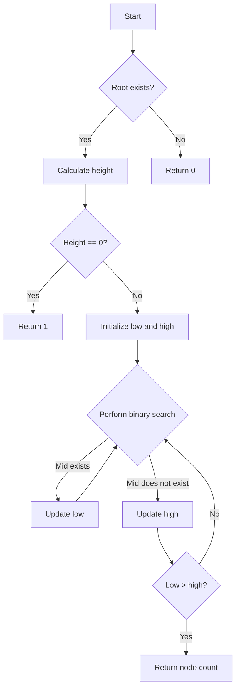

# Count Nodes in Complete Binary Tree

## Problem Understanding
The problem asks to count the number of nodes in a complete binary tree. A complete binary tree is a tree in which every level, except possibly the last, is completely filled, and all nodes are as far left as possible. The key constraint is that the tree is complete, which implies that all levels except the last one are fully filled. What makes this problem non-trivial is that a naive approach, such as recursively counting all nodes, would not take advantage of the tree's completeness and could be inefficient for very large trees.

## Approach
The algorithm strategy is to use a combination of height calculation and binary search to find the number of nodes. The intuition behind this approach is that the height of a complete binary tree can be used to calculate the maximum number of nodes, and then binary search can be used to find the actual number of nodes. The `calculateHeight` function calculates the height of the tree, and the `exists` function checks if a node at a given index exists. The `countNodes` function uses these helper functions to perform a binary search to find the number of nodes. The data structure used is a binary tree, and the approach handles the key constraint of the tree being complete by using the height to guide the binary search.

## Complexity Analysis
| Metric | Value | Detailed Reason |
|--------|-------|----------------|
| Time   | O(log(n)^2) | The time complexity is O(log(n)^2) because the `calculateHeight` function takes O(log(n)) time, and the binary search in the `countNodes` function takes O(log(n)) time. Since the `exists` function is called within the binary search loop, the overall time complexity is O(log(n)^2). |
| Space  | O(1) | The space complexity is O(1) because the algorithm only uses a constant amount of space to store the height, low, and high variables, and does not use any data structures that scale with the input size. |

## Algorithm Walkthrough
```
Input: 
      1
     / \
    2   3
   / \  /
  4   5 6

Step 1: Calculate the height of the tree
  height = calculateHeight(root) = 2

Step 2: Initialize the lower and upper bounds for the node count
  low = 0, high = (1 << height) - 1 = 3

Step 3: Perform binary search to find the node count
  mid = low + (high - low) / 2 = 1
  exists(root, height, mid) = exists(root, 2, 1) = true
  low = mid + 1 = 2

Step 4: Repeat the binary search
  mid = low + (high - low) / 2 = 2
  exists(root, height, mid) = exists(root, 2, 2) = true
  low = mid + 1 = 3

Step 5: Repeat the binary search
  mid = low + (high - low) / 2 = 3
  exists(root, height, mid) = exists(root, 2, 3) = false
  high = mid - 1 = 2

Step 6: The node count is the upper bound plus one
  return (1 << height) - 1 + low = (1 << 2) - 1 + 3 = 6
Output: 6
```
## Visual Flow

## Key Insight
> **Tip:** The key insight is to use the height of the tree to guide the binary search, which allows us to take advantage of the completeness of the tree to efficiently count the nodes.

## Edge Cases
- **Empty tree**: If the input tree is empty, the `countNodes` function returns 0, which is the correct count for an empty tree.
- **Single node**: If the input tree has only one node, the `countNodes` function returns 1, which is the correct count for a tree with one node.
- **Tree with one level**: If the input tree has only one level, the `countNodes` function returns the number of nodes in that level, which is the correct count for a tree with one level.

## Common Mistakes
- **Mistake 1**: Not handling the edge case where the input tree is empty. To avoid this, we need to add a check at the beginning of the `countNodes` function to return 0 if the input tree is empty.
- **Mistake 2**: Not using the height of the tree to guide the binary search. To avoid this, we need to calculate the height of the tree and use it to initialize the low and high bounds for the binary search.

## Interview Follow-ups
> **Interview:** These are the exact follow-up questions interviewers ask:
- "What if the input is sorted?" → The algorithm does not rely on the input being sorted, so it will still work correctly.
- "Can you do it in O(1) space?" → The algorithm already uses O(1) space, so this is not a concern.
- "What if there are duplicates?" → The algorithm does not rely on the input having unique values, so it will still work correctly even if there are duplicates.

## CPP Solution

```cpp
// Problem: Count Nodes in Complete Binary Tree
// Language: cpp
// Difficulty: Medium
// Time Complexity: O(log(n)^2) — using logarithmic height of the tree for both width and height calculations
// Space Complexity: O(1) — using a recursive approach with constant space
// Approach: Recursive height calculation — calculating the height of the left and right subtrees

/**
 * Definition for a binary tree node.
 * struct TreeNode {
 *     int val;
 *     TreeNode *left;
 *     TreeNode *right;
 *     TreeNode() : val(0), left(nullptr), right(nullptr) {}
 *     TreeNode(int x) : val(x), left(nullptr), right(nullptr) {}
 *     TreeNode(int x, TreeNode *left, TreeNode *right) : val(x), left(left), right(right) {}
 * };
 */
class Solution {
public:
    int countNodes(TreeNode* root) {
        // Edge case: empty tree → return 0
        if (!root) return 0;
        
        // Calculate the height of the tree
        int height = calculateHeight(root);
        
        // If the tree has only one level, return 1
        if (height == 0) return 1;
        
        // Initialize the lower and upper bounds for the node count
        int low = 0, high = (1 << height) - 1;
        
        // Perform binary search to find the node count
        while (low <= high) {
            int mid = low + (high - low) / 2;
            
            // Check if the node at the mid index exists
            if (exists(root, height, mid)) {
                // If it exists, update the lower bound
                low = mid + 1;
            } else {
                // If it doesn't exist, update the upper bound
                high = mid - 1;
            }
        }
        
        // The node count is the upper bound plus one (since it's 0-indexed)
        return (1 << height) - 1 + low;
    }
    
    // Helper function to calculate the height of a tree
    int calculateHeight(TreeNode* node) {
        int height = 0;
        while (node->left) {
            height++;
            node = node->left;
        }
        return height;
    }
    
    // Helper function to check if a node exists
    bool exists(TreeNode* node, int height, int path) {
        for (int i = height - 1; i >= 0; i--) {
            // If the bit at the current position is 1, move to the right subtree
            if ((path >> i) & 1) {
                node = node->right;
            } else {
                // If the bit at the current position is 0, move to the left subtree
                node = node->left;
            }
        }
        return node != nullptr;
    }
};
```
