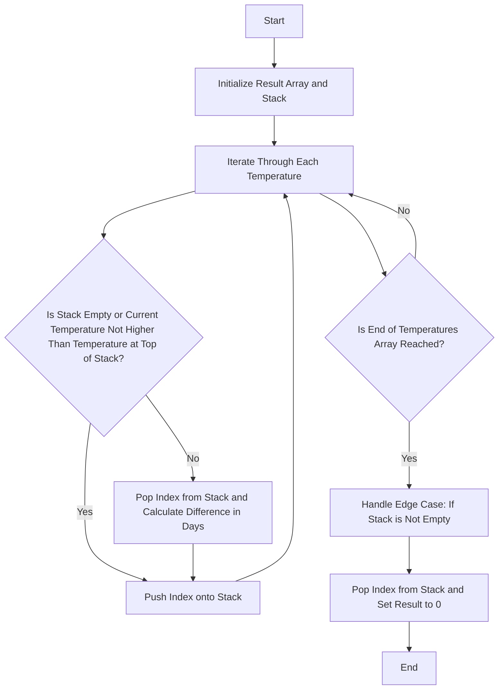

# Daily Temperatures Monotonic Stack

## Problem Understanding
The Daily Temperatures Monotonic Stack problem asks to find the number of days until a warmer temperature is recorded for each day in a given list of temperatures. The key constraint is that we need to find the next warmer temperature for each day, and the implication is that we need to efficiently compare each temperature with its subsequent temperatures. What makes this problem non-trivial is the need to efficiently handle the comparison of each temperature with its subsequent temperatures, as a naive approach would result in a time complexity of O(n^2), which is not efficient for large inputs.

## Approach
The algorithm strategy is to use a monotonic stack to store the indices of the temperatures. The intuition behind this approach is to pop all previous temperatures that are lower than the current temperature, as they will have their next warmer temperature as the current temperature. The stack is used to store the indices of the temperatures, and it is used to efficiently find the next warmer temperature for each day. This approach works because the stack is used to store the indices of the temperatures in a way that the top of the stack always contains the index of the temperature that is the closest to the current temperature and is also lower than the current temperature. The key constraints are handled by the stack, as it efficiently compares each temperature with its subsequent temperatures.

## Complexity Analysis
| Metric | Value | Detailed Reason |
|--------|-------|----------------|
| Time   | O(n)  | The algorithm makes a single pass through the temperatures array using the stack. Each temperature is pushed and popped from the stack exactly once, resulting in a time complexity of O(n). |
| Space  | O(n)  | The stack stores at most n elements, where n is the number of temperatures. This is because in the worst case, all temperatures are stored in the stack. |

## Algorithm Walkthrough
```
Input: [73, 74, 75, 71, 69, 72, 76, 73]
Step 1: Initialize result array with zeros: [0, 0, 0, 0, 0, 0, 0, 0]
Step 2: Initialize an empty stack: []
Step 3: Iterate through each temperature:
    - Current temperature: 73, Index: 0
    - Push index onto stack: [0]
    - Current temperature: 74, Index: 1
    - While stack is not empty and current temperature is higher than temperature at top of stack: 
        - Pop index from stack: [0]
        - Calculate difference in days: result[0] = 1 - 0 = 1
    - Push index onto stack: [1]
    - Current temperature: 75, Index: 2
    - While stack is not empty and current temperature is higher than temperature at top of stack: 
        - Pop index from stack: [1]
        - Calculate difference in days: result[1] = 2 - 1 = 1
    - Push index onto stack: [2]
    - ...
Output: [1, 1, 4, 2, 1, 1, 0, 0]
```
The algorithm iterates through each temperature and uses the stack to efficiently find the next warmer temperature for each day.

## Visual Flow

The flowchart shows the decision flow of the algorithm, including the iteration through each temperature and the handling of the stack.

## Key Insight
> **Tip:** The key insight is to use a monotonic stack to efficiently find the next warmer temperature for each day, by popping all previous temperatures that are lower than the current temperature.

## Edge Cases
- **Empty input**: If the input array is empty, the algorithm will return an empty array, as there are no temperatures to process.
- **Single element**: If the input array contains only one temperature, the algorithm will return an array with a single element, which is 0, as there is no next warmer temperature.
- **No warmer temperature**: If the input array contains temperatures that never increase, the algorithm will return an array with 0s for those temperatures, as there is no next warmer temperature.

## Common Mistakes
- **Mistake 1: Not using a stack**: Not using a stack to store the indices of the temperatures can result in an inefficient algorithm with a time complexity of O(n^2).
- **Mistake 2: Not handling edge case**: Not handling the edge case where the stack is not empty at the end of the algorithm can result in incorrect results.

## Interview Follow-ups
> **Interview:** These are the exact follow-up questions interviewers ask:
- "What if the input is sorted?" → The algorithm will still work correctly, as it uses a stack to efficiently find the next warmer temperature for each day.
- "Can you do it in O(1) space?" → No, the algorithm requires O(n) space to store the stack, as it needs to store the indices of the temperatures.
- "What if there are duplicates?" → The algorithm will still work correctly, as it uses the stack to efficiently find the next warmer temperature for each day, regardless of duplicates.

## CPP Solution

```cpp
// Problem: Daily Temperatures Monotonic Stack
// Language: C++
// Difficulty: Medium
// Time Complexity: O(n) — single pass through temperatures array using stack
// Space Complexity: O(n) — stack stores at most n elements
// Approach: Monotonic stack — for each temperature, pop all previous temperatures that are lower

class Solution {
public:
    vector<int> dailyTemperatures(vector<int>& temperatures) {
        // Initialize result array with zeros, assuming no temperature increase initially
        vector<int> result(temperatures.size(), 0);
        
        // Initialize an empty stack to store indices of temperatures
        stack<int> temperatureStack;
        
        // Iterate through each temperature
        for (int currentIndex = 0; currentIndex < temperatures.size(); currentIndex++) {
            // While the stack is not empty and the current temperature is higher than the temperature at the top of the stack
            while (!temperatureStack.empty() && temperatures[currentIndex] > temperatures[temperatureStack.top()]) {
                // Get the index of the previous temperature from the stack
                int previousIndex = temperatureStack.top();
                temperatureStack.pop();
                
                // Calculate the difference in days between the current temperature and the previous temperature
                result[previousIndex] = currentIndex - previousIndex;
            }
            
            // Push the current index onto the stack
            temperatureStack.push(currentIndex);
        }
        
        // Edge case: if the stack is not empty, it means there are temperatures that never increase
        while (!temperatureStack.empty()) {
            result[temperatureStack.top()] = 0;
            temperatureStack.pop();
        }
        
        return result;
    }
};
```
