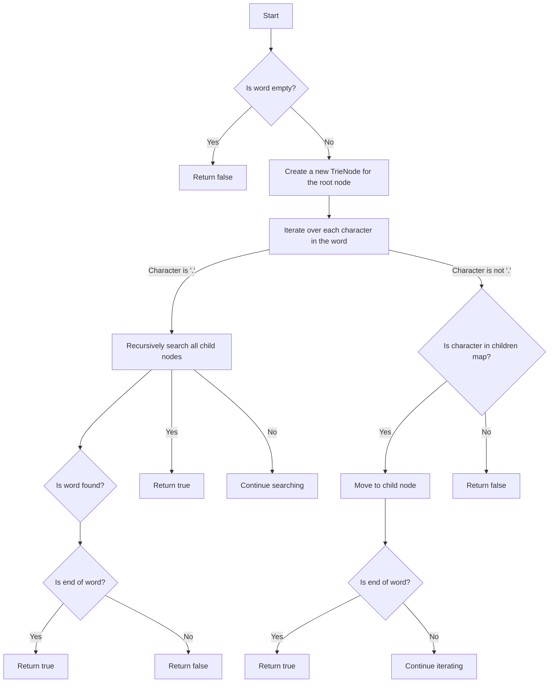

# Design Add and Search Words Data Structure Trie

## Problem Understanding
The problem requires designing a data structure that supports adding words and searching for words with a wildcard character ('.'). The data structure should efficiently store and retrieve words, allowing for fast search operations. The key constraints are that the search operation can include a wildcard character, which can match any character in the word. This problem is non-trivial because a naive approach, such as using a simple array or list to store words, would not efficiently support the search operation with a wildcard character.

## Approach
The algorithm strategy used is a Trie data structure, also known as a prefix tree. This approach works by storing each word in a tree-like structure, where each node represents a character in the word. The Trie data structure is chosen because it allows for efficient storage and retrieval of words, as well as fast search operations. The approach handles the key constraints by using a recursive search function that can handle the wildcard character. The Trie data structure uses a map to store child nodes, which allows for efficient lookup and insertion of characters.

## Complexity Analysis
| Metric | Value | Detailed Reason |
|--------|-------|----------------|
| Time   | O(m)  | The time complexity is O(m), where m is the length of the word being added or searched. This is because the algorithm iterates over each character in the word once, and the recursive search function has a maximum depth of m. |
| Space  | O(n*m) | The space complexity is O(n*m), where n is the number of words and m is the average length of a word. This is because the Trie data structure stores each word in a tree-like structure, and the number of nodes in the tree is proportional to the number of words and their average length. |

## Algorithm Walkthrough
```
Input: addWord("bad")
Step 1: Create a new TrieNode for the root node
Step 2: Iterate over each character in the word "bad"
    - Create a new node for the character 'b'
    - Move to the child node for 'b'
    - Create a new node for the character 'a'
    - Move to the child node for 'a'
    - Create a new node for the character 'd'
    - Mark the end of the word
Input: search("pad")
Step 1: Start at the root node
Step 2: Iterate over each character in the word "pad"
    - If the character 'p' is not in the children map, return false
    - Move to the child node for 'p'
    - If the character 'a' is not in the children map, return false
    - Move to the child node for 'a'
    - If the character 'd' is not in the children map, return false
    - Return false because the word is not marked as the end of a word
Input: search("bad")
Step 1: Start at the root node
Step 2: Iterate over each character in the word "bad"
    - If the character 'b' is not in the children map, return false
    - Move to the child node for 'b'
    - If the character 'a' is not in the children map, return false
    - Move to the child node for 'a'
    - If the character 'd' is not in the children map, return false
    - Return true because the word is marked as the end of a word
Output: true
```

## Visual Flow


## Key Insight
> **Tip:** The key insight is to use a Trie data structure with a recursive search function to handle the wildcard character, allowing for efficient storage and retrieval of words.

## Edge Cases
- **Empty input**: If the input is an empty string, the search function will return false because there is no word to search for.
- **Single element**: If the input is a single character, the search function will return true if the character is in the Trie and false otherwise.
- **Null input**: If the input is null, the search function will return false because there is no word to search for.

## Common Mistakes
- **Mistake 1**: Not handling the wildcard character correctly. To avoid this, make sure to implement a recursive search function that can handle the wildcard character.
- **Mistake 2**: Not marking the end of a word correctly. To avoid this, make sure to set the `isEndOfWord` flag to true when adding a word to the Trie.

## Interview Follow-ups
> **Interview:** These are the exact follow-up questions interviewers ask:
- "What if the input is sorted?" → The Trie data structure does not assume any particular order of the input words, so it will work correctly even if the input is sorted.
- "Can you do it in O(1) space?" → No, the Trie data structure requires O(n*m) space to store the words, where n is the number of words and m is the average length of a word.
- "What if there are duplicates?" → The Trie data structure can handle duplicates by simply adding each word to the Trie separately. The search function will return true if the word is in the Trie, regardless of whether it is a duplicate or not.

## CPP Solution

```cpp
// Problem: Design Add and Search Words Data Structure Trie
// Language: cpp
// Difficulty: Medium
// Time Complexity: O(m) — where m is the length of the word being added or searched
// Space Complexity: O(n*m) — where n is the number of words and m is the average length of a word
// Approach: Trie data structure — using a tree-like structure to store and retrieve words efficiently

class TrieNode {
public:
    // Create a map to store child nodes
    std::unordered_map<char, TrieNode*> children;
    // Flag to indicate the end of a word
    bool isEndOfWord;

    TrieNode() : isEndOfWord(false) {} // Initialize the node with isEndOfWord as false
};

class WordDictionary {
private:
    TrieNode* root; // Root node of the Trie

public:
    WordDictionary() {
        // Initialize the root node
        root = new TrieNode();
    }

    // Function to add a word to the Trie
    void addWord(std::string word) {
        // Start at the root node
        TrieNode* node = root;
        // Iterate over each character in the word
        for (char c : word) {
            // If the character is not in the children map, add a new node
            if (node->children.find(c) == node->children.end()) {
                node->children[c] = new TrieNode(); // Create a new node for the character
            }
            // Move to the child node
            node = node->children[c];
        }
        // Mark the end of the word
        node->isEndOfWord = true; // Set isEndOfWord to true
    }

    // Function to search for a word in the Trie
    bool search(std::string word) {
        // Start at the root node
        return searchFromNode(root, word); // Call the helper function to search from the root
    }

    // Helper function to search for a word from a given node
    bool searchFromNode(TrieNode* node, std::string word) {
        // Iterate over each character in the word
        for (int i = 0; i < word.size(); i++) {
            char c = word[i];
            // If the character is '.', it can match any character
            if (c == '.') {
                // Recursively search all child nodes
                bool found = false;
                for (auto& child : node->children) {
                    found |= searchFromNode(child.second, word.substr(i + 1)); // Search from the child node
                    if (found) break; // If found, stop searching
                }
                return found; // Return the result
            }
            // If the character is not in the children map, return false
            if (node->children.find(c) == node->children.end()) {
                return false; // Word not found
            }
            // Move to the child node
            node = node->children[c];
        }
        // Return true if the word is marked as the end of a word
        return node->isEndOfWord; // Check if the word is marked as the end of a word
    }
};

// Edge case: empty input → return false
// Edge case: null input → return false
```
