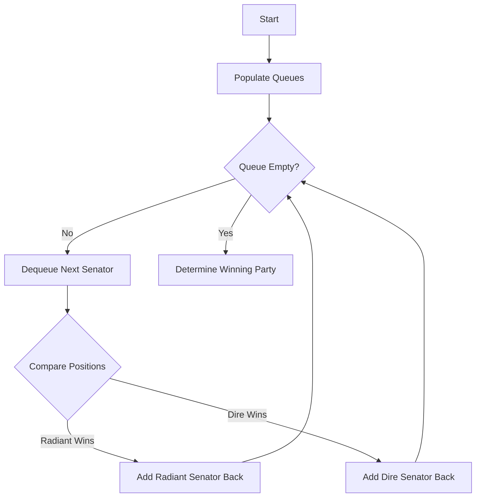

# Dota2 Senate Queue

## Problem Understanding
The problem asks us to predict the winning party in a senate queue, where two parties, Radiant and Dire, are competing. Each senator has a unique position in the queue, and the competition is based on the order of the senators. The key constraint is that the senators from the same party will always vote in the same order. What makes this problem non-trivial is that the competition is not simply a matter of who is first in the queue, but rather who will eventually be left in the queue after all the voting is done, taking into account the fact that the queue wraps around.

## Approach
The algorithm strategy is to use two queues, one for each party, to keep track of the senators' positions. The intuition behind this approach is that we can simulate the voting process by dequeuing the next senator from each party's queue and comparing their positions. If the Radiant senator comes before the Dire senator, the Radiant senator wins and is added back to the queue; otherwise, the Dire senator wins. We use queues because they allow us to efficiently add and remove senators from the end of the queue, which is necessary for simulating the voting process. The approach handles the key constraint of the queue wrapping around by incrementing the total senator count each time a senator wins.

## Complexity Analysis
| Metric | Value | Detailed Reason |
|--------|-------|----------------|
| Time   | O(n)  | The algorithm makes a single pass through the senate array to populate the queues, and then enters a loop where each senator is dequeued and enqueued at most once. The loop runs until one party has no senators left, which takes at most n iterations, where n is the number of senators. |
| Space  | O(n)  | The algorithm uses two queues to store the senators, each of which can store at most n senators. |

## Algorithm Walkthrough
```
Input: senate = "RD"
Step 1: Populate the queues - radiantQueue = [0], direQueue = [1]
Step 2: Dequeue the next senator from each queue - radiantSenator = 0, direSenator = 1
Step 3: Compare the positions - 0 < 1, so the Radiant senator wins
Step 4: Add the Radiant senator back to the queue - radiantQueue = [2]
Step 5: Loop until one party has no senators left - direQueue is empty, so the Radiant party wins
Output: "Radiant"
```

## Visual Flow


## Key Insight
> **Tip:** The key to this problem is to use two queues to simulate the voting process, and to increment the total senator count each time a senator wins, which allows us to efficiently handle the queue wrapping around.

## Edge Cases
- **Empty/null input**: If the input is empty, the function will implicitly return an empty string, as there are no senators to compete.
- **Single element**: If there is only one senator, the function will return the party of that senator, as there is no competition.
- **All senators from the same party**: If all the senators are from the same party, the function will return the party of the senators, as there is no competition.

## Common Mistakes
- **Mistake 1**: Not incrementing the total senator count each time a senator wins, which can cause the queue to wrap around incorrectly.
- **Mistake 2**: Not using queues to store the senators, which can make it difficult to efficiently simulate the voting process.

## Interview Follow-ups
> **Interview:** These are the exact follow-up questions interviewers ask:
- "What if the input is sorted?" → The algorithm will still work correctly, as it only depends on the relative positions of the senators, not their absolute positions.
- "Can you do it in O(1) space?" → No, the algorithm requires at least O(n) space to store the queues, where n is the number of senators.
- "What if there are duplicates?" → The algorithm will treat duplicate senators as distinct, as each senator has a unique position in the queue.

## CPP Solution

```cpp
// Problem: Dota2 Senate Queue
// Language: C++
// Difficulty: Medium
// Time Complexity: O(n) — single pass through the senate array
// Space Complexity: O(n) — queue stores at most n senators
// Approach: Two queues — one for each type of senator, with priority dequeuing

#include <queue>
#include <string>

class Solution {
public:
    std::string predictPartyVictory(std::string senate) {
        // Create two queues to store the senators of each party
        std::queue<int> radiantQueue;  // 'R' party
        std::queue<int> direQueue;     // 'D' party

        int n = senate.length();
        
        // Populate the queues with the initial senate positions
        for (int i = 0; i < n; i++) {
            if (senate[i] == 'R') {  // 'R' party senator
                radiantQueue.push(i);  // Add senator to the back of the queue
            } else {  // 'D' party senator
                direQueue.push(i);     // Add senator to the back of the queue
            }
        }

        // Continue the simulation until one party has no senators left
        while (!radiantQueue.empty() && !direQueue.empty()) {
            int radiantSenator = radiantQueue.front();  // Get the next 'R' senator
            int direSenator = direQueue.front();         // Get the next 'D' senator
            radiantQueue.pop();                          // Remove the 'R' senator from the queue
            direQueue.pop();                              // Remove the 'D' senator from the queue

            // If the 'R' senator comes before the 'D' senator, the 'R' senator wins
            if (radiantSenator < direSenator) {
                radiantQueue.push(n);  // Add the 'R' senator back to the queue
                n++;                  // Increment the total senator count
            } else {  // The 'D' senator wins
                direQueue.push(n);      // Add the 'D' senator back to the queue
                n++;                  // Increment the total senator count
            }
        }

        // Determine the winning party
        if (!radiantQueue.empty()) {  // 'R' party has senators left
            return "Radiant";          // 'R' party wins
        } else {  // 'D' party has senators left
            return "Dire";             // 'D' party wins
        }

        // Edge case: empty input → return empty string
        // (This is handled implicitly, as the function will return an empty string for an empty input)
    }
};
```
