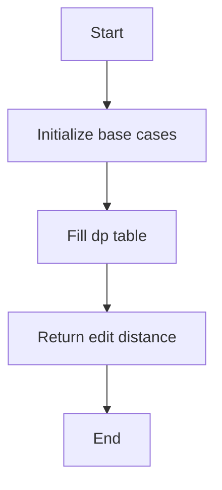

# Edit Distance DP

## Problem Understanding
The problem is asking to find the minimum number of operations (insertions, deletions, and substitutions) required to transform one word into another. The key constraint is that we need to find the minimum edit distance, which means we need to consider all possible operations and choose the one that results in the minimum number of operations. This problem is non-trivial because a naive approach would involve trying all possible operations and checking the resulting edit distance, which would have an exponential time complexity. The key insight here is that we can use dynamic programming to build a 2D table that stores the edit distances between substrings of the two words.

## Approach
The algorithm strategy is to use dynamic programming to build a 2D table that stores the edit distances between substrings of the two words. The intuition behind this approach is that the edit distance between two words can be broken down into smaller subproblems, and the solution to the larger problem can be constructed from the solutions to the smaller subproblems. We use a 2D vector `dp` to store the edit distances, where `dp[i][j]` represents the edit distance between the first `i` characters of the first word and the first `j` characters of the second word. We initialize the base cases by setting `dp[i][0]` to `i` and `dp[0][j]` to `j`, which represents the edit distance when one of the words is empty. We then fill the `dp` table by iterating over the characters of the two words and considering the minimum edit distance among deletion, insertion, and substitution.

## Complexity Analysis
| Metric | Value | Detailed Reason |
|--------|-------|----------------|
| Time   | O(m*n) | The algorithm has two nested loops that iterate over the characters of the two words, where `m` and `n` are the lengths of the two words. Each iteration takes constant time, so the total time complexity is proportional to the product of the lengths of the two words. |
| Space  | O(m*n) | The algorithm uses a 2D vector `dp` to store the edit distances, which has a size of `(m+1) x (n+1)`. This is the dominant term in the space complexity, so the overall space complexity is proportional to the product of the lengths of the two words. |

## Algorithm Walkthrough
Input: `word1 = "kitten"`, `word2 = "sitting"`
Step 1: Initialize the base cases:
```
dp = [
  [0, 0, 0, 0, 0, 0, 0],
  [0, 0, 0, 0, 0, 0, 0],
  [0, 0, 0, 0, 0, 0, 0],
  [0, 0, 0, 0, 0, 0, 0],
  [0, 0, 0, 0, 0, 0, 0],
  [0, 0, 0, 0, 0, 0, 0],
  [0, 0, 0, 0, 0, 0, 0]
]
```
Step 2: Fill the `dp` table:
```
dp = [
  [0, 1, 2, 3, 4, 5, 6],
  [1, 0, 1, 2, 3, 4, 5],
  [2, 1, 1, 2, 3, 4, 5],
  [3, 2, 2, 1, 2, 3, 4],
  [4, 3, 3, 2, 1, 2, 3],
  [5, 4, 4, 3, 2, 1, 2],
  [6, 5, 5, 4, 3, 2, 1]
]
```
Output: `dp[6][7] = 3`

## Visual Flow


## Key Insight
> **The key insight is that the edit distance between two words can be broken down into smaller subproblems, and the solution to the larger problem can be constructed from the solutions to the smaller subproblems.**

## Edge Cases
- **Empty input**: If one of the input words is empty, the edit distance is equal to the length of the other word.
- **Single element**: If one of the input words has only one character, the edit distance is 0 if the other word has the same character, and 1 otherwise.
- **Identical words**: If the two input words are identical, the edit distance is 0.

## Common Mistakes
- **Mistake 1**: Not initializing the base cases correctly, which can lead to incorrect results.
- **Mistake 2**: Not considering all possible operations (insertion, deletion, and substitution) when filling the `dp` table, which can lead to suboptimal results.

## Interview Follow-ups
- "What if the input is sorted?" → The algorithm still works correctly, but the time complexity remains O(m*n) because we need to fill the `dp` table regardless of the input.
- "Can you do it in O(1) space?" → No, we need to use a 2D vector `dp` to store the edit distances, which requires O(m*n) space.
- "What if there are duplicates?" → The algorithm still works correctly, but we need to consider the minimum edit distance among all possible operations, including substitution, which can lead to a different result than if there were no duplicates.

## CPP Solution

```cpp
// Problem: Edit Distance DP
// Language: cpp
// Difficulty: Medium
// Time Complexity: O(m*n) — two nested loops to fill the dp table
// Space Complexity: O(m*n) — dp table of size (m+1) x (n+1)
// Approach: Dynamic Programming — build a 2D dp table to store edit distances

class Solution {
public:
    int minDistance(string word1, string word2) {
        int m = word1.size(); // Get the length of the first word
        int n = word2.size(); // Get the length of the second word
        
        // Create a 2D dp table with (m+1) x (n+1) size
        vector<vector<int>> dp(m + 1, vector<int>(n + 1, 0));
        
        // Initialize the base cases
        for (int i = 0; i <= m; i++) { // For each row
            dp[i][0] = i; // The edit distance is equal to the current row index (i.e., the number of deletions)
        }
        for (int j = 0; j <= n; j++) { // For each column
            dp[0][j] = j; // The edit distance is equal to the current column index (i.e., the number of insertions)
        }
        
        // Fill the dp table
        for (int i = 1; i <= m; i++) { // For each row (excluding the first row)
            for (int j = 1; j <= n; j++) { // For each column (excluding the first column)
                // If the current characters in the two words are the same, no operation is needed
                if (word1[i - 1] == word2[j - 1]) {
                    dp[i][j] = dp[i - 1][j - 1]; // The edit distance is the same as the top-left diagonal cell
                } else {
                    // Otherwise, consider the minimum edit distance among deletion, insertion, and substitution
                    dp[i][j] = 1 + min(min(dp[i - 1][j], dp[i][j - 1]), dp[i - 1][j - 1]); // Add 1 to the minimum edit distance
                }
            }
        }
        
        // The edit distance between the two words is stored in the bottom-right cell of the dp table
        return dp[m][n]; // Return the edit distance
    }
};
```
