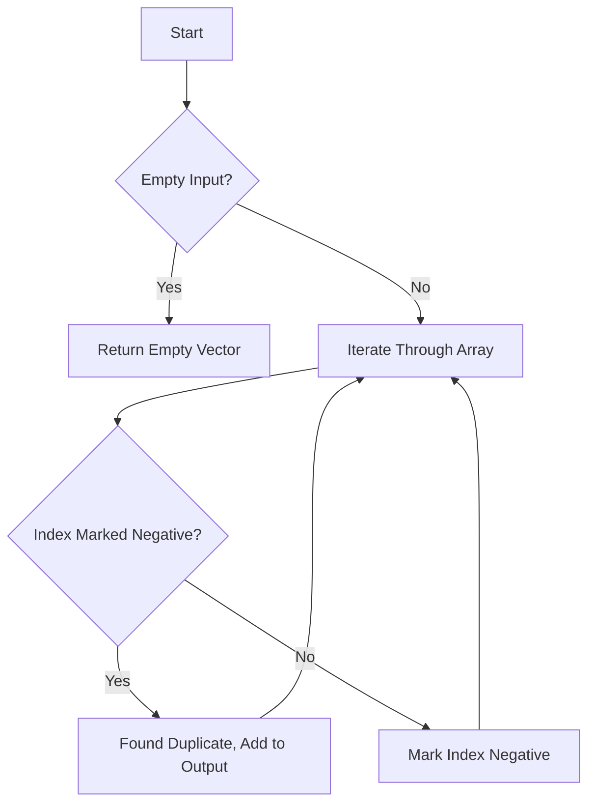

# Find All Duplicates in an Array In-Place

## Problem Understanding
The problem asks to find all duplicates in an array in-place, meaning we should use the given array to mark visited indices and find duplicates without using any extra space that scales with input size. The key constraint is that the input array contains integers from 1 to n, where n is the length of the array. This constraint allows us to use the array itself to mark visited indices. The problem becomes non-trivial because we need to detect duplicates in a single pass through the array while also handling the marking of visited indices without using extra space.

## Approach
The algorithm strategy used here is called negative marking, where we mark visited indices as negative to detect duplicates. This approach works by iterating through the array and for each element, we calculate the index it should point to (by taking the absolute value and subtracting 1). If the value at that index is already negative, it means we have visited this index before, hence the current number is a duplicate. We use the absolute value to handle indices that have been marked as negative. The data structure used is the input array itself, which is modified in-place to mark visited indices.

## Complexity Analysis
| Metric | Value | Detailed Reason |
|--------|-------|----------------|
| Time   | O(n)  | We make a single pass through the array, and each operation (checking if an index is negative, marking it negative) takes constant time. Therefore, the overall time complexity is linear. |
| Space  | O(1)  | Excluding the output vector that stores duplicates, we use constant space. The input array is modified in-place to mark visited indices, and we do not use any additional data structures that scale with input size. |

## Algorithm Walkthrough
```
Input: [4, 3, 2, 7, 8, 2, 3, 1]
Step 1: i = 0, nums[i] = 4, index = abs(4) - 1 = 3, nums[3] = 7 (not negative), mark nums[3] as negative: nums[3] = -7
Step 2: i = 1, nums[i] = 3, index = abs(3) - 1 = 2, nums[2] = 7 (not negative), mark nums[2] as negative: nums[2] = -2
Step 3: i = 2, nums[i] = 2, index = abs(2) - 1 = 1, nums[1] = 3 (not negative), mark nums[1] as negative: nums[1] = -3
Step 4: i = 3, nums[i] = 7, index = abs(7) - 1 = 6, nums[6] = 2 (not negative), mark nums[6] as negative: nums[6] = -2
Step 5: i = 4, nums[i] = 8, index = abs(8) - 1 = 7, nums[7] = 1 (not negative), mark nums[7] as negative: nums[7] = -1
Step 6: i = 5, nums[i] = 2, index = abs(2) - 1 = 1, nums[1] = -3 (negative), duplicate found: 2
Step 7: i = 6, nums[i] = 3, index = abs(3) - 1 = 2, nums[2] = -2 (negative), duplicate found: 3
Output: [2, 3]
```

## Visual Flow


## Key Insight
> **Tip:** The single most important insight is to use the input array itself to mark visited indices by negating the values, allowing us to detect duplicates in a single pass.

## Edge Cases
- **Empty/null input**: If the input array is empty, the function returns an empty vector because there are no elements to process.
- **Single element**: If the input array contains a single element, the function will not find any duplicates and will return an empty vector unless the single element is a duplicate of itself, which is not possible given the problem constraints.
- **All unique elements**: If all elements in the input array are unique, the function will still iterate through the entire array but will not find any duplicates, returning an empty vector.

## Common Mistakes
- **Mistake 1**: Not using the absolute value when calculating the index to visit, which can lead to incorrect indexing and failure to mark visited indices correctly. To avoid this, always use `abs(nums[i])` when calculating the index.
- **Mistake 2**: Not handling the case where the input array is empty or contains a single element. To avoid this, add explicit checks at the beginning of the function to handle these edge cases.

## Interview Follow-ups
> **Interview:** 
- "What if the input is sorted?" → The algorithm still works because it does not rely on the input being sorted; it uses the array values to determine the indices to visit.
- "Can you do it in O(1) space?" → The current solution already achieves O(1) space complexity excluding the output vector, by modifying the input array in-place.
- "What if there are duplicates of duplicates?" → The algorithm will still correctly identify all duplicates, including duplicates of duplicates, because it checks each element individually and marks its corresponding index as negative.

## CPP Solution

```cpp
// Problem: Find All Duplicates in an Array In-Place
// Language: C++
// Difficulty: Medium
// Time Complexity: O(n) — single pass through array with constant time operations
// Space Complexity: O(1) — excluding output vector, we use constant space
// Approach: Negative marking — mark visited indices as negative to detect duplicates

class Solution {
public:
    vector<int> findDuplicates(vector<int>& nums) {
        vector<int> duplicates; // Store duplicates here
        
        // Edge case: empty input → return empty vector
        if (nums.empty()) return duplicates;
        
        // Iterate through the array
        for (int i = 0; i < nums.size(); i++) {
            // Take absolute value to handle negative marked indices
            int index = abs(nums[i]) - 1; // Calculate index to visit
            
            // If we've already visited this index (marked as negative), it's a duplicate
            if (nums[index] < 0) {
                duplicates.push_back(index + 1); // Store duplicate, +1 since indices start at 1
            } else {
                // Mark the index as visited by making it negative
                nums[index] = -nums[index]; // Negative marking
            }
        }
        
        return duplicates;
    }
};
```
