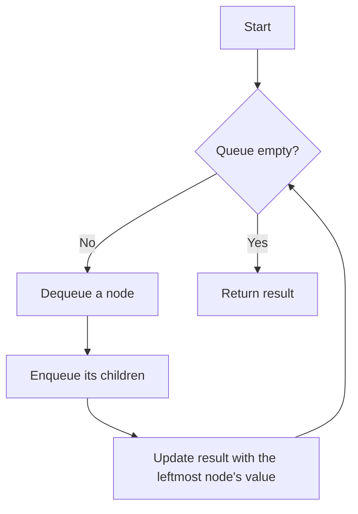

# Find Bottom Left Tree Value BFS

## Problem Understanding
The problem asks to find the bottom left tree value in a binary tree using Breadth-First Search (BFS) traversal. The key constraint is that we need to explore the tree level by level, and at each level, we should update the result with the leftmost node's value. This problem is non-trivial because a naive approach would be to perform a Depth-First Search (DFS) traversal, which would not guarantee the correct result. The BFS approach is necessary to ensure that we visit all nodes at each level before moving on to the next level.

## Approach
The algorithm strategy is to use a queue to perform BFS traversal, exploring the tree level by level. The intuition behind this approach is that a queue allows us to process nodes in the order they are added, which is essential for BFS traversal. We use a queue to store nodes to be processed, and at each level, we update the result with the leftmost node's value. The queue data structure is chosen because it provides efficient enqueue and dequeue operations, which are necessary for BFS traversal. This approach handles the key constraint of exploring the tree level by level and updating the result with the leftmost node's value at each level.

## Complexity Analysis
| Metric | Value | Detailed Reason |
|--------|-------|----------------|
| Time   | O(n)  | We visit each node once, where n is the number of nodes in the tree. The while loop runs until the queue is empty, and in each iteration, we process all nodes at the current level. The time complexity is linear because we perform a constant amount of work for each node. |
| Space  | O(n)  | We use a queue to store nodes to be processed, and in the worst case, the queue can contain all nodes at the last level of the tree. The space complexity is linear because the maximum number of nodes in the queue is proportional to the number of nodes in the tree. |

## Algorithm Walkthrough
```
Input: 
    2
   / \
  1   3
 /
4

Step 1: Initialize the result with the root's value (2) and push the root node into the queue.
Queue: [2]
Result: 2

Step 2: Process all nodes at the current level (root level).
Dequeue the root node and enqueue its children (1 and 3).
Queue: [1, 3]
Result: 2 (no update)

Step 3: Process all nodes at the current level (level 1).
Dequeue node 1 and enqueue its child (4).
Dequeue node 3 and do not enqueue any children.
Queue: [4]
Result: 1 (update with the leftmost node's value at the current level)

Step 4: Process all nodes at the current level (level 2).
Dequeue node 4 and do not enqueue any children.
Queue: []
Result: 1 (no update)

Output: 1
```
This example exercises the main logic path of the algorithm, demonstrating how the result is updated with the leftmost node's value at each level.

## Visual Flow

This flowchart shows the decision flow of the algorithm, where we repeatedly dequeue nodes, enqueue their children, and update the result until the queue is empty.

## Key Insight
> **Tip:** The key insight is to update the result with the leftmost node's value at the start of each level, ensuring that we get the correct result even if there are multiple nodes at the last level.

## Edge Cases
- **Empty tree**: If the input tree is empty, the algorithm returns -1, which is the expected result.
- **Single node**: If the input tree has only one node, the algorithm returns the value of that node, which is the expected result.
- **Unbalanced tree**: If the input tree is unbalanced, the algorithm still works correctly because it uses a queue to process nodes level by level, ensuring that we visit all nodes in the correct order.

## Common Mistakes
- **Mistake 1**: Not updating the result with the leftmost node's value at the start of each level. To avoid this, we should update the result before processing all nodes at the current level.
- **Mistake 2**: Not checking if the queue is empty before dequeuing a node. To avoid this, we should check if the queue is empty before attempting to dequeue a node.

## Interview Follow-ups
> **Interview:** These are the exact follow-up questions interviewers ask:
- "What if the input is sorted?" → The algorithm still works correctly because it uses a queue to process nodes level by level, regardless of the input order.
- "Can you do it in O(1) space?" → No, because we need to use a queue to store nodes to be processed, which requires O(n) space in the worst case.
- "What if there are duplicates?" → The algorithm still works correctly because it uses a queue to process nodes level by level, and duplicates do not affect the result.

## CPP Solution

```cpp
// Problem: Find Bottom Left Tree Value BFS
// Language: cpp
// Difficulty: Medium
// Time Complexity: O(n) — visiting each node once
// Space Complexity: O(n) — storing nodes in the queue
// Approach: Breadth-First Search (BFS) traversal — exploring the tree level by level

/**
 * Definition for a binary tree node.
 * struct TreeNode {
 *     int val;
 *     TreeNode *left;
 *     TreeNode *right;
 *     TreeNode() : val(0), left(nullptr), right(nullptr) {}
 *     TreeNode(int x) : val(x), left(nullptr), right(nullptr) {}
 *     TreeNode(int x, TreeNode *left, TreeNode *right) : val(x), left(left), right(right) {}
 * };
 */

class Solution {
public:
    int findBottomLeftValue(TreeNode* root) {
        // Edge case: empty tree → return -1
        if (!root) return -1;

        // Initialize the result with the root's value
        int result = root->val;

        // Initialize a queue with the root node
        std::queue<TreeNode*> queue;
        queue.push(root);

        // Perform BFS traversal
        while (!queue.empty()) {
            // Update the result with the leftmost node's value at the current level
            result = queue.front()->val; // update result at the start of each level

            // Process all nodes at the current level
            int levelSize = queue.size(); // get the number of nodes at the current level
            for (int i = 0; i < levelSize; i++) {
                // Dequeue a node
                TreeNode* currentNode = queue.front();
                queue.pop();

                // Enqueue its children
                if (currentNode->left) queue.push(currentNode->left); // enqueue left child if exists
                if (currentNode->right) queue.push(currentNode->right); // enqueue right child if exists
            }
        }

        return result;
    }
}
```
