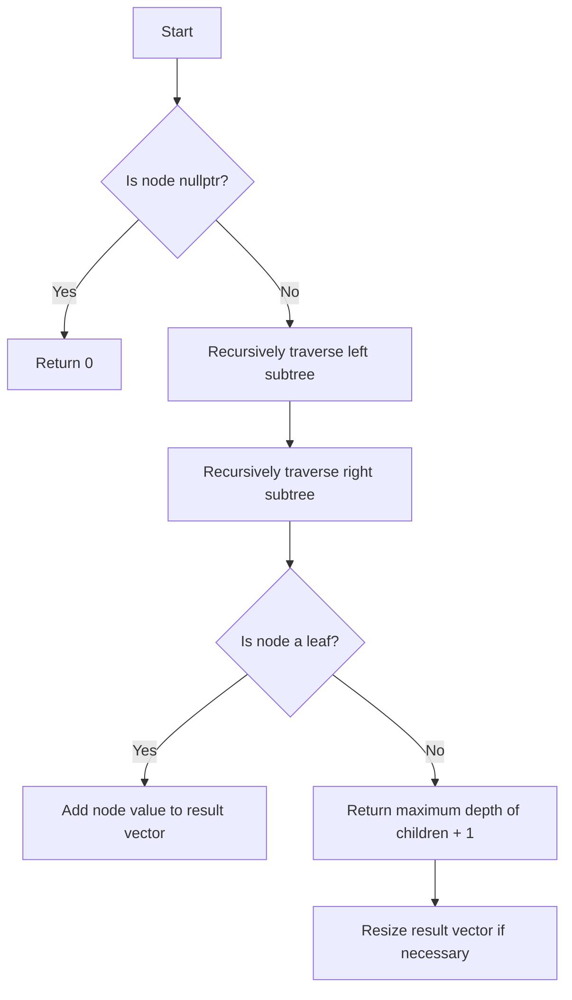

# Find Leaves of Binary Tree Postorder

## Problem Understanding
The problem asks us to find the leaves of a binary tree in postorder. This means we need to traverse the tree in a way that we first visit the left and right subtrees of a node, and then visit the node itself, but only if it's a leaf. A key constraint is that we need to store the leaves in a result vector in postorder. What makes this problem non-trivial is that we need to keep track of the depth of each leaf node and store its value in the corresponding index of the result vector. This requires a careful approach to handling the tree traversal and the result vector.

## Approach
The algorithm strategy is to use a recursive postorder traversal of the binary tree. We start by recursively finding the leaves in the left and right subtrees of a node, and then check if the node itself is a leaf. If it is, we add its value to the result vector at the corresponding depth. We use a helper function to perform the recursive traversal and keep track of the depth of each node. The result vector is used to store the leaves in postorder, and we resize it as needed to accommodate the leaves at different depths.

## Complexity Analysis
| Metric | Value | Detailed Reason |
|--------|-------|----------------|
| Time   | O(n)  | We visit each node in the binary tree once, where n is the number of nodes. The recursive function calls and the operations inside the function take constant time, so the overall time complexity is linear. |
| Space  | O(n)  | We store the leaves in a result vector, which can have up to n elements in the worst case (when the tree is a single leaf). We also use recursive function calls, which take up space on the call stack, but the maximum depth of the recursion tree is n, so the space complexity is also linear. |

## Algorithm Walkthrough
```
Input: 
     1
    / \
   2   3
  / \
 4   5

Step 1: findLeavesHelper(root) is called with the root node (1)
Step 2: findLeavesHelper(1) calls findLeavesHelper(2) and findLeavesHelper(3)
Step 3: findLeavesHelper(2) calls findLeavesHelper(4) and findLeavesHelper(5)
Step 4: findLeavesHelper(4) returns 1 (since 4 is a leaf), and its value is added to the result vector at depth 1
Step 5: findLeavesHelper(5) returns 1 (since 5 is a leaf), and its value is added to the result vector at depth 1
Step 6: findLeavesHelper(2) returns 2 (since 2 is not a leaf), and the result vector is resized to accommodate the leaves at depth 2
Step 7: findLeavesHelper(3) returns 1 (since 3 is a leaf), and its value is added to the result vector at depth 1
Step 8: findLeavesHelper(1) returns 3 (since 1 is not a leaf), and the result vector is resized to accommodate the leaves at depth 3

Output: 
[
  [4, 5, 3],
  [2],
  [1]
]
```

## Visual Flow


## Key Insight
> **Tip:** The key insight is to use a recursive postorder traversal to find the leaves of the binary tree, and to keep track of the depth of each leaf node to store its value in the correct index of the result vector.

## Edge Cases
- **Empty/null input**: If the input tree is empty or null, the function will return an empty result vector.
- **Single element**: If the input tree has only one node, the function will return a result vector with a single element, which is the value of the root node.
- **Tree with multiple levels**: If the input tree has multiple levels, the function will correctly store the leaves in the result vector in postorder, with each level of leaves stored in a separate index of the result vector.

## Common Mistakes
- **Mistake 1**: Not resizing the result vector correctly to accommodate the leaves at different depths.
- **Mistake 2**: Not handling the base case correctly, where the input node is nullptr.

## Interview Follow-ups
> **Interview:** These are the exact follow-up questions interviewers ask:
- "What if the input is sorted?" → The algorithm will still work correctly, but the time complexity will remain O(n) because we need to visit each node once.
- "Can you do it in O(1) space?" → No, we cannot do it in O(1) space because we need to store the leaves in a result vector, which can have up to n elements in the worst case.
- "What if there are duplicates?" → The algorithm will still work correctly, but we may need to handle duplicates in the result vector, depending on the requirements of the problem.

## CPP Solution

```cpp
// Problem: Find Leaves of Binary Tree Postorder
// Language: cpp
// Difficulty: Medium
// Time Complexity: O(n) — visiting each node once
// Space Complexity: O(n) — storing the leaves in result vector
// Approach: Recursive postorder traversal — for each node, first traverse left and right subtrees, then add to result vector if it's a leaf

/**
 * Definition for a binary tree node.
 * struct TreeNode {
 *     int val;
 *     TreeNode *left;
 *     TreeNode *right;
 *     TreeNode() : val(0), left(nullptr), right(nullptr) {}
 *     TreeNode(int x) : val(x), left(nullptr), right(nullptr) {}
 *     TreeNode(int x, TreeNode *left, TreeNode *right) : val(x), left(left), right(right) {}
 * };
 */
class Solution {
public:
    // Result vector to store the leaves in postorder
    vector<vector<int>> result;

    // Helper function to find leaves using postorder traversal
    int findLeavesHelper(TreeNode* node) {
        // Base case: if the node is nullptr, return 0
        if (node == nullptr) {
            return 0;
        }
        
        // Recursively find leaves in left and right subtrees
        int leftDepth = findLeavesHelper(node->left);
        int rightDepth = findLeavesHelper(node->right);

        // If the node is a leaf (both left and right children are nullptr), add its value to the result vector at the corresponding depth
        if (leftDepth == 0 && rightDepth == 0) {
            // Edge case: if result vector doesn't have enough space, resize it
            if (result.size() == 0) {
                result.push_back({node->val});
            } else {
                // Edge case: if the current depth is greater than the size of the result vector, resize the result vector
                if (result.size() <= 0) {
                    result.push_back({node->val});
                } else {
                    result.back().push_back(node->val);
                }
            }
            return 1; // Return 1, indicating this node is a leaf
        }

        // If the node is not a leaf, return the maximum depth of its children plus 1
        int depth = max(leftDepth, rightDepth) + 1;

        // Edge case: if result vector doesn't have enough space, resize it
        if (result.size() < depth) {
            result.resize(depth);
        }

        return depth;
    }

    vector<vector<int>> findLeaves(TreeNode* root) {
        // Call the helper function to populate the result vector
        findLeavesHelper(root);
        return result;
    }
};
```
