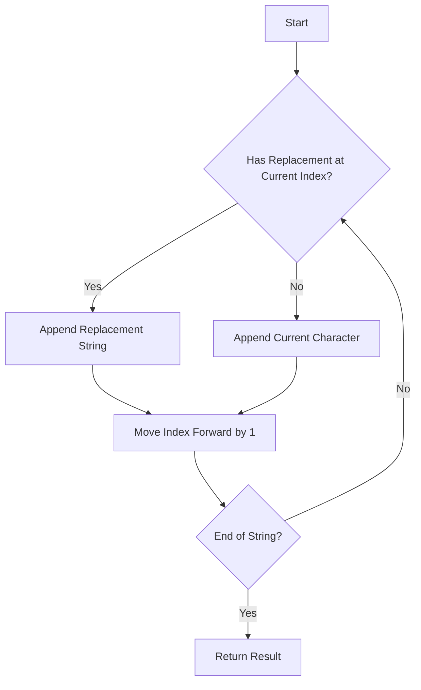

# Find and Replace in String String Manipulation

## Problem Understanding
The problem is asking to find and replace substrings in a given string based on the provided indices, source strings, and target strings. The key constraints are that the replacement should be done in a single pass through the string, and the resulting string may be of the same length as the original string. What makes this problem non-trivial is that the replacement strings can be of different lengths than the source strings, requiring careful handling of the indices and string manipulation.

## Approach
The algorithm strategy is to use a StringBuilder-like solution, iterating through the string and appending the replacement when a match is found. This approach works by first creating a map to store the indices and their corresponding replacement strings, and then iterating through the string to apply the replacements. The map data structure is chosen to efficiently store and retrieve the replacement strings based on their indices. The approach handles the key constraints by iterating through the string only once and appending the replacement strings as needed.

## Complexity Analysis
| Metric | Value | Detailed Reason |
|--------|-------|----------------|
| Time   | O(n)  | The algorithm iterates through the string once, where n is the length of the string. The map operations (insertion and lookup) take constant time on average, and the string operations (substring and append) take linear time in the length of the substring. |
| Space  | O(n)  | The algorithm creates a map to store the replacement strings, which can contain up to n elements in the worst case (when every index has a replacement). The result string can also be of the same length as the original string, requiring additional space. |

## Algorithm Walkthrough
```
Input: s = "abcd", indices = [0, 2], sources = ["ab", "cd"], targets = ["xy", "pq"]
Step 1: Create a map to store the replacements: replacements = {0: ("ab", "xy"), 2: ("cd", "pq")}
Step 2: Initialize the result string: result = ""
Step 3: Iterate through the string:
  i = 0, replacements.find(i) != replacements.end(), so append "xy" to result and move i to 2
  result = "xy"
  i = 2, replacements.find(i) != replacements.end(), so append "pq" to result and move i to 4
  result = "xypq"
  i = 4, replacements.find(i) == replacements.end(), so append "" to result and move i to 5
  result = "xypq"
Output: result = "xypq"
```
## Visual Flow

## Key Insight
> **Tip:** The key insight is to use a map to store the replacements and iterate through the string once, appending the replacement strings as needed, to achieve efficient string manipulation.

## Edge Cases
- **Empty/null input**: If the input string is empty, the algorithm returns an empty string, as there are no characters to replace.
- **Single element**: If the input string has only one character, the algorithm checks if there is a replacement for that character and applies it if found.
- **No replacements**: If there are no replacements for any index, the algorithm returns the original string, as no modifications are needed.

## Common Mistakes
- **Mistake 1**: Not handling the case where the replacement string is longer than the source string, leading to incorrect index updates.
- **Mistake 2**: Not checking if the substring at the current index matches the source string before applying the replacement.

## Interview Follow-ups
> **Interview:** These are the exact follow-up questions interviewers ask:
- "What if the input is sorted?" → The algorithm still works as expected, as the sorting of the input does not affect the replacement process.
- "Can you do it in O(1) space?" → No, the algorithm requires additional space to store the replacement strings and the result string.
- "What if there are duplicates?" → The algorithm handles duplicates by checking the substring at each index and applying the replacement if the source string matches.

## CPP Solution

```cpp
// Problem: Find and Replace in String String Manipulation
// Language: C++
// Difficulty: Medium
// Time Complexity: O(n) — single pass through the string
// Space Complexity: O(n) — resulting string may be of the same length
// Approach: StringBuilder-like solution — iterate through the string and append the replacement when a match is found

class Solution {
public:
    string findReplaceString(string s, vector<int>& indices, vector<string>& sources, vector<string>& targets) {
        // Edge case: empty input string → return empty string
        if (s.empty()) return "";

        // Create a map to store the indices and their corresponding replacement strings
        map<int, pair<string, string>> replacements;
        for (int i = 0; i < indices.size(); i++) {
            // Check if the substring at the current index matches the source string
            string substr = s.substr(indices[i]);
            if (substr.find(sources[i]) == 0) {
                replacements[indices[i]] = {sources[i], targets[i]};
            }
        }

        // Initialize an empty result string
        string result = "";

        // Initialize a variable to keep track of the current index in the string
        int i = 0;

        // Iterate through the string
        while (i < s.size()) {
            // Check if the current index has a replacement
            if (replacements.find(i) != replacements.end()) {
                // Append the replacement string to the result
                result += replacements[i].second;
                // Move the index forward by the length of the source string
                i += replacements[i].first.size();
            } else {
                // If there's no replacement, append the current character to the result
                result += s[i];
                // Move the index forward by 1
                i++;
            }
        }

        // Return the resulting string
        return result;
    }
};
```
