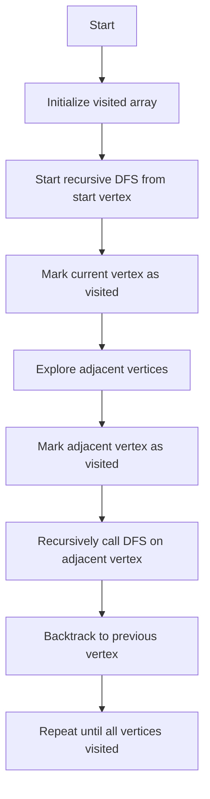

# Graph DFS using recursion and stack

## Problem Understanding
The problem is asking to implement a Depth-First Search (DFS) traversal on a graph using both recursive and stack-based approaches. The graph is represented as an adjacency list, where each vertex is associated with a list of its adjacent vertices. The key constraint is to visit each vertex and edge only once, and the problem becomes non-trivial when dealing with large graphs or graphs with multiple connected components, as a naive approach may result in infinite loops or missed vertices.

## Approach
The algorithm strategy is to use a recursive function to traverse the graph, marking each visited vertex and exploring its adjacent vertices. The recursive approach works by recursively calling the DFS function on each unvisited adjacent vertex. The stack-based approach uses a stack to store vertices to be visited, popping the top vertex, marking it as visited, and pushing its unvisited adjacent vertices onto the stack. Both approaches use a visited array to keep track of visited vertices. The adjacency list representation allows for efficient iteration over adjacent vertices.

## Complexity Analysis
| Metric | Value | Detailed Reason |
|--------|-------|----------------|
| Time   | O(V + E) | The algorithm visits each vertex and edge once. In the recursive approach, each vertex is visited once and its adjacent vertices are explored. In the stack-based approach, each vertex is pushed and popped from the stack once, and its adjacent vertices are iterated over. The time complexity is linear with respect to the number of vertices and edges. |
| Space  | O(V) | The algorithm uses a visited array of size V to keep track of visited vertices. In the recursive approach, the recursion stack can grow up to a maximum depth of V, while in the stack-based approach, the stack can store up to V vertices. |

## Algorithm Walkthrough
```
Input: Graph with 5 vertices and 4 edges: (0, 1), (0, 2), (1, 3), (1, 4)
Step 1: Initialize visited array: [false, false, false, false, false]
Step 2: Start recursive DFS from vertex 0: visited[0] = true, print 0
Step 3: Explore adjacent vertices of 0: vertex 1, visited[1] = true, print 1
Step 4: Explore adjacent vertices of 1: vertex 3, visited[3] = true, print 3; vertex 4, visited[4] = true, print 4
Step 5: Backtrack to vertex 0, explore adjacent vertex 2: visited[2] = true, print 2
Output: Recursive DFS Traversal: 0 1 3 4 2
```

## Visual Flow


## Key Insight
> **Tip:** The key insight is to use a visited array to keep track of visited vertices and avoid revisiting them, ensuring that each vertex and edge is visited only once.

## Edge Cases
- **Empty/null input**: If the input graph is empty, the algorithm will not print anything, as there are no vertices to visit.
- **Single element**: If the graph has only one vertex, the algorithm will print the single vertex, as there are no adjacent vertices to explore.
- **Graph with multiple connected components**: If the graph has multiple connected components, the algorithm will only visit the vertices in the component containing the start vertex. To visit all vertices, the algorithm would need to be run from each connected component.

## Common Mistakes
- **Mistake 1**: Not using a visited array to keep track of visited vertices, resulting in infinite loops or missed vertices. → To avoid this, always use a visited array to mark visited vertices.
- **Mistake 2**: Not checking for null or empty input graphs, resulting in runtime errors. → To avoid this, always check for null or empty input graphs before running the algorithm.

## Interview Follow-ups
> **Interview:** These are the exact follow-up questions interviewers ask:
- "What if the input is sorted?" → The algorithm's time complexity remains the same, as the sorting of the input does not affect the number of vertices and edges visited.
- "Can you do it in O(1) space?" → No, the algorithm requires at least O(V) space to store the visited array, where V is the number of vertices.
- "What if there are duplicates?" → The algorithm will still work correctly, as the visited array ensures that each vertex is visited only once, even if there are duplicate edges.

## CPP Solution

```cpp
// Problem: Graph DFS using recursion and stack
// Language: C++
// Difficulty: Medium
// Time Complexity: O(V + E) — visiting each vertex and edge once
// Space Complexity: O(V) — storing visited vertices in the recursion stack
// Approach: Recursive DFS traversal — using a recursive function to traverse the graph

#include <iostream>
#include <vector>
#include <stack>

class Graph {
private:
    int numVertices;
    std::vector<std::vector<int>> adjacencyList;

public:
    Graph(int numVertices) {
        this->numVertices = numVertices;
        adjacencyList.resize(numVertices);
    }

    // Add an edge to the graph
    void addEdge(int src, int dest) {
        adjacencyList[src].push_back(dest); // Adding a directed edge from src to dest
    }

    // Recursive DFS function
    void recursiveDFS(int vertex, std::vector<bool>& visited) {
        visited[vertex] = true; // Mark the current vertex as visited
        std::cout << vertex << " "; // Print the current vertex

        // Iterate through all adjacent vertices of the current vertex
        for (int adjacentVertex : adjacencyList[vertex]) {
            if (!visited[adjacentVertex]) { // If the adjacent vertex is not visited
                recursiveDFS(adjacentVertex, visited); // Recursively call the DFS function on the adjacent vertex
            }
        }
    }

    // Stack-based DFS function
    void stackBasedDFS(int startVertex) {
        std::vector<bool> visited(numVertices, false); // Initialize a visited array
        std::stack<int> dfsStack; // Create a stack for DFS
        dfsStack.push(startVertex); // Push the start vertex onto the stack
        visited[startVertex] = true; // Mark the start vertex as visited

        while (!dfsStack.empty()) { // While the stack is not empty
            int currentVertex = dfsStack.top(); // Get the top vertex from the stack
            dfsStack.pop(); // Pop the top vertex from the stack
            std::cout << currentVertex << " "; // Print the current vertex

            // Iterate through all adjacent vertices of the current vertex
            for (int adjacentVertex : adjacencyList[currentVertex]) {
                if (!visited[adjacentVertex]) { // If the adjacent vertex is not visited
                    dfsStack.push(adjacentVertex); // Push the adjacent vertex onto the stack
                    visited[adjacentVertex] = true; // Mark the adjacent vertex as visited
                }
            }
        }
    }

    // Main function to demonstrate graph DFS
    void demonstrateDFS() {
        // Create a sample graph
        Graph graph(5);
        graph.addEdge(0, 1);
        graph.addEdge(0, 2);
        graph.addEdge(1, 3);
        graph.addEdge(1, 4);

        std::cout << "Recursive DFS Traversal: ";
        std::vector<bool> visited(5, false);
        graph.recursiveDFS(0, visited);
        std::cout << std::endl;

        std::cout << "Stack-based DFS Traversal: ";
        graph.stackBasedDFS(0);
        std::cout << std::endl;
    }
};

int main() {
    Graph graph(5);
    graph.addEdge(0, 1);
    graph.addEdge(0, 2);
    graph.addEdge(1, 3);
    graph.addEdge(1, 4);

    // Edge case: empty graph
    Graph emptyGraph(0);
    std::cout << "Empty Graph DFS Traversal: ";
    emptyGraph.stackBasedDFS(0); // This will not print anything

    // Edge case: graph with a single vertex
    Graph singleVertexGraph(1);
    std::cout << "\nSingle Vertex Graph DFS Traversal: ";
    singleVertexGraph.stackBasedDFS(0);

    // Edge case: graph with multiple connected components
    Graph multipleComponentsGraph(6);
    multipleComponentsGraph.addEdge(0, 1);
    multipleComponentsGraph.addEdge(2, 3);
    multipleComponentsGraph.addEdge(4, 5);
    std::cout << "\nMultiple Components Graph DFS Traversal: ";
    multipleComponentsGraph.stackBasedDFS(0);

    return 0;
}
```
