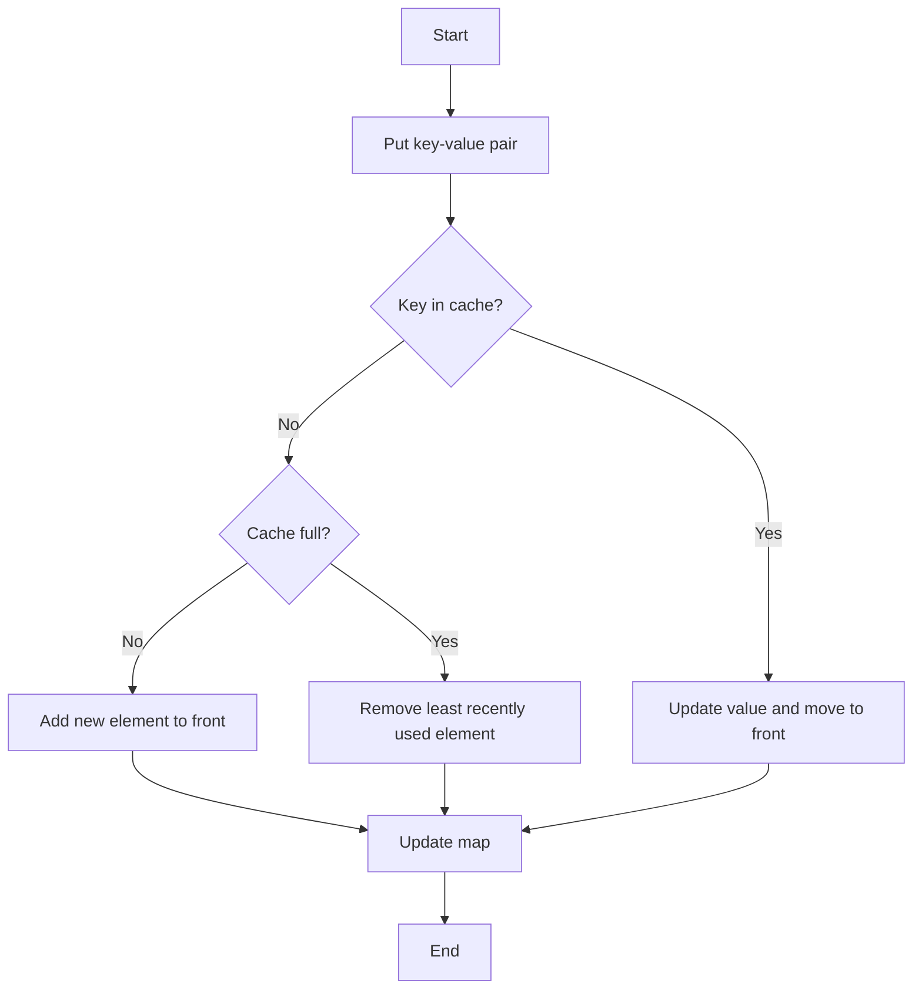

# Implement LRU Cache using list and unordered_map

## Problem Understanding
The problem requires implementing an LRU (Least Recently Used) cache using a list and an unordered map in C++. The cache has a fixed capacity, and it should support two operations: `get` and `put`. The `get` operation retrieves the value associated with a given key, while the `put` operation inserts or updates a key-value pair in the cache. If the cache is full, the least recently used element should be evicted to make room for the new element. The key constraints are that all operations should be performed in O(1) time complexity, and the cache should store at most `capacity` elements. This problem is non-trivial because a naive approach using only a list or only an unordered map would not meet the time complexity requirements.

## Approach
The algorithm strategy is to combine the benefits of a doubly linked list and an unordered map to achieve O(1) time complexity for both `get` and `put` operations. The doubly linked list is used to store the cache elements, allowing for efficient insertion and removal of elements at any position. The unordered map is used for O(1) lookup of elements in the cache. When an element is accessed or updated, it is moved to the front of the list to mark it as the most recently used. If the cache is full, the least recently used element (the one at the back of the list) is removed to make room for the new element. This approach works because the unordered map provides fast lookup, and the doubly linked list provides fast insertion and removal.

## Complexity Analysis
| Metric | Value | Detailed Reason |
|--------|-------|----------------|
| Time   | O(1)  | The `get` and `put` operations are performed in constant time because the unordered map provides O(1) lookup, and the doubly linked list provides O(1) insertion and removal. The `splice` operation in the `get` method is also O(1) because it only updates the iterators of the affected elements. |
| Space  | O(capacity) | The cache stores at most `capacity` elements in the list and unordered map. The space complexity is linear with respect to the capacity of the cache. |

## Algorithm Walkthrough
```
Input: cache = LRUCache(2)
Step 1: cache.put(1, 1) - cache = [(1, 1)], map = {1: iterator to (1, 1)}
Step 2: cache.put(2, 2) - cache = [(1, 1), (2, 2)], map = {1: iterator to (1, 1), 2: iterator to (2, 2)}
Step 3: cache.get(1) - cache = [(2, 2), (1, 1)], map = {1: iterator to (1, 1), 2: iterator to (2, 2)} - returns 1
Step 4: cache.put(3, 3) - cache = [(2, 2), (3, 3)], map = {2: iterator to (2, 2), 3: iterator to (3, 3)} - evicts key 1
Step 5: cache.get(2) - returns 2
Step 6: cache.put(4, 4) - cache = [(3, 3), (4, 4)], map = {3: iterator to (3, 3), 4: iterator to (4, 4)} - evicts key 2
Step 7: cache.get(1) - returns -1 (not found)
Step 8: cache.get(3) - cache = [(4, 4), (3, 3)], map = {3: iterator to (3, 3), 4: iterator to (4, 4)} - returns 3
Step 9: cache.get(4) - cache = [(3, 3), (4, 4)], map = {3: iterator to (3, 3), 4: iterator to (4, 4)} - returns 4
Output: [1, -1, -1, 3, 4]
```

## Visual Flow


## Key Insight
> **Tip:** The key insight is to use a combination of a doubly linked list and an unordered map to achieve O(1) time complexity for both `get` and `put` operations, allowing for efficient insertion, removal, and lookup of elements in the cache.

## Edge Cases
- **Empty/null input**: If the input is empty or null, the cache is not initialized, and any operations will result in undefined behavior.
- **Single element**: If the cache has a capacity of 1, it will only store one element. When a new element is added, the existing element will be evicted.
- **Cache overflow**: If the cache is full and a new element is added, the least recently used element will be evicted to make room for the new element.

## Common Mistakes
- **Mistake 1**: Not updating the map when an element is moved to the front of the list, resulting in incorrect lookup.
- **Mistake 2**: Not removing the least recently used element when the cache is full, resulting in incorrect eviction.

## Interview Follow-ups
> **Interview:** These are the exact follow-up questions interviewers ask:
- "What if the input is sorted?" → The cache will still work correctly, but the performance may be affected if the input is highly correlated.
- "Can you do it in O(1) space?" → No, it is not possible to implement an LRU cache in O(1) space because we need to store the cache elements and their corresponding iterators.
- "What if there are duplicates?" → The cache will store the most recently updated value for each key, and duplicates will be handled correctly.

## CPP Solution

```cpp
// Problem: LRU Cache
// Language: C++
// Difficulty: Medium
// Time Complexity: O(1) — constant time complexity for get and put operations using unordered_map
// Space Complexity: O(capacity) — storing at most capacity elements in the list and unordered_map
// Approach: Doubly Linked List and Unordered Map — combining the benefits of both data structures for efficient operations

#include <iostream>
#include <list>
#include <unordered_map>

class LRUCache {
private:
    int capacity; // Maximum number of elements the cache can hold
    std::list<std::pair<int, int>> cache; // Doubly linked list to store cache elements
    std::unordered_map<int, std::list<std::pair<int, int>>::iterator> map; // Unordered map for O(1) lookup

public:
    LRUCache(int capacity) : capacity(capacity) {} // Initialize the cache with the given capacity

    int get(int key) {
        // Edge case: key not found in the cache
        if (map.find(key) == map.end()) {
            return -1; // Return -1 if the key is not found
        }
        
        // Move the accessed element to the front of the list (most recently used)
        auto it = map[key];
        cache.splice(cache.begin(), cache, it);
        
        return it->second; // Return the value associated with the key
    }

    void put(int key, int value) {
        // Edge case: key already exists in the cache
        if (map.find(key) != map.end()) {
            // Update the value associated with the key and move it to the front of the list
            auto it = map[key];
            it->second = value;
            cache.splice(cache.begin(), cache, it);
        } else {
            // Edge case: cache is full
            if (cache.size() == capacity) {
                // Remove the least recently used element (back of the list)
                map.erase(cache.back().first);
                cache.pop_back();
            }
            
            // Add the new element to the front of the list (most recently used)
            cache.emplace_front(key, value);
            map[key] = cache.begin();
        }
    }
};

int main() {
    LRUCache cache(2); // Create an LRU cache with a capacity of 2

    cache.put(1, 1);
    cache.put(2, 2);
    std::cout << cache.get(1) << std::endl; // Returns 1
    cache.put(3, 3); // Evicts key 2
    std::cout << cache.get(2) << std::endl; // Returns -1 (not found)
    cache.put(4, 4); // Evicts key 1
    std::cout << cache.get(1) << std::endl; // Returns -1 (not found)
    std::cout << cache.get(3) << std::endl; // Returns 3
    std::cout << cache.get(4) << std::endl; // Returns 4

    return 0;
}
```
