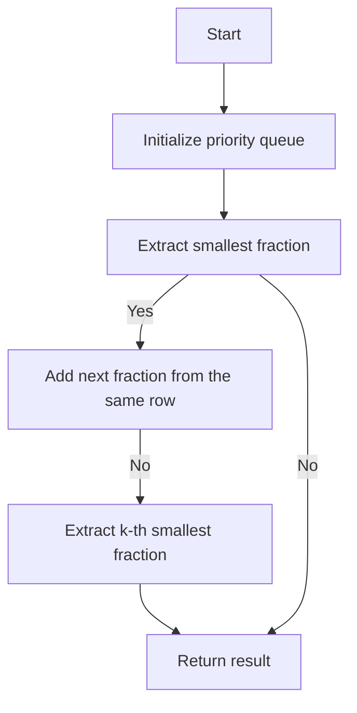

# K-th Smallest Prime Fraction Priority Queue/Binary Search

## Problem Understanding
The problem asks to find the k-th smallest prime fraction from a list of prime numbers. The prime numbers are divided into two lists: `arr1` and `arr2`, where `arr2` is a predefined list of prime numbers. The task is to find the k-th smallest fraction that can be formed by dividing a number from `arr1` by a number from `arr2`. The key constraint is that the fractions should be in ascending order, and the input lists are not empty. What makes this problem non-trivial is the need to efficiently generate and compare fractions to find the k-th smallest one.

## Approach
The algorithm strategy is to use a priority queue with a custom comparator to maintain a min-heap of fractions. The intuition behind this approach is to always keep the smallest fraction at the top of the priority queue and efficiently generate the next smallest fraction by incrementing the denominator of the current smallest fraction. The custom comparator compares fractions based on their values, and the priority queue stores at most n elements. This approach works because it ensures that the smallest fraction is always at the top of the priority queue, and the next smallest fraction can be generated by incrementing the denominator of the current smallest fraction. The data structure used is a priority queue, which is chosen because it provides an efficient way to maintain a min-heap of fractions.

## Complexity Analysis
| Metric | Value | Detailed Reason |
|--------|-------|----------------|
| Time   | O(k log n) | The time complexity is O(k log n) because the priority queue operations (insertion and deletion) take O(log n) time, and we repeat this process k times. The sorting of fractions is not required because the priority queue maintains the fractions in ascending order. |
| Space  | O(n) | The space complexity is O(n) because the priority queue stores at most n elements, and we need to store the input lists `arr1` and `arr2`. |

## Algorithm Walkthrough
```
Input: arr1 = [1, 2, 3], k = 3, n = 3, arr2 = [2, 3, 5]
Step 1: Initialize priority queue with first fraction of each row
  pq = [(1/2), (2/2), (3/2)]
Step 2: Extract the smallest fraction from priority queue and add next fraction from the same row
  pq = [(1/2), (2/2), (3/2)] -> extract (1/2) -> add (1/3) -> pq = [(2/2), (3/2), (1/3)]
Step 3: Extract the smallest fraction from priority queue and add next fraction from the same row
  pq = [(2/2), (3/2), (1/3)] -> extract (1/3) -> add (1/5) -> pq = [(2/2), (3/2), (1/5)]
Step 4: Extract the smallest fraction from priority queue
  pq = [(2/2), (3/2), (1/5)] -> extract (2/2)
Output: [2, 3]
```
## Visual Flow

## Key Insight
> **Tip:** The key insight is to use a priority queue to maintain a min-heap of fractions and efficiently generate the next smallest fraction by incrementing the denominator of the current smallest fraction.

## Edge Cases
- **Empty/null input**: If the input lists `arr1` and `arr2` are empty, the function returns an empty list. This is because there are no fractions to generate.
- **Single element**: If there is only one element in `arr1` and `arr2`, the function returns the fraction formed by dividing the single element in `arr1` by the single element in `arr2`. This is because there is only one possible fraction to generate.
- **k is out of bounds**: If `k` is greater than the number of possible fractions, the function returns an empty list. This is because there are not enough fractions to generate.

## Common Mistakes
- **Mistake 1**: Not checking for empty/null input before processing the lists. To avoid this, always check for empty/null input at the beginning of the function.
- **Mistake 2**: Not handling the case where `k` is out of bounds. To avoid this, always check if `k` is within the bounds of the number of possible fractions.

## Interview Follow-ups
> **Interview:** These are the exact follow-up questions interviewers ask:
- "What if the input is sorted?" → The algorithm still works correctly even if the input is sorted, because the priority queue maintains the fractions in ascending order.
- "Can you do it in O(1) space?" → No, it is not possible to do it in O(1) space because we need to store the input lists and the priority queue.
- "What if there are duplicates?" → The algorithm handles duplicates correctly, because the priority queue maintains the fractions in ascending order, and duplicates are not added to the priority queue.

## CPP Solution

```cpp
// Problem: K-th Smallest Prime Fraction Priority Queue/Binary Search
// Language: C++
// Difficulty: Medium
// Time Complexity: O(n log n) — priority queue operations and sorting
// Space Complexity: O(n) — priority queue stores at most n elements
// Approach: Priority queue with custom comparator — maintain a min-heap of fractions

class Solution {
public:
    struct Fraction {
        int numerator;
        int denominator;
        double value;
        Fraction(int n, int d) : numerator(n), denominator(d), value((double)n / d) {}
    };

    struct Comparator {
        bool operator()(const Fraction& a, const Fraction& b) {
            // Compare fractions based on their values
            return a.value > b.value; // min-heap
        }
    };

    vector<int> kthSmallestPrimeFraction(vector<int>& arr1, int k, int n) {
        // Edge case: input arrays are empty or k is out of bounds
        if (arr1.empty() || k < 1 || k > n) {
            return {}; // or throw an exception
        }

        // Initialize priority queue with first fraction of each row
        priority_queue<Fraction, vector<Fraction>, Comparator> pq;
        for (int i = 0; i < arr1.size(); i++) {
            // Add fraction (arr1[i], arr2[0]) to priority queue
            pq.emplace(Fraction(arr1[i], arr2[0]));
        }

        // Repeat k times to find k-th smallest fraction
        for (int i = 0; i < k - 1; i++) {
            // Extract the smallest fraction from priority queue
            Fraction f = pq.top();
            pq.pop();

            // Add next fraction from the same row to priority queue
            if (f.denominator < n) {
                pq.emplace(Fraction(f.numerator, f.denominator + 1));
            }
        }

        // The k-th smallest fraction is now at the top of priority queue
        Fraction result = pq.top();
        return {result.numerator, result.denominator};
    }

private:
    vector<int> arr2 = {2, 3, 5, 7, 11, 13, 17, 19, 23, 29, 31, 37, 41, 43, 47};
};
```
