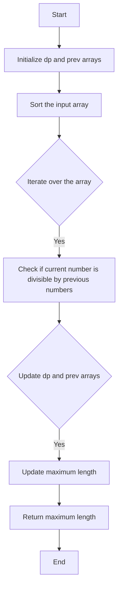

# Largest Divisible Subset DP

## Problem Understanding
The problem asks to find the length of the largest divisible subset in a given array of integers. A divisible subset is a subset where every pair of elements satisfies the condition that the larger number is divisible by the smaller number. The key constraint is that the input array is not sorted, and we need to find the longest divisible subset. This problem is non-trivial because a naive approach would involve checking all possible subsets, which would result in exponential time complexity. The problem requires a dynamic programming approach to efficiently find the longest divisible subset.

## Approach
The algorithm strategy is to use dynamic programming to compare each pair of numbers and find the longest divisible subset that ends with each number. The intuition behind this approach is that if a number is divisible by a previous number, it can be part of a longer divisible subset. We use two arrays, `dp` and `prev`, to store the lengths of the longest divisible subsets and the previous number in the subset, respectively. The `dp` array is initialized with 1, assuming each number is a subset of size 1. We then iterate over the sorted array, updating the `dp` and `prev` arrays based on the divisibility condition. This approach works because it ensures that we consider all possible subsets and choose the longest one.

## Complexity Analysis
| Metric | Value | Detailed Reason |
|--------|-------|----------------|
| Time   | O(n^2) | The algorithm involves two nested loops, each iterating over the input array of size `n`. The outer loop runs `n-1` times, and the inner loop runs up to `i` times. The sorting operation at the beginning takes O(n log n) time, but it is dominated by the O(n^2) time complexity of the dynamic programming loop. |
| Space  | O(n) | The algorithm uses two additional arrays, `dp` and `prev`, each of size `n`. These arrays store the lengths of the longest divisible subsets and the previous number in the subset, respectively. The space complexity is linear because we only need to store information for each number in the input array. |

## Algorithm Walkthrough
```
Input: [1, 2, 3, 6, 24]
Step 1: Initialize dp = [1, 1, 1, 1, 1] and prev = [-1, -1, -1, -1, -1]
Step 2: Sort the input array: [1, 2, 3, 6, 24]
Step 3: Iterate over the array:
  - i = 1: Check if 2 is divisible by 1 (yes), update dp[1] = 2 and prev[1] = 0
  - i = 2: Check if 3 is divisible by 1 (yes), update dp[2] = 2 and prev[2] = 0
  - i = 3: Check if 6 is divisible by 1 (yes), update dp[3] = 2 and prev[3] = 0
           Check if 6 is divisible by 2 (yes), update dp[3] = 3 and prev[3] = 1
  - i = 4: Check if 24 is divisible by 1 (yes), update dp[4] = 2 and prev[4] = 0
           Check if 24 is divisible by 2 (yes), update dp[4] = 3 and prev[4] = 1
           Check if 24 is divisible by 3 (no)
           Check if 24 is divisible by 6 (yes), update dp[4] = 4 and prev[4] = 3
Step 4: Return the maximum length: 4
Output: 4
```
## Visual Flow

## Key Insight
> **Tip:** The key insight is to use dynamic programming to efficiently find the longest divisible subset by comparing each pair of numbers and updating the `dp` and `prev` arrays accordingly.

## Edge Cases
- **Empty/null input**: If the input array is empty, the algorithm returns 0, which is the correct result because there are no numbers to form a divisible subset.
- **Single element**: If the input array has only one element, the algorithm returns 1, which is the correct result because a single number is a divisible subset of size 1.
- **Duplicate numbers**: If the input array has duplicate numbers, the algorithm treats them as distinct elements and finds the longest divisible subset accordingly.

## Common Mistakes
- **Mistake 1**: Not sorting the input array before applying the dynamic programming approach. This can lead to incorrect results because the algorithm relies on the sorted order to find the longest divisible subset.
- **Mistake 2**: Not initializing the `dp` array with 1, assuming each number is a subset of size 1. This can lead to incorrect results because the algorithm needs to consider each number as a potential starting point for a divisible subset.

## Interview Follow-ups
> **Interview:** These are the exact follow-up questions interviewers ask:
- "What if the input is sorted?" → The algorithm still works correctly, but the sorting step can be skipped, reducing the time complexity to O(n^2).
- "Can you do it in O(1) space?" → No, the algorithm requires at least O(n) space to store the `dp` and `prev` arrays.
- "What if there are duplicates?" → The algorithm treats duplicate numbers as distinct elements and finds the longest divisible subset accordingly. However, if the duplicates are considered identical, a modified approach can be used to handle this case.

## CPP Solution

```cpp
// Problem: Largest Divisible Subset DP
// Language: cpp
// Difficulty: Medium
// Time Complexity: O(n^2) — using dynamic programming to compare each pair of numbers
// Space Complexity: O(n) — storing the lengths of the longest divisible subsets
// Approach: Dynamic Programming with subset length tracking — for each number, find the longest divisible subset that ends with it

class Solution {
public:
    int largestDivisibleSubset(vector<int>& nums) {
        // Edge case: empty input → return 0
        if (nums.empty()) return 0;

        // Sort the input array to ensure that we can find the longest divisible subset
        sort(nums.begin(), nums.end()); // Sorting is necessary for the DP approach

        int n = nums.size();
        vector<int> dp(n, 1); // Initialize each number as a subset of size 1
        vector<int> prev(n, -1); // Store the previous number in the longest divisible subset

        int maxLength = 1; // Initialize the maximum length
        int lastIndex = 0; // Store the index of the last number in the longest divisible subset

        // Iterate over each number in the sorted array
        for (int i = 1; i < n; i++) {
            for (int j = 0; j < i; j++) {
                // Check if the current number is divisible by the previous number
                if (nums[i] % nums[j] == 0 && dp[i] < dp[j] + 1) {
                    dp[i] = dp[j] + 1; // Update the length of the longest divisible subset
                    prev[i] = j; // Update the previous number in the longest divisible subset
                }
            }
            // Update the maximum length and the index of the last number
            if (dp[i] > maxLength) {
                maxLength = dp[i];
                lastIndex = i;
            }
        }

        // Reconstruct the longest divisible subset (optional, not required for the problem)
        // vector<int> subset;
        // while (lastIndex != -1) {
        //     subset.push_back(nums[lastIndex]);
        //     lastIndex = prev[lastIndex];
        // }
        // reverse(subset.begin(), subset.end());

        return maxLength; // Return the length of the longest divisible subset
    }
};
```
