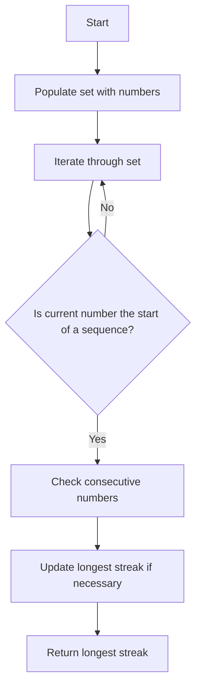

# Longest Consecutive Sequence std::unordered_set

## Problem Understanding
The problem is asking to find the length of the longest consecutive sequence in a given array of integers. The key constraint is that the sequence must be consecutive, meaning each number is one more than the previous number. What makes this problem non-trivial is that the input array is not guaranteed to be sorted, and there may be duplicate numbers. The problem requires an efficient solution that can handle large inputs, and a naive approach such as sorting the array first would not be efficient enough.

## Approach
The algorithm strategy is to use an `std::unordered_set` to store all numbers in the array for O(1) lookup. Then, for each number in the set, check if it is the start of a sequence by checking if `num - 1` is not in the set. If it is the start of a sequence, then check numbers that are consecutive to the current number and keep track of the length of the current sequence. The approach works by only considering each number as the start of a sequence if it is not part of a longer sequence, which avoids redundant work. The `std::unordered_set` is used for efficient lookup, and the algorithm handles the key constraint of finding consecutive sequences by checking neighboring numbers.

## Complexity Analysis
| Metric | Value | Detailed Reason |
|--------|-------|----------------|
| Time   | O(n)  | We perform a constant amount of work for each element in the set. The while loop inside the for loop may seem like it would increase the time complexity, but since each number is only visited once as the start of a sequence, the total number of operations is still proportional to the size of the input. |
| Space  | O(n)  | In the worst case, we store all elements in the set, which requires O(n) space. |

## Algorithm Walkthrough
```
Input: [100, 4, 200, 1, 3, 2]
Step 1: Populate the set with all numbers: {100, 4, 200, 1, 3, 2}
Step 2: Iterate through the set, for each number, check if it is the start of a sequence:
  - For 100, 100 - 1 = 99 is not in the set, but since 100 + 1 = 101 is not in the set, the sequence length is 1.
  - For 4, 4 - 1 = 3 is in the set, so it is not the start of a sequence.
  - For 200, 200 - 1 = 199 is not in the set, but since 200 + 1 = 201 is not in the set, the sequence length is 1.
  - For 1, 1 - 1 = 0 is not in the set, and 1 + 1 = 2, 2 + 1 = 3, and 3 + 1 = 4 are all in the set, so the sequence length is 4.
  - For 3, 3 - 1 = 2 is in the set, so it is not the start of a sequence.
  - For 2, 2 - 1 = 1 is in the set, so it is not the start of a sequence.
Step 3: Update the longest streak if the current sequence is longer. The longest streak is 4.
Output: 4
```

## Visual Flow


## Key Insight
> **Tip:** The key insight is to only consider each number as the start of a sequence if it is not part of a longer sequence, which avoids redundant work and allows for an efficient solution.

## Edge Cases
- **Empty/null input**: If the input array is empty, the function returns 0, as there are no sequences to consider.
- **Single element**: If the input array contains only one element, the function returns 1, as a single element is a sequence of length 1.
- **Duplicate numbers**: If the input array contains duplicate numbers, they are ignored when populating the set, as sets only store unique elements. This does not affect the correctness of the solution.

## Common Mistakes
- **Mistake 1**: Not checking if a number is the start of a sequence before checking its consecutive numbers. This would result in redundant work and incorrect results.
- **Mistake 2**: Not using an `std::unordered_set` for efficient lookup, which would increase the time complexity of the solution.

## Interview Follow-ups
> **Interview:** These are the exact follow-up questions interviewers ask:
- "What if the input is sorted?" → The solution would still work correctly, but it would be less efficient than a solution that takes advantage of the sorted input.
- "Can you do it in O(1) space?" → No, it is not possible to solve this problem in O(1) space, as we need to store all numbers in a data structure for efficient lookup.
- "What if there are duplicates?" → The solution ignores duplicates when populating the set, as sets only store unique elements. This does not affect the correctness of the solution.

## CPP Solution

```cpp
// Problem: Longest Consecutive Sequence std::unordered_set
// Language: C++
// Difficulty: Medium
// Time Complexity: O(n) — we perform a constant amount of work for each element in the set
// Space Complexity: O(n) — in the worst case, we store all elements in the set
// Approach: std::unordered_set lookup — for each number, check if its neighbors exist

class Solution {
public:
    int longestConsecutive(std::vector<int>& nums) {
        // Edge case: empty input → return 0
        if (nums.empty()) return 0;

        std::unordered_set<int> numSet; // store all numbers in a set for O(1) lookup
        for (int num : nums) { // populate the set
            numSet.insert(num); // add each number to the set
        }

        int longestStreak = 0; // track the longest consecutive sequence
        for (int num : numSet) {
            // if the current number is the start of a sequence (i.e., `num - 1` is not in the set)
            if (numSet.find(num - 1) == numSet.end()) {
                int currentNum = num; // start of the current sequence
                int currentStreak = 1; // length of the current sequence

                // check numbers that are consecutive to the current number
                while (numSet.find(currentNum + 1) != numSet.end()) {
                    currentNum += 1; // move to the next number in the sequence
                    currentStreak += 1; // increment the length of the current sequence
                }

                // update the longest streak if the current sequence is longer
                longestStreak = std::max(longestStreak, currentStreak);
            }
        }

        return longestStreak; // return the length of the longest consecutive sequence
    }
};
```
