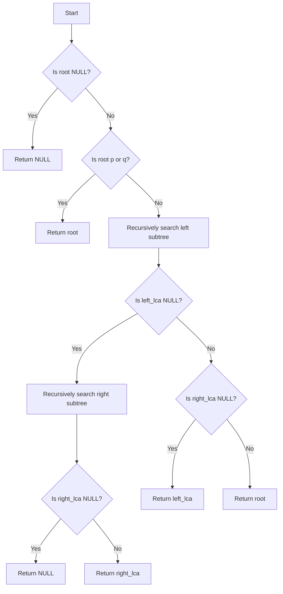

# Lowest Common Ancestor Binary Tree

## Problem Understanding
The problem is asking to find the lowest common ancestor (LCA) of two given nodes in a binary tree. The key constraint is that the tree is not guaranteed to be balanced, and the nodes can be anywhere in the tree. The problem becomes non-trivial because a naive approach would involve searching for the two nodes separately and then finding their common ancestor, which would result in a time complexity of O(n^2) in the worst case. However, we can take advantage of the tree structure to reduce the time complexity to O(n) by using a recursive approach.

## Approach
The algorithm strategy is to use recursive tree traversal to find the LCA of the two given nodes. The intuition behind this approach is that the LCA of two nodes is the node that is farthest from the root and is an ancestor of both nodes. We use a recursive function to traverse the tree, and for each node, we check if it is one of the target nodes or if it is the LCA of the two target nodes. We use a recursive call to search for the target nodes in the left and right subtrees, and based on the results, we determine whether the current node is the LCA or not. We use a recursive call stack to store the nodes to be visited, which has a space complexity of O(h), where h is the height of the tree.

## Complexity Analysis
| Metric | Value | Detailed Reason |
|--------|-------|----------------|
| Time   | O(n)  | The algorithm visits each node in the tree once, resulting in a time complexity of O(n), where n is the number of nodes in the tree. The recursive calls are made only when necessary, and the function returns as soon as it finds the LCA. |
| Space  | O(h)  | The space complexity is O(h), where h is the height of the tree, because of the recursive call stack. In the worst-case scenario, the tree is completely unbalanced, and the height of the tree is equal to the number of nodes, resulting in a space complexity of O(n). |

## Algorithm Walkthrough
```
Input: 
    root = [3,5,1,6,2,0,8,null,null,7,4]
    p = 5
    q = 1
Step 1: 
    Check if root is NULL: root is not NULL
    Check if root is p or q: root is not p or q
Step 2: 
    Recursively search for p and q in left subtree:
        left_lca = lowestCommonAncestor(root->left, p, q) 
        left subtree: [5,6,2,null,null,7,4]
        left_lca = 5 (found p in left subtree)
Step 3: 
    Recursively search for p and q in right subtree:
        right_lca = lowestCommonAncestor(root->right, p, q) 
        right subtree: [1,0,8]
        right_lca = 1 (found q in right subtree)
Step 4: 
    Since both target nodes are found in different subtrees, 
    the current node is the LCA: return root (which is 3)
Output: 
    The lowest common ancestor of p and q is 3
```
## Visual Flow

## Key Insight
> **Tip:** The key insight is to realize that the LCA of two nodes is the node that is farthest from the root and is an ancestor of both nodes, which can be found by recursively searching for the target nodes in the left and right subtrees.

## Edge Cases
- **Empty tree**: If the tree is empty (i.e., root is NULL), the function returns NULL.
- **Single node**: If the tree has only one node, and that node is one of the target nodes, the function returns that node. If the node is not one of the target nodes, the function returns NULL.
- **Unbalanced tree**: If the tree is unbalanced, the function still works correctly, but the time complexity may be closer to O(n) in the worst case.

## Common Mistakes
- **Not checking for NULL**: Not checking if the root or the left/right child is NULL before recursively calling the function can lead to a runtime error.
- **Not handling the case where both target nodes are in the same subtree**: If both target nodes are in the same subtree, the function should return the LCA of the two nodes in that subtree, rather than the current node.

## Interview Follow-ups
> **Interview:** These are the exact follow-up questions interviewers ask:
- "What if the input is sorted?" → The algorithm still works correctly, but the time complexity may be improved if the input is sorted.
- "Can you do it in O(1) space?" → No, it's not possible to find the LCA in O(1) space because we need to store the recursive call stack.
- "What if there are duplicates?" → The algorithm still works correctly, but we need to handle the case where the two target nodes are the same node.

## CPP Solution

```cpp
// Problem: Lowest Common Ancestor Binary Tree
// Language: C++
// Difficulty: Medium
// Time Complexity: O(n) — single pass through tree, where n is the number of nodes
// Space Complexity: O(h) — recursive call stack, where h is the height of the tree
// Approach: Recursive tree traversal — find LCA by traversing tree upwards from target nodes

/**
 * Definition for a binary tree node.
 * struct TreeNode {
 *     int val;
 *     TreeNode *left;
 *     TreeNode *right;
 *     TreeNode(int x) : val(x), left(NULL), right(NULL) {}
 * };
 */

class Solution {
public:
    TreeNode* lowestCommonAncestor(TreeNode* root, TreeNode* p, TreeNode* q) {
        // Edge case: empty tree → return NULL
        if (root == NULL) return NULL;

        // If current node is one of the target nodes, return it
        if (root == p || root == q) return root;

        // Recursively search for target nodes in left and right subtrees
        TreeNode* left_lca = lowestCommonAncestor(root->left, p, q);  // Find LCA in left subtree
        TreeNode* right_lca = lowestCommonAncestor(root->right, p, q);  // Find LCA in right subtree

        // If both target nodes are in different subtrees, current node is LCA
        if (left_lca && right_lca) return root;  // Both target nodes found in different subtrees

        // If both target nodes are in left subtree, LCA is in left subtree
        if (left_lca) return left_lca;  // Both target nodes found in left subtree

        // If both target nodes are in right subtree, LCA is in right subtree
        if (right_lca) return right_lca;  // Both target nodes found in right subtree

        // Edge case: target nodes not found in tree → return NULL
        return NULL;
    }
}
```
