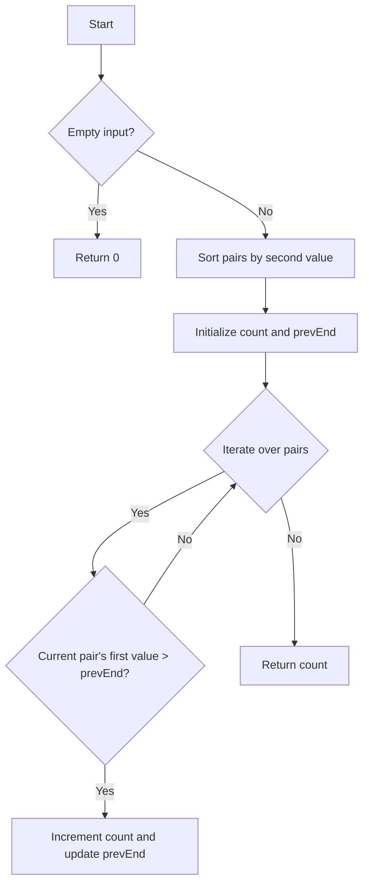

# Maximum Length of Pair Chain Greedy

## Problem Understanding
The problem is asking to find the maximum length of a pair chain from a given list of pairs, where a pair chain is defined as a sequence of pairs such that the first value of each pair is greater than the second value of the previous pair. The key constraint is that each pair can only be used once, and the pairs must be chosen in a way that maximizes the length of the chain. What makes this problem non-trivial is the need to find a greedy algorithm that can efficiently select the pairs in the correct order to form the longest chain.

## Approach
The algorithm strategy used here is a greedy approach, where we always choose the pair with the smallest second value that is greater than the previous pair's second value. This approach works because it ensures that we are always choosing the pair that will allow us to add the most pairs to the chain in the future. The pairs are sorted based on their second value, and then we iterate over the sorted pairs, checking if the current pair's first value is greater than the previous pair's second value. If it is, we increment the count and update the previous pair's end. The data structure used is a vector of vectors, where each inner vector represents a pair.

## Complexity Analysis
| Metric | Value | Detailed Reason |
|--------|-------|----------------|
| Time   | O(n log n) | The time complexity is O(n log n) due to the sorting operation, where n is the number of pairs. The subsequent for loop has a time complexity of O(n), but it is dominated by the sorting operation. |
| Space  | O(1) | The space complexity is O(1) because we are not using any additional data structures that scale with the input size. The sorting operation is done in-place, and we only use a constant amount of space to store the count and the previous pair's end. |

## Algorithm Walkthrough
```
Input: [[1,2],[2,3],[3,4]]
Step 1: Sort the pairs based on their second value: [[1,2],[2,3],[3,4]]
Step 2: Initialize the count and the previous pair's end: count = 1, prevEnd = 2
Step 3: Iterate over the sorted pairs:
  - i = 1: pairs[1][0] = 2, pairs[1][1] = 3, prevEnd = 2. Since 2 > 2 is false, count remains 1, prevEnd remains 2.
  - i = 2: pairs[2][0] = 3, pairs[2][1] = 4, prevEnd = 2. Since 3 > 2 is true, count = 2, prevEnd = 4.
Output: 2
```
This example illustrates how the algorithm works by sorting the pairs and then iterating over them to find the maximum length of the pair chain.

## Visual Flow

This flowchart shows the decision flow of the algorithm, including the handling of empty input and the iteration over the pairs.

## Key Insight
> **Tip:** The key to solving this problem is to realize that sorting the pairs by their second value allows us to efficiently find the maximum length of the pair chain by iterating over the sorted pairs and checking for the condition that the current pair's first value is greater than the previous pair's second value.

## Edge Cases
- **Empty/null input**: If the input is empty, the algorithm returns 0, which is the correct result because there are no pairs to form a chain.
- **Single element**: If there is only one pair, the algorithm returns 1, which is the correct result because a single pair is a chain of length 1.
- **Pairs with equal first and second values**: If there are pairs with equal first and second values, the algorithm will still work correctly because it only checks for the condition that the current pair's first value is greater than the previous pair's second value.

## Common Mistakes
- **Mistake 1**: Not sorting the pairs by their second value before iterating over them. This can lead to incorrect results because the algorithm relies on the pairs being sorted to find the maximum length of the pair chain.
- **Mistake 2**: Not checking for the condition that the current pair's first value is greater than the previous pair's second value. This can lead to incorrect results because the algorithm relies on this condition to determine whether to increment the count and update the previous pair's end.

## Interview Follow-ups
> **Interview:** These are the exact follow-up questions interviewers ask:
- "What if the input is sorted?" → The algorithm will still work correctly, but the time complexity will be O(n) because the sorting operation will not be necessary.
- "Can you do it in O(1) space?" → The algorithm already uses O(1) space, so this is not a problem.
- "What if there are duplicates?" → The algorithm will still work correctly, but it may not be the most efficient solution because it relies on the pairs being unique to find the maximum length of the pair chain.

## CPP Solution

```cpp
// Problem: Maximum Length of Pair Chain Greedy
// Language: cpp
// Difficulty: Medium
// Time Complexity: O(n log n) — sorting the pairs based on their second value
// Space Complexity: O(n) — storing the pairs in the vector
// Approach: Greedy algorithm — always choose the pair with the smallest second value that is greater than the previous pair's second value

class Solution {
public:
    int findLongestChain(vector<vector<int>>& pairs) {
        // Edge case: empty input → return 0
        if (pairs.empty()) return 0;

        // Sort the pairs based on their second value
        sort(pairs.begin(), pairs.end(), [](const vector<int>& a, const vector<int>& b) {
            // Sort in ascending order based on the second value of each pair
            return a[1] < b[1];
        });

        int count = 1; // Initialize the count of pairs in the chain
        int prevEnd = pairs[0][1]; // Initialize the end of the previous pair

        // Iterate over the sorted pairs
        for (int i = 1; i < pairs.size(); i++) {
            // Check if the current pair's first value is greater than the previous pair's second value
            if (pairs[i][0] > prevEnd) {
                // If it is, increment the count and update the previous pair's end
                count++;
                prevEnd = pairs[i][1]; // Update the previous pair's end
            }
        }

        return count; // Return the maximum length of the pair chain
    }
};
```
