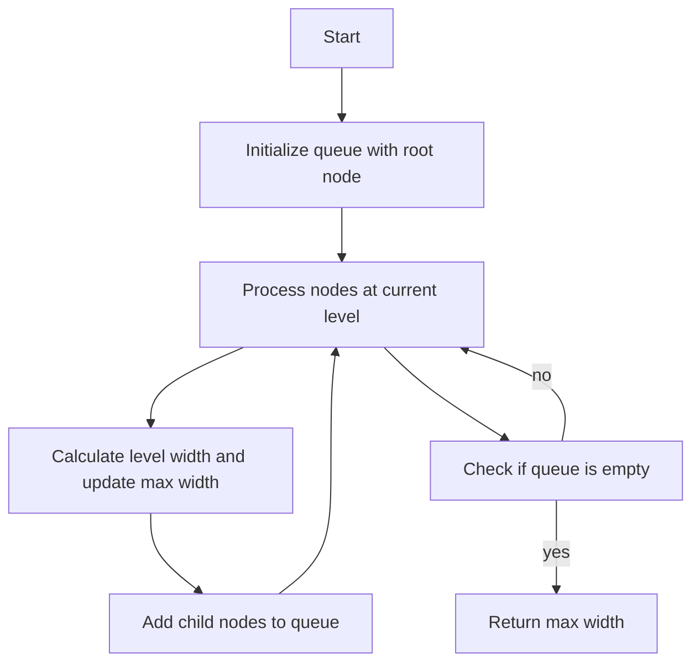

# Maximum Width of Binary Tree

## Problem Understanding
The problem asks to find the maximum width of a binary tree, where the width of a tree is defined as the maximum number of nodes at any level. The key constraint is that the tree can have any number of nodes, and the width is calculated based on the positions of the nodes at each level. What makes this problem non-trivial is that simply traversing the tree and counting the nodes at each level is not sufficient, as we need to consider the positions of the nodes to accurately calculate the width.

## Approach
The algorithm strategy used here is a level order traversal with a queue, where each node is stored along with its position. The intuition behind this approach is to calculate the width of the tree at each level by finding the difference between the positions of the rightmost and leftmost nodes at that level. This approach works because the positions of the nodes are calculated based on the positions of their parents, allowing us to accurately determine the width of the tree at each level. The queue data structure is used to store the nodes and their positions, and it is chosen because it allows for efficient processing of the nodes at each level.

## Complexity Analysis
| Metric | Value | Detailed Reason |
|--------|-------|----------------|
| Time   | O(n)  | The algorithm makes a single pass through the tree, visiting each node once and performing a constant amount of work for each node. The time complexity is therefore linear with respect to the number of nodes in the tree. |
| Space  | O(n)  | The queue stores at most n nodes, where n is the number of nodes in the tree. In the worst case, the queue will store all nodes at the last level of the tree, which can be up to n/2 nodes. However, since we drop constant factors in Big O notation, the space complexity is O(n). |

## Algorithm Walkthrough
```
Input: 
      1
     / \
    3   2
   / \   \
  5   3   9

Step 1: Initialize queue with root node and its position (0)
Queue: [(1, 0)]

Step 2: Process root node
Level width: 1
Max width: 1
Queue: [(3, 1), (2, 2)]

Step 3: Process nodes at level 1
Level width: 2
Max width: 2
Queue: [(5, 3), (3, 4), (9, 5)]

Step 4: Process nodes at level 2
Level width: 3
Max width: 3
Queue: []

Output: 3
```
This walkthrough demonstrates how the algorithm calculates the width of the tree at each level and updates the maximum width accordingly.

## Visual Flow

This flowchart illustrates the main steps of the algorithm and the decision flow between them.

## Key Insight
> **Tip:** The key insight is to use the position of each node to calculate the width of the tree at each level, rather than simply counting the number of nodes.

## Edge Cases
- **Empty/null input**: If the input tree is empty, the algorithm returns 0, as there are no nodes to process.
- **Single element**: If the input tree has only one node, the algorithm returns 1, as the width of a tree with a single node is 1.
- **Unbalanced tree**: If the input tree is highly unbalanced, the algorithm may still return the correct maximum width, as it calculates the width of the tree at each level based on the positions of the nodes.

## Common Mistakes
- **Mistake 1**: Forgetting to update the max width when processing each level. To avoid this, make sure to update the max width whenever a new level is processed.
- **Mistake 2**: Not calculating the positions of the child nodes correctly. To avoid this, make sure to use the correct formula to calculate the positions of the child nodes based on the positions of their parents.

## Interview Follow-ups
> **Interview:** These are the exact follow-up questions interviewers ask:
- "What if the input is sorted?" → The algorithm still works correctly, as it calculates the width of the tree based on the positions of the nodes, rather than the values of the nodes.
- "Can you do it in O(1) space?" → No, it is not possible to solve this problem in O(1) space, as we need to store the nodes and their positions in a queue to calculate the width of the tree.
- "What if there are duplicates?" → The algorithm still works correctly, as it calculates the width of the tree based on the positions of the nodes, rather than the values of the nodes.

## CPP Solution

```cpp
// Problem: Maximum Width of Binary Tree
// Language: C++
// Difficulty: Medium
// Time Complexity: O(n) — single pass through tree using level order traversal
// Space Complexity: O(n) — queue stores at most n nodes
// Approach: Level order traversal with queue — for each level, calculate the width

/**
 * Definition for a binary tree node.
 * struct TreeNode {
 *     int val;
 *     TreeNode *left;
 *     TreeNode *right;
 *     TreeNode() : val(0), left(nullptr), right(nullptr) {}
 *     TreeNode(int x) : val(x), left(nullptr), right(nullptr) {}
 *     TreeNode(int x, TreeNode *left, TreeNode *right) : val(x), left(left), right(right) {}
 * };
 */
class Solution {
public:
    int widthOfBinaryTree(TreeNode* root) {
        // Edge case: empty tree → return 0
        if (!root) return 0;
        
        // Initialize queue with root node and its position (0)
        std::queue<std::pair<TreeNode*, unsigned long long>> queue;
        queue.push({root, 0});
        
        unsigned long long maxWidth = 0; // Store the maximum width
        
        while (!queue.empty()) {
            // Calculate the width of the current level
            unsigned long long levelWidth = queue.back().second - queue.front().second + 1;
            maxWidth = std::max(maxWidth, levelWidth); // Update maxWidth if necessary
            
            // Process all nodes at the current level
            int size = queue.size();
            for (int i = 0; i < size; i++) {
                auto [node, position] = queue.front();
                queue.pop();
                
                // Calculate the position of the left child (2 * position + 1)
                // and add it to the queue if it exists
                if (node->left) queue.push({node->left, 2 * position + 1});
                
                // Calculate the position of the right child (2 * position + 2)
                // and add it to the queue if it exists
                if (node->right) queue.push({node->right, 2 * position + 2});
            }
        }
        
        return maxWidth;
    }
}
```
