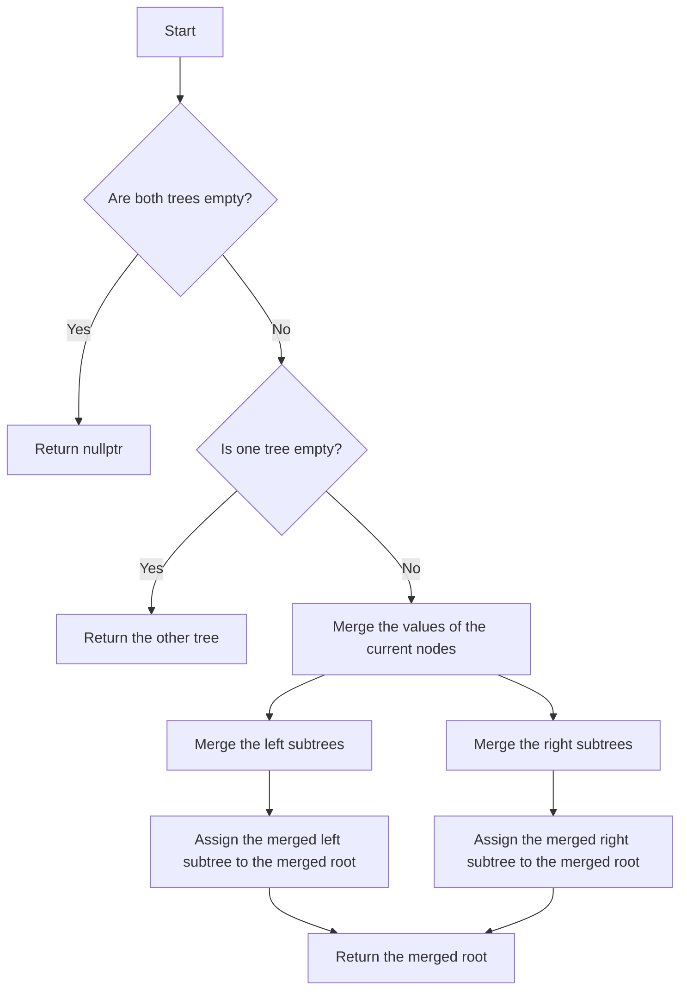

# Merge Two Binary Trees DFS

## Problem Understanding
The problem is asking to merge two binary trees using depth-first search (DFS) traversal. The key constraint is that the trees should be merged in a way that the values of the corresponding nodes are added together. If one tree is empty, the other tree should be returned. The problem is non-trivial because a naive approach might try to merge the trees level by level, which would require extra space to store the levels, or it might try to merge the trees recursively without handling the edge cases properly.

## Approach
The algorithm strategy is to use recursive depth-first search to traverse both trees simultaneously. The intuition behind this approach is that DFS allows us to visit each node in both trees once, and we can merge the corresponding nodes by adding their values. We use a recursive function to merge the trees, which takes two tree nodes as input and returns the merged node. The function first checks for edge cases, such as if both trees are empty or if one tree is empty. If neither tree is empty, it merges the values of the current nodes and recursively merges the left and right subtrees.

## Complexity Analysis
| Metric | Value | Detailed Reason |
|--------|-------|----------------|
| Time   | O(n)  | The time complexity is O(n), where n is the total number of nodes in both trees. This is because we visit each node once during the DFS traversal. The recursive function calls are proportional to the number of nodes, and each node is visited once. |
| Space  | O(n)  | The space complexity is O(n), where n is the total number of nodes in both trees. This is because in the worst case, the recursion stack can grow up to the height of the tree, which can be n for an unbalanced tree. |

## Algorithm Walkthrough
```
Input: 
    Tree1:      1
             /   \
            3     2
           / \
          5   4

    Tree2:     2
             /   \
            1     3
           / \
          6   7

Step 1: 
    Merge the roots: 1 + 2 = 3
    mergedRoot = new TreeNode(3)

Step 2: 
    Merge the left subtrees:
        Merge the roots: 3 + 1 = 4
        mergedLeft = new TreeNode(4)
        mergedLeft->left = mergeTrees(5, 6) = new TreeNode(11)
        mergedLeft->right = mergeTrees(4, 7) = new TreeNode(11)

Step 3: 
    Merge the right subtrees:
        Merge the roots: 2 + 3 = 5
        mergedRight = new TreeNode(5)

Step 4: 
    Assign the merged left and right subtrees to the merged root:
    mergedRoot->left = mergedLeft
    mergedRoot->right = mergedRight

Output: 
    Merged Tree:    3
                 /   \
                4     5
               / \
              11   11
```

## Visual Flow


## Key Insight
> **Tip:** The key insight is to use recursive depth-first search to traverse both trees simultaneously, merging the corresponding nodes by adding their values, and handling edge cases properly.

## Edge Cases
- **Empty/null input**: If both trees are empty, the function returns nullptr. This is because there are no nodes to merge, and the result is an empty tree.
- **Single element**: If one tree has only one node, the function merges it with the corresponding node in the other tree. If the other tree is empty, the function returns the single node.
- **Unbalanced trees**: If the trees are unbalanced, the function still works correctly, but the recursion stack can grow up to the height of the tree, which can be n for an unbalanced tree.

## Common Mistakes
- **Mistake 1**: Not handling edge cases properly. To avoid this, always check for edge cases, such as empty trees or single nodes, and handle them correctly.
- **Mistake 2**: Not merging the left and right subtrees correctly. To avoid this, use recursive function calls to merge the subtrees, and assign the merged subtrees to the merged root correctly.

## Interview Follow-ups
> **Interview:** These are the exact follow-up questions interviewers ask:
- "What if the input is sorted?" → The algorithm still works correctly, but the time complexity remains O(n), where n is the total number of nodes in both trees.
- "Can you do it in O(1) space?" → No, because we need to store the recursion stack, which can grow up to the height of the tree, which can be n for an unbalanced tree.
- "What if there are duplicates?" → The algorithm still works correctly, and duplicates are merged correctly by adding their values.

## CPP Solution

```cpp
// Problem: Merge Two Binary Trees DFS
// Language: C++
// Difficulty: Medium
// Time Complexity: O(n) — DFS traversal visits each node once
// Space Complexity: O(n) — recursion stack in the worst case (unbalanced tree)
// Approach: Recursive depth-first search — merge corresponding nodes from both trees

/**
 * Definition for a binary tree node.
 * struct TreeNode {
 *     int val;
 *     TreeNode *left;
 *     TreeNode *right;
 *     TreeNode() : val(0), left(nullptr), right(nullptr) {}
 *     TreeNode(int x) : val(x), left(nullptr), right(nullptr) {}
 *     TreeNode(int x, TreeNode *left, TreeNode *right) : val(x), left(left), right(right) {}
 * };
 */

class Solution {
public:
    // Merge two binary trees using DFS
    TreeNode* mergeTrees(TreeNode* root1, TreeNode* root2) {
        // Edge case: if both trees are empty, return nullptr
        if (root1 == nullptr && root2 == nullptr) return nullptr;
        
        // Edge case: if one tree is empty, return the other tree
        if (root1 == nullptr) return root2; // return root2 as it's not empty
        if (root2 == nullptr) return root1; // return root1 as it's not empty
        
        // Merge the values of the current nodes
        TreeNode* mergedRoot = new TreeNode(root1->val + root2->val);
        
        // Recursively merge the left and right subtrees
        mergedRoot->left = mergeTrees(root1->left, root2->left); // merge left subtrees
        mergedRoot->right = mergeTrees(root1->right, root2->right); // merge right subtrees
        
        return mergedRoot;
    }
};
```
