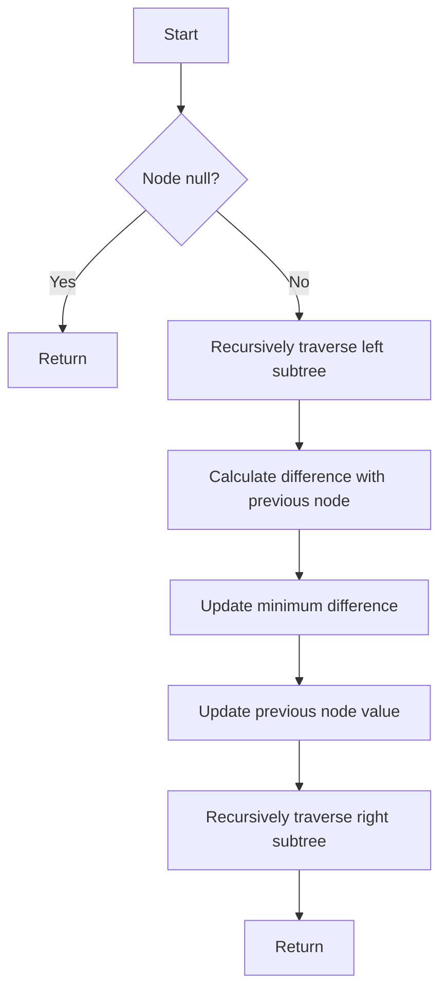

# Minimum Distance Between BST Nodes Inorder II

## Problem Understanding
The problem is asking to find the minimum distance between two nodes in a binary search tree (BST) when traversed in inorder. The key constraint is that the tree is a BST, which means that for any given node, all elements in its left subtree are less than the node, and all elements in its right subtree are greater than the node. This property allows us to use an inorder traversal to get the nodes in sorted order, which makes calculating the minimum distance between nodes straightforward. The problem becomes non-trivial because a naive approach, such as comparing every pair of nodes, would result in a time complexity of O(n^2), where n is the number of nodes in the tree.

## Approach
The algorithm strategy is to use an inorder traversal to get the nodes in sorted order and then calculate the differences between consecutive nodes. This approach works because the inorder traversal of a BST yields the nodes in ascending order. We use a recursive helper function to perform the inorder traversal, and during this traversal, we keep track of the minimum difference found so far and the value of the previous node. We use references to pass these values to the recursive function calls, which allows us to modify them in place. The space complexity is O(h), where h is the height of the tree, due to the recursion stack.

## Complexity Analysis
| Metric | Value | Detailed Reason |
|--------|-------|----------------|
| Time   | O(n)  | We perform a single pass through the tree using inorder traversal, visiting each node exactly once. The time complexity is linear with respect to the number of nodes in the tree. |
| Space  | O(h)  | The space complexity is determined by the maximum depth of the recursion stack, which is equal to the height of the tree. In the worst-case scenario (an unbalanced tree), h = n, but for a balanced BST, h = log(n). |

## Algorithm Walkthrough
```
Input: 
     4
   /   \
  2     6
 / \   / \
1   3 5   7

Step 1: Initialize minDiff = INT_MAX, prevVal = -1
Step 2: Inorder traversal:
  - Visit node 1: minDiff = INT_MAX, prevVal = -1
  - Visit node 2: minDiff = min(INT_MAX, 2-1) = 1, prevVal = 1
  - Visit node 3: minDiff = min(1, 3-2) = 1, prevVal = 2
  - Visit node 4: minDiff = min(1, 4-3) = 1, prevVal = 3
  - Visit node 5: minDiff = min(1, 5-4) = 1, prevVal = 4
  - Visit node 6: minDiff = min(1, 6-5) = 1, prevVal = 5
  - Visit node 7: minDiff = min(1, 7-6) = 1, prevVal = 6
Output: minDiff = 1
```

## Visual Flow


## Key Insight
> **Tip:** The key insight here is that inorder traversal of a BST yields the nodes in ascending order, allowing us to efficiently calculate the minimum distance between nodes by keeping track of the previous node value and updating the minimum difference as we traverse the tree.

## Edge Cases
- **Empty tree**: If the input tree is empty (i.e., the root is null), the function will return INT_MAX because no nodes are visited during the traversal.
- **Single node**: If the tree consists of a single node, the function will return INT_MAX because there are no pairs of nodes to calculate the difference between.
- **Unbalanced tree**: If the input tree is highly unbalanced (e.g., each node has only a left child), the space complexity due to the recursion stack can be O(n), where n is the number of nodes in the tree.

## Common Mistakes
- **Mistake 1: Not initializing minDiff with INT_MAX**: This can lead to incorrect results if the minimum difference between nodes is larger than the initial value of minDiff. To avoid this, ensure that minDiff is initialized with the maximum possible integer value.
- **Mistake 2: Not checking for the first node in the traversal**: If we don't check if prevVal is -1 before calculating the difference, we might end up using an invalid previous value, leading to incorrect results. Always verify that prevVal is valid before calculating the difference.

## Interview Follow-ups
> **Interview:** 
- "What if the input is sorted?" → The algorithm still works correctly because it relies on the properties of a BST, not the input being sorted. However, if the input is already sorted, a simpler approach might be applicable.
- "Can you do it in O(1) space?" → No, achieving O(1) space complexity is not possible with this approach because we need to keep track of the previous node value and the minimum difference, which requires additional space. However, for a balanced BST, the space complexity is O(log n), which might be considered close to O(1) for very large inputs.
- "What if there are duplicates?" → The algorithm will still work correctly and return the minimum distance between any two nodes, including duplicates. If the problem statement requires handling duplicates differently, additional modifications might be necessary.

## CPP Solution

```cpp
// Problem: Minimum Distance Between BST Nodes Inorder II
// Language: cpp
// Difficulty: medium
// Time Complexity: O(n) — single pass through tree using inorder traversal
// Space Complexity: O(h) — space used by recursion stack, where h is height of tree
// Approach: Inorder traversal — to get nodes in sorted order and calculate distances

/**
 * Definition for a binary tree node.
 * struct TreeNode {
 *     int val;
 *     TreeNode *left;
 *     TreeNode *right;
 *     TreeNode() : val(0), left(nullptr), right(nullptr) {}
 *     TreeNode(int x) : val(x), left(nullptr), right(nullptr) {}
 *     TreeNode(int x, TreeNode *left, TreeNode *right) : val(x), left(left), right(right) {}
 * };
 */
class Solution {
public:
    int minDiffInBST(TreeNode* root) {
        // Initialize minimum difference and previous node value
        int minDiff = INT_MAX; // Initialize with max value
        int prevVal = -1; // Initialize with invalid value

        // Perform inorder traversal to get nodes in sorted order
        inorderTraversal(root, minDiff, prevVal);
        
        return minDiff;
    }

    // Helper function for inorder traversal
    void inorderTraversal(TreeNode* node, int& minDiff, int& prevVal) {
        // Base case: if node is null, return
        if (node == nullptr) return;

        // Recursively traverse left subtree
        inorderTraversal(node->left, minDiff, prevVal);

        // If this is not the first node, update minimum difference
        if (prevVal != -1) { // Check if previous value is valid
            // Update minimum difference
            minDiff = min(minDiff, node->val - prevVal); // Calculate difference
        }

        // Update previous node value
        prevVal = node->val; // Update previous value

        // Recursively traverse right subtree
        inorderTraversal(node->right, minDiff, prevVal);
    }
};
```
