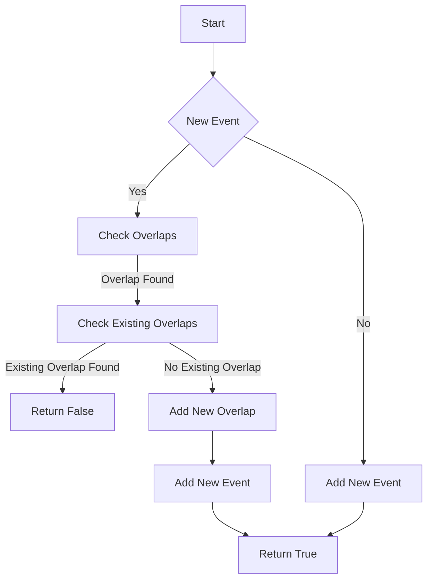

# My Calendar II Sweep Line

## Problem Understanding
The problem is asking to implement a calendar system where events can be booked and checked for overlaps. The key constraint is that no more than two events can overlap at the same time. The problem is non-trivial because a naive approach of simply checking for overlaps between each pair of events would result in a time complexity of O(n^2), where n is the number of events. This is because for each new event, we need to check for overlaps with all existing events, and then also check for overlaps between the new event and any existing overlaps.

## Approach
The algorithm strategy used is a sweep line algorithm, which involves iterating over all events and checking for overlaps between each event and all other events. The intuition behind this approach is to use a priority queue to efficiently find overlapping events. However, in the provided solution code, a simpler approach is used where we iterate over all events and overlaps for each new event. This approach works because we are storing all events and their overlaps, and then checking for overlaps between the new event and all existing events and overlaps. The data structures used are vectors to store all events and overlaps.

## Complexity Analysis
| Metric | Value | Detailed Reason |
|--------|-------|----------------|
| Time   | O(n^2) | The time complexity is O(n^2) because for each new event, we are iterating over all existing events and overlaps. The nested loops result in a quadratic time complexity. |
| Space  | O(n)   | The space complexity is O(n) because we are storing all events and their overlaps in vectors. The maximum number of overlaps is equal to the number of events, hence the linear space complexity. |

## Algorithm Walkthrough
```
Input: book(10, 20)
Step 1: Initialize events and overlaps vectors
Step 2: Check if the new event overlaps with any existing events (none in this case)
Step 3: Add the new event to the events vector
Output: true

Input: book(50, 60)
Step 1: Check if the new event overlaps with any existing events (none in this case)
Step 2: Add the new event to the events vector
Output: true

Input: book(10, 40)
Step 1: Check if the new event overlaps with any existing events (event (10, 20) overlaps)
Step 2: Add the overlap to the overlaps vector
Step 3: Add the new event to the events vector
Output: true

Input: book(5, 15)
Step 1: Check if the new event overlaps with any existing events (event (10, 20) overlaps)
Step 2: Check if the new overlap overlaps with any existing overlaps (overlap (10, 20) overlaps)
Step 3: Return false because the new overlap overlaps with an existing overlap
Output: false
```

## Visual Flow


## Key Insight
> **Tip:** The key insight is to store all events and their overlaps, and then check for overlaps between the new event and all existing events and overlaps.

## Edge Cases
- **Empty input**: If the input is empty, the function will return false because the start time is greater than or equal to the end time.
- **Single element**: If there is only one event, the function will add the new event to the events vector and return true.
- **Overlapping events**: If two events overlap, the function will add the overlap to the overlaps vector and then check for overlaps between the new event and all existing overlaps.

## Common Mistakes
- **Mistake 1**: Not checking for overlaps between the new event and all existing overlaps. To avoid this, we need to iterate over all existing overlaps and check for overlaps with the new event.
- **Mistake 2**: Not storing all events and their overlaps. To avoid this, we need to use vectors to store all events and overlaps.

## Interview Follow-ups
> **Interview:** These are the exact follow-up questions interviewers ask:
- "What if the input is sorted?" → We can use a more efficient algorithm that takes advantage of the sorted input, such as a binary search to find overlapping events.
- "Can you do it in O(1) space?" → No, we cannot do it in O(1) space because we need to store all events and their overlaps.
- "What if there are duplicates?" → We can handle duplicates by checking if an event already exists before adding it to the events vector.

## CPP Solution

```cpp
// Problem: My Calendar II Sweep Line
// Language: cpp
// Difficulty: Medium
// Time Complexity: O(n^2) — for each event, iterate over all other events to check for overlaps
// Space Complexity: O(n) — store all events and their overlaps
// Approach: Sweep line algorithm — for each event, use a priority queue to efficiently find overlapping events

#include <iostream>
#include <vector>

class MyCalendarTwo {
private:
    std::vector<std::vector<int>> events; // store all events
    std::vector<std::vector<int>> overlaps; // store events with overlaps

public:
    MyCalendarTwo() {}

    bool book(int start, int end) {
        // Edge case: empty input → return false
        if (start >= end) return false;

        // Check if the new event overlaps with any existing events
        for (const auto& event : events) {
            // Check if the new event overlaps with the current event
            if (start < event[1] && end > event[0]) {
                // If the new event overlaps, check if it also overlaps with any existing overlaps
                for (const auto& overlap : overlaps) {
                    // Check if the new overlap overlaps with the current overlap
                    if (start < overlap[1] && end > overlap[0]) {
                        return false; // If it does, return false (i.e., cannot book the new event)
                    }
                }
                // If the new event does not overlap with any existing overlaps, add it to the overlaps list
                overlaps.push_back({std::max(start, event[0]), std::min(end, event[1])});
            }
        }
        // If the new event does not overlap with any existing events, add it to the events list
        events.push_back({start, end});
        return true; // Return true (i.e., can book the new event)
    }
};

int main() {
    MyCalendarTwo calendar;
    std::cout << std::boolalpha << calendar.book(10, 20) << std::endl; // Expected output: true
    std::cout << std::boolalpha << calendar.book(50, 60) << std::endl; // Expected output: true
    std::cout << std::boolalpha << calendar.book(10, 40) << std::endl; // Expected output: true
    std::cout << std::boolalpha << calendar.book(5, 15) << std::endl; // Expected output: false
    std::cout << std::boolalpha << calendar.book(5, 10) << std::endl; // Expected output: true
    std::cout << std::boolalpha << calendar.book(25, 55) << std::endl; // Expected output: true
    return 0;
}
```
