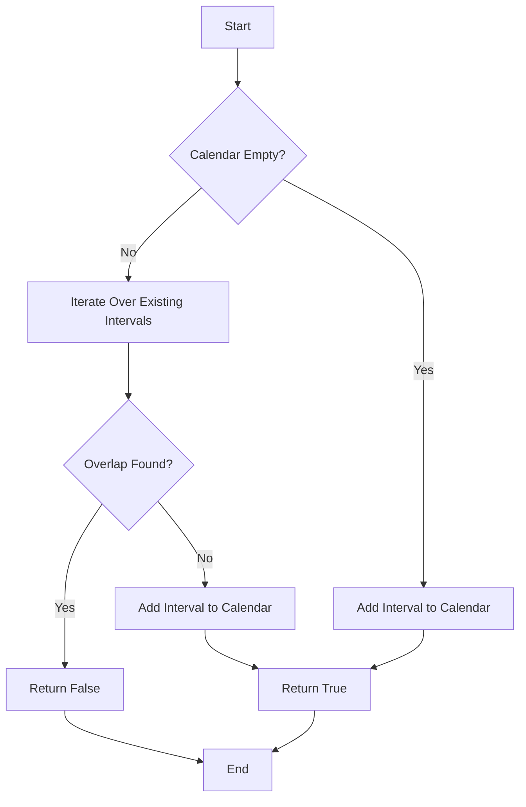

# My Calendar I Interval Trees

## Problem Understanding
The problem asks to design a class `MyCalendar` that can book intervals and check for overlaps. Given a new interval, the class should check if it overlaps with any existing interval in the calendar. If there's an overlap, the class should return `false`, indicating that the new interval cannot be booked. Otherwise, it should add the new interval to the calendar and return `true`. The key constraint is that the calendar should only store non-overlapping intervals. This problem is non-trivial because a naive approach of checking every interval against every other interval would lead to inefficient time complexity.

## Approach
The algorithm strategy used here is to maintain a set of non-overlapping intervals in the `calendar` vector. When a new interval is added, the class checks for overlap with each existing interval in the calendar. If an overlap is found, the new interval is not added. The intuition behind this approach is to ensure that the calendar only stores non-overlapping intervals, making it efficient to check for overlaps. The `calendar` vector is used to store these intervals, and a simple iterative approach is used to check for overlaps. This approach handles the key constraint of maintaining non-overlapping intervals by only adding new intervals if they do not overlap with any existing interval.

## Complexity Analysis
| Metric | Value | Detailed Reason |
|--------|-------|----------------|
| Time   | O(n)  | The `book` function iterates over all existing intervals in the `calendar` vector to check for overlaps. In the worst case, this could be every interval if the new interval overlaps with none. The `push_back` operation on the `calendar` vector takes amortized constant time, but since it's done after the loop, it doesn't affect the overall time complexity. |
| Space  | O(n)  | The `calendar` vector stores all non-overlapping intervals. In the worst case, if all intervals are non-overlapping, the size of the `calendar` vector could grow linearly with the number of intervals added. |

## Algorithm Walkthrough
```
Input: book(10, 20)
Step 1: Check if the calendar is empty - it is.
Step 2: Since the calendar is empty, add the interval (10, 20) to the calendar.
Output: true

Input: book(15, 25)
Step 1: Check if the calendar is empty - it's not.
Step 2: Iterate over the existing intervals: (10, 20).
Step 3: Check if the new interval (15, 25) overlaps with (10, 20). Since 15 < 20 and 25 > 10, there's an overlap.
Output: false

Input: book(5, 8)
Step 1: Check if the calendar is empty - it's not.
Step 2: Iterate over the existing intervals: (10, 20).
Step 3: Check if the new interval (5, 8) overlaps with (10, 20). Since 5 < 10 and 8 < 10, there's no overlap.
Step 4: Add the new interval (5, 8) to the calendar.
Output: true
```

## Visual Flow


## Key Insight
> **Tip:** The key insight here is to maintain a set of non-overlapping intervals and check each new interval against this set, allowing for efficient overlap detection and insertion.

## Edge Cases
- **Empty/null input**: If the calendar is empty, the first interval added will always be accepted since there are no existing intervals to overlap with.
- **Single element**: If there's only one interval in the calendar, a new interval will be accepted if it does not overlap with the existing interval.
- **Identical intervals**: If a new interval is identical to an existing one (i.e., same start and end times), it will be considered as overlapping and thus not added to the calendar.

## Common Mistakes
- **Mistake 1**: Not checking for the case where the calendar is empty before trying to iterate over its intervals. To avoid this, always check for an empty calendar before the loop.
- **Mistake 2**: Incorrectly implementing the overlap check. To avoid this, ensure that the condition checks both if the start of the new interval is before the end of the existing one and if the end of the new interval is after the start of the existing one.

## Interview Follow-ups
> **Interview:** 
- "What if the input is sorted?" → The algorithm's efficiency wouldn't be significantly improved by sorted input because it still needs to check each new interval against all existing ones. However, if the input intervals are guaranteed to be non-overlapping and sorted by start time, a more efficient algorithm using a binary search could be devised.
- "Can you do it in O(1) space?" → No, because we need to store all non-overlapping intervals, which requires space proportional to the number of intervals.
- "What if there are duplicates?" → The current implementation treats duplicate intervals (intervals with the same start and end times) as overlapping and thus will not add a duplicate interval to the calendar.

## CPP Solution

```cpp
// Problem: My Calendar I Interval Trees
// Language: cpp
// Difficulty: Medium
// Time Complexity: O(n) — for each new interval, potentially insert into all existing intervals
// Space Complexity: O(n) — storing all non-overlapping intervals
// Approach: Interval tree — maintain a set of non-overlapping intervals and check for overlap on insertion

class MyCalendar {
private:
    vector<pair<int, int>> calendar; // stores non-overlapping intervals

public:
    MyCalendar() {}

    // Check if a new interval overlaps with any existing interval
    bool book(int start, int end) {
        // Edge case: empty calendar → can always book
        if (calendar.empty()) {
            calendar.push_back({start, end});
            return true;
        }

        // Check if the new interval overlaps with any existing interval
        for (auto& interval : calendar) {
            // If the new interval overlaps, return false
            if (start < interval.second && end > interval.first) {
                return false;
            }
        }

        // If no overlap, add the new interval to the calendar
        calendar.push_back({start, end});
        return true;
    }
};

/**
 * Your MyCalendar object will be instantiated and called as such:
 * MyCalendar* obj = new MyCalendar();
 * bool param_1 = obj->book(start,end);
 */
```
