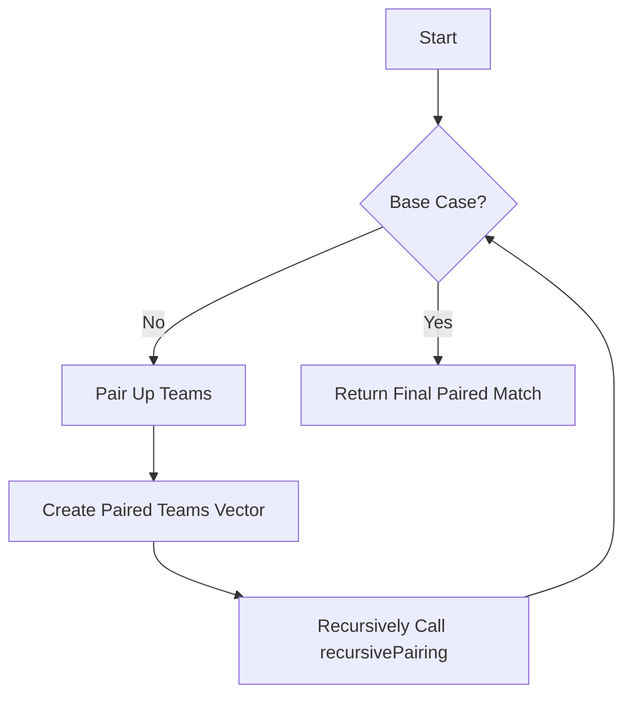

# Output Contest Matches Recursion

## Problem Understanding
The problem is asking to output the final contest matches in a tournament with n teams, where each match is represented as a pair of teams. The key constraint is that the teams are paired up from the ends towards the center in each round. What makes this problem non-trivial is that the pairing process is recursive, and the number of teams decreases by half in each round. The naive approach of manually pairing up teams in each round would be cumbersome and prone to errors, especially for large values of n.

## Approach
The algorithm strategy used here is recursion, where the teams are paired up from the ends towards the center in each round. The intuition behind this approach is that the pairing process can be broken down into smaller sub-problems, where each sub-problem is a smaller tournament with half the number of teams. The recursive helper function `recursivePairing` takes a vector of strings representing the teams and returns the final paired match. The vector is used to store the teams and the paired teams in each round. The approach handles the key constraint by pairing up teams from the ends towards the center in each round.

## Complexity Analysis
| Metric | Value | Detailed Reason |
|--------|-------|----------------|
| Time   | O(n)  | The algorithm makes a single pass through the teams to recursively pair them up, where n is the number of teams. The recursive function calls are made n times, and each call takes constant time to pair up two teams. |
| Space  | O(n)  | The space complexity is O(n) due to the recursive call stack, where n is the number of teams. In the worst case, the recursive call stack can grow up to n levels deep. |

## Algorithm Walkthrough
```
Input: n = 4
Step 1: Initialize teams vector with strings "1", "2", "3", "4"
Step 2: Call recursivePairing function with teams vector
Step 3: In recursivePairing function, pair up teams from ends towards center: "(1,4)" and "(2,3)"
Step 4: Recursively call recursivePairing function with paired teams vector
Step 5: In recursivePairing function, pair up paired teams from ends towards center: "((1,4),(2,3))"
Output: "((1,4),(2,3))"
```
This example illustrates how the algorithm pairs up teams from the ends towards the center in each round.

## Visual Flow

This flowchart shows the decision flow of the algorithm, where the base case is when there is only one team left.

## Key Insight
> **Tip:** The key insight is to recognize that the pairing process can be broken down into smaller sub-problems, where each sub-problem is a smaller tournament with half the number of teams.

## Edge Cases
- **Empty input**: If the input n is 0, the algorithm will not pair up any teams and will return an empty string. This is because the base case of the recursive function is when there is only one team left, and if there are no teams, the function will not be called.
- **Single team**: If the input n is 1, the algorithm will return the single team itself, as there are no other teams to pair up with. This is handled by the base case of the recursive function.
- **Even number of teams**: If the input n is an even number, the algorithm will pair up all teams correctly, as the pairing process is designed to handle even numbers of teams. For example, if n = 4, the algorithm will pair up teams as "(1,4)" and "(2,3)".

## Common Mistakes
- **Mistake 1**: Not handling the base case correctly, where there is only one team left. To avoid this, make sure to check for the base case at the beginning of the recursive function and return the correct result.
- **Mistake 2**: Not pairing up teams correctly from the ends towards the center. To avoid this, make sure to use a loop to pair up teams from the ends towards the center, and use a vector to store the paired teams.

## Interview Follow-ups
> **Interview:** These are the exact follow-up questions interviewers ask:
- "What if the input is sorted?" → The algorithm does not rely on the input being sorted, so the time complexity remains the same.
- "Can you do it in O(1) space?" → No, the algorithm requires O(n) space to store the recursive call stack, so it is not possible to do it in O(1) space.
- "What if there are duplicates?" → The algorithm assumes that the input teams are unique, so duplicates are not handled. However, it would be possible to modify the algorithm to handle duplicates by using a set to store the teams instead of a vector.

## CPP Solution

```cpp
// Problem: Output Contest Matches Recursion
// Language: C++
// Difficulty: Medium
// Time Complexity: O(n) — single pass through teams to recursively pair them up
// Space Complexity: O(n) — recursive call stack in the worst case
// Approach: Recursion — recursively pair up teams from the ends towards the center

class Solution {
public:
    string findContestMatch(int n) {
        // Initialize a vector to store the teams
        vector<string> teams(n);
        for (int i = 1; i <= n; i++) {
            // Initialize each team as a string with its number
            teams[i - 1] = to_string(i);
        }
        
        // Call the recursive helper function to pair up teams
        return recursivePairing(teams);
    }

private:
    string recursivePairing(vector<string>& teams) {
        // Base case: if there's only one team, return it
        if (teams.size() == 1) {
            // Edge case: single team → return the team itself
            return teams[0];
        }

        // Initialize a vector to store the paired teams
        vector<string> pairedTeams;
        
        // Pair up teams from the ends towards the center
        for (int i = 0; i < teams.size() / 2; i++) {
            // Create a string to represent the paired teams
            string pairedTeam = "(" + teams[i] + "," + teams[teams.size() - 1 - i] + ")";
            pairedTeams.push_back(pairedTeam);
        }

        // Recursively pair up the paired teams
        return recursivePairing(pairedTeams);
    }
};
```
