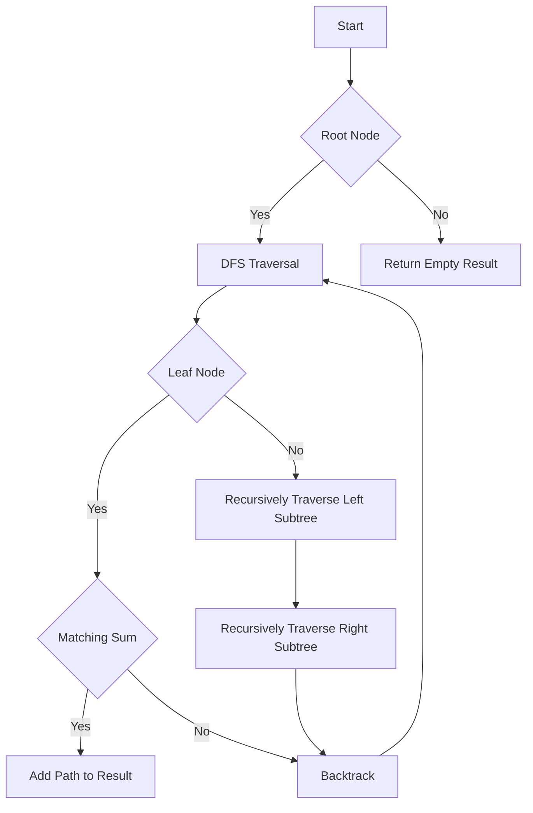

# Path Sum II DFS Backtracking

## Problem Understanding
The problem asks to find all root-to-leaf paths in a binary tree where the sum of the node values equals a given target sum. The key constraint is that the path must start at the root and end at a leaf node, and the sum of the node values along the path must match the target sum. This problem is non-trivial because a naive approach would involve checking all possible paths, resulting in exponential time complexity. The problem requires an efficient algorithm to explore all possible paths without redundant calculations.

## Approach
The algorithm strategy used is Depth-First Search (DFS) with backtracking, which explores all possible paths from the root to the leaf nodes. This approach works by maintaining a running sum of the node values along the current path and checking if the sum matches the target sum when a leaf node is reached. The algorithm uses a recursive helper function to traverse the tree, and a vector to store the current path and the result. The choice of DFS with backtracking is suitable because it allows for efficient exploration of all possible paths without redundant calculations.

## Complexity Analysis
| Metric | Value | Detailed Reason |
|--------|-------|----------------|
| Time   | O(n)  | The algorithm visits each node once in the worst case, resulting in a linear time complexity. The recursive calls to the helper function also contribute to the time complexity, but the overall time complexity remains O(n) because each node is visited once. |
| Space  | O(n)  | The maximum depth of the recursion tree is n, where n is the number of nodes in the tree. The algorithm also uses a vector to store the current path and the result, which can grow up to a maximum size of n in the worst case. |

## Algorithm Walkthrough
```
Input: 
        5
       / \
      4   8
     /   / \
    11  13  4
   / \      / \
  7   2    5   1
Target Sum: 22

Step 1: Start DFS traversal from the root node (5)
  - Current Path: [5]
  - Remaining Sum: 17

Step 2: Recursively traverse left subtree (4)
  - Current Path: [5, 4]
  - Remaining Sum: 13

Step 3: Recursively traverse left subtree (11)
  - Current Path: [5, 4, 11]
  - Remaining Sum: 2

Step 4: Recursively traverse left subtree (7)
  - Current Path: [5, 4, 11, 7]
  - Remaining Sum: -5 (not a valid path)

Step 5: Backtrack and recursively traverse right subtree (2)
  - Current Path: [5, 4, 11, 2]
  - Remaining Sum: 0 (valid path)

Step 6: Add path to result and backtrack
  - Result: [[5, 4, 11, 2]]

Step 7: Continue DFS traversal and find other valid paths
  - Result: [[5, 4, 11, 2], [5, 8, 4, 5]]

Output: [[5, 4, 11, 2], [5, 8, 4, 5]]
```

## Visual Flow


## Key Insight
> **Tip:** The key insight is to use DFS with backtracking to efficiently explore all possible paths from the root to the leaf nodes, and to maintain a running sum of the node values along the current path to check if the sum matches the target sum.

## Edge Cases
- **Empty tree**: If the input tree is empty, the algorithm returns an empty result.
- **Single node tree**: If the input tree has only one node, the algorithm checks if the node value matches the target sum and returns the path if it does.
- **No valid paths**: If there are no valid paths that sum up to the target sum, the algorithm returns an empty result.

## Common Mistakes
- **Mistake 1**: Not backtracking correctly, resulting in incorrect paths being added to the result. To avoid this, make sure to remove the current node from the path after exploring its subtrees.
- **Mistake 2**: Not checking if the current node is a leaf node before checking if the sum matches the target sum. To avoid this, add a check for leaf nodes before checking the sum.

## Interview Follow-ups
> **Interview:** These are the exact follow-up questions interviewers ask:
- "What if the input is sorted?" → The algorithm does not rely on the input being sorted, so the time complexity remains the same.
- "Can you do it in O(1) space?" → No, the algorithm uses a vector to store the current path and the result, which requires O(n) space.
- "What if there are duplicates?" → The algorithm handles duplicates correctly by exploring all possible paths and checking if the sum matches the target sum for each path.

## CPP Solution

```cpp
// Problem: Path Sum II DFS Backtracking
// Language: cpp
// Difficulty: Medium
// Time Complexity: O(n) — each node is visited once in the worst case
// Space Complexity: O(n) — maximum depth of the recursion tree
// Approach: Depth-First Search backtracking — exploring all possible paths

/**
 * Definition for a binary tree node.
 * struct TreeNode {
 *     int val;
 *     TreeNode *left;
 *     TreeNode *right;
 *     TreeNode() : val(0), left(nullptr), right(nullptr) {}
 *     TreeNode(int x) : val(x), left(nullptr), right(nullptr) {}
 *     TreeNode(int x, TreeNode *left, TreeNode *right) : val(x), left(left), right(right) {}
 * };
 */
class Solution {
public:
    vector<vector<int>> pathSum(TreeNode* root, int targetSum) {
        // Edge case: empty tree → return empty result
        if (!root) return {};

        vector<vector<int>> result;
        vector<int> currentPath;

        // Start DFS traversal from the root node
        dfs(root, targetSum, currentPath, result);
        return result;
    }

    // Helper function for DFS traversal
    void dfs(TreeNode* node, int remainingSum, vector<int>& currentPath, vector<vector<int>>& result) {
        // Edge case: leaf node with matching sum → add path to result
        if (!node->left && !node->right && remainingSum == node->val) {
            currentPath.push_back(node->val);
            result.push_back(currentPath);
            currentPath.pop_back(); // backtrack
            return;
        }

        // Add current node to the path
        currentPath.push_back(node->val);

        // Recursively traverse left and right subtrees
        if (node->left) {
            // Explore left subtree with updated remaining sum
            dfs(node->left, remainingSum - node->val, currentPath, result);
        }
        if (node->right) {
            // Explore right subtree with updated remaining sum
            dfs(node->right, remainingSum - node->val, currentPath, result);
        }

        // Backtrack: remove current node from the path
        currentPath.pop_back();
    }
};
```
