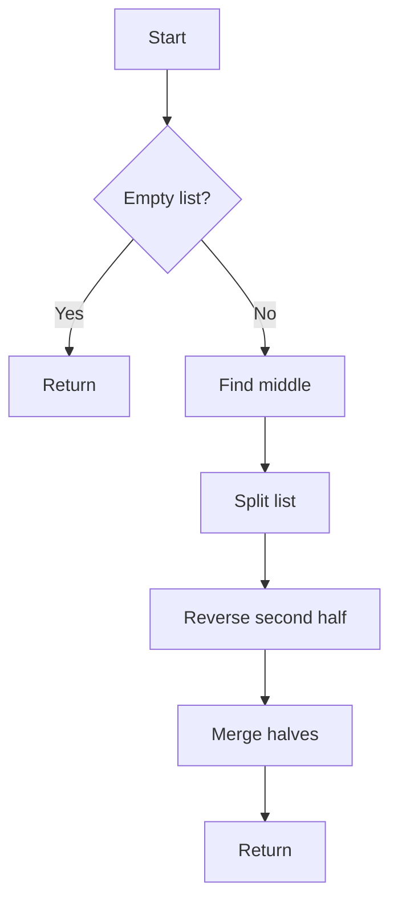

# Reorder List Split/Reverse/Merge

## Problem Understanding
The problem requires reordering a singly-linked list by splitting it into two halves, reversing the second half, and then merging the two halves. The key constraint is that the list should be reordered in-place, meaning that no additional space should be used. This problem is non-trivial because it requires careful manipulation of the list's nodes to achieve the desired ordering, and a naive approach would likely result in incorrect or inefficient solutions. The problem also involves handling edge cases, such as empty or short lists.

## Approach
The algorithm strategy is to first find the middle of the list using the slow and fast pointer technique. Then, split the list into two halves and reverse the second half. Finally, merge the two halves by interweaving the nodes. This approach works because it ensures that the nodes are correctly reordered and that the list is split and merged efficiently. The data structure used is a singly-linked list, and the algorithm handles key constraints such as edge cases and in-place reordering. The approach also has a time complexity of O(n) and a space complexity of O(1), making it efficient for large lists.

## Complexity Analysis
| Metric | Value | Detailed Reason |
|--------|-------|----------------|
| Time   | O(n)  | The algorithm traverses the list three times: once to find the middle, once to reverse the second half, and once to merge the two halves. Each traversal takes O(n) time, where n is the number of nodes in the list. |
| Space  | O(1)  | The algorithm only uses a constant amount of space to store the slow and fast pointers, the prev pointer, and the nextNode pointer. It does not use any additional data structures that scale with the input size. |

## Algorithm Walkthrough
```
Input: 1 -> 2 -> 3 -> 4
Step 1: Find the middle of the list
    slow = 1 -> 2
    fast = 1 -> 2 -> 3 -> 4
Step 2: Split the list into two halves
    firstHalf = 1 -> 2
    secondHalf = 3 -> 4
Step 3: Reverse the second half
    secondHalf = 4 -> 3
Step 4: Merge the two halves
    result = 1 -> 4 -> 2 -> 3
Output: 1 -> 4 -> 2 -> 3
```
This walkthrough demonstrates the algorithm's steps and how it correctly reorders the list.

## Visual Flow

This flowchart illustrates the algorithm's decision flow and data transformation.

## Key Insight
> **Tip:** The key insight is to use the slow and fast pointer technique to find the middle of the list, and then to reverse the second half before merging the two halves.

## Edge Cases
- **Empty/null input**: If the input list is empty or null, the algorithm simply returns without modifying the list.
- **Single element**: If the input list has only one element, the algorithm returns the same list since there is nothing to reorder.
- **Two elements**: If the input list has only two elements, the algorithm returns the same list since there is nothing to reorder.

## Common Mistakes
- **Mistake 1**: Not checking for edge cases, such as empty or short lists, before attempting to reorder the list.
- **Mistake 2**: Not correctly reversing the second half of the list, resulting in an incorrect reordering.

## Interview Follow-ups
> **Interview:** These are the exact follow-up questions interviewers ask:
- "What if the input is sorted?" → The algorithm still works correctly, but the output will be the same as the input since the list is already sorted.
- "Can you do it in O(1) space?" → The algorithm already uses O(1) space, so this is not a concern.
- "What if there are duplicates?" → The algorithm works correctly even if there are duplicates in the list. It will still reorder the list correctly, preserving the original node values.

## CPP Solution

```cpp
// Problem: Reorder List Split/Reverse/Merge
// Language: C++
// Difficulty: Medium
// Time Complexity: O(n) — traversing list three times: split, reverse, merge
// Space Complexity: O(1) — only using a constant amount of space
// Approach: Split list into two halves, reverse the second half, merge the two halves

/**
 * Definition for singly-linked list.
 * struct ListNode {
 *     int val;
 *     ListNode *next;
 *     ListNode() : val(0), next(nullptr) {}
 *     ListNode(int x) : val(x), next(nullptr) {}
 *     ListNode(int x, ListNode *next) : val(x), next(next) {}
 * };
 */
class Solution {
public:
    void reorderList(ListNode* head) {
        // Edge case: empty list → do nothing
        if (!head || !head->next || !head->next->next) 
            return;
        
        // Find the middle of the list
        ListNode* slow = head;
        ListNode* fast = head;
        while (fast->next && fast->next->next) {
            // Move slow pointer one step at a time
            slow = slow->next;
            // Move fast pointer two steps at a time
            fast = fast->next->next;
        }
        
        // Split the list into two halves
        ListNode* secondHalf = slow->next;
        slow->next = nullptr; // split the list
        
        // Reverse the second half
        ListNode* prev = nullptr;
        while (secondHalf) {
            // Store the next node
            ListNode* nextNode = secondHalf->next;
            // Reverse the link
            secondHalf->next = prev;
            // Move to the next node
            prev = secondHalf;
            secondHalf = nextNode;
        }
        
        // Merge the two halves
        ListNode* first = head;
        secondHalf = prev; // start of reversed second half
        while (secondHalf) {
            // Store the next nodes
            ListNode* nextFirst = first->next;
            ListNode* nextSecond = secondHalf->next;
            // Merge the nodes
            first->next = secondHalf;
            secondHalf->next = nextFirst;
            // Move to the next nodes
            first = nextFirst;
            secondHalf = nextSecond;
        }
    }
};
```
