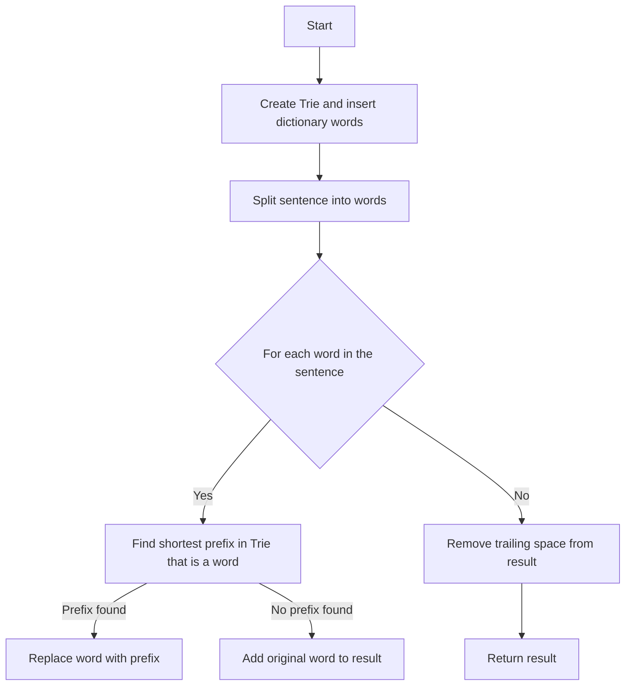

# Replace Words Trie

## Problem Understanding
The problem is asking to replace words in a sentence with their shortest prefix that is present in a given dictionary. The key constraint is that the dictionary is a list of words, and the sentence is a string of words separated by spaces. The problem is non-trivial because a naive approach of checking every word in the dictionary against every word in the sentence would result in a time complexity of O(n^2 * m), where n is the number of words in the dictionary and the sentence, and m is the average length of a word.

## Approach
The algorithm strategy is to use a Trie-based dictionary lookup to efficiently find the shortest prefix of each word in the sentence that is present in the dictionary. The intuition behind this approach is that a Trie allows for fast lookup and insertion of strings, making it ideal for this problem. The approach works by first creating a Trie and inserting all words from the dictionary into it. Then, for each word in the sentence, it checks if there is a prefix in the Trie that is a word, and if so, replaces the word with the prefix. The Trie data structure is used to store the dictionary words, and it is chosen because it allows for fast lookup and insertion of strings.

## Complexity Analysis
| Metric | Value | Detailed Reason |
|--------|-------|----------------|
| Time   | O(n*m + s) | The time complexity is O(n*m) for inserting all words from the dictionary into the Trie, where n is the number of words and m is the average length of a word. The time complexity is O(s) for iterating through each word in the sentence, where s is the total number of characters in the sentence. Since these operations are performed sequentially, the total time complexity is O(n*m + s). |
| Space  | O(n*m) | The space complexity is O(n*m) for storing the Trie, where n is the number of words and m is the average length of a word. |

## Algorithm Walkthrough
```
Input: dictionary = ["cat","bat","rat"], sentence = "the cattle was rattled by the battery"
Step 1: Create a Trie and insert all words from the dictionary into it.
        Trie:
        - root
            - c
                - a
                    - t (isWord = true)
            - b
                - a
                    - t (isWord = true)
            - r
                - a
                    - t (isWord = true)
Step 2: Split the sentence into words.
        words = ["the", "cattle", "was", "rattled", "by", "the", "battery"]
Step 3: For each word in the sentence, find the shortest prefix in the Trie that is a word.
        word = "cattle"
        prefix = "cat" (found in the Trie)
        result += "cat "
        word = "rattled"
        prefix = "rat" (found in the Trie)
        result += "rat "
        word = "battery"
        prefix = "bat" (found in the Trie)
        result += "bat "
Output: "the cat was rat by the bat"
```

## Visual Flow


## Key Insight
> **Tip:** The key insight is to use a Trie data structure to store the dictionary words, allowing for fast lookup and insertion of strings, and then iterate through each word in the sentence to find the shortest prefix in the Trie that is a word.

## Edge Cases
- **Empty dictionary**: If the dictionary is empty, the result will be the original sentence, as there are no words to replace.
- **Single word in dictionary**: If the dictionary contains only one word, the result will replace all occurrences of the word in the sentence with the word itself, if it is present in the Trie.
- **No words in sentence match dictionary**: If no words in the sentence match any words in the dictionary, the result will be the original sentence.

## Common Mistakes
- **Mistake 1**: Not checking if a character is present in the Trie before moving to the child node, which can result in a null pointer exception. → To avoid this, check if the character is present in the Trie using the `find()` method before moving to the child node.
- **Mistake 2**: Not removing the trailing space from the result string, which can result in an incorrect output. → To avoid this, remove the trailing space from the result string using the `pop_back()` method.

## Interview Follow-ups
> **Interview:** These are the exact follow-up questions interviewers ask:
- "What if the input is sorted?" → The algorithm will still work correctly, but the time complexity will remain the same, as the sorting of the input does not affect the Trie-based lookup.
- "Can you do it in O(1) space?" → No, it is not possible to solve this problem in O(1) space, as we need to store the dictionary words in a data structure, which requires at least O(n*m) space.
- "What if there are duplicates in the dictionary?" → The algorithm will ignore duplicates in the dictionary, as it only stores unique words in the Trie.

## CPP Solution

```cpp
// Problem: Replace Words Trie
// Language: cpp
// Difficulty: Medium
// Time Complexity: O(n*m) — where n is the number of words and m is the average length of a word
// Space Complexity: O(n*m) — where n is the number of words and m is the average length of a word
// Approach: Trie-based dictionary lookup — iterate through each word and check if it is in the Trie

class TrieNode {
public:
    unordered_map<char, TrieNode*> children; // Map to store the child nodes
    bool isWord; // Flag to mark the end of a word

    // Constructor to initialize the Trie node
    TrieNode() : isWord(false) {}
};

class Solution {
public:
    string replaceWords(vector<string>& dictionary, string sentence) {
        // Create a Trie and insert all words from the dictionary
        TrieNode* root = new TrieNode();
        for (const string& word : dictionary) {
            TrieNode* node = root; // Start at the root node
            for (char c : word) {
                // If the character is not in the Trie, add it
                if (node->children.find(c) == node->children.end()) {
                    node->children[c] = new TrieNode();
                }
                node = node->children[c]; // Move to the child node
            }
            node->isWord = true; // Mark the end of the word
        }

        // Split the sentence into words
        istringstream iss(sentence);
        string word;
        string result; // Store the result string

        while (iss >> word) {
            // Find the shortest prefix in the Trie that is a word
            TrieNode* node = root; // Start at the root node
            string prefix; // Store the prefix
            for (char c : word) {
                // If the character is not in the Trie, break
                if (node->children.find(c) == node->children.end()) {
                    break;
                }
                prefix += c; // Add the character to the prefix
                node = node->children[c]; // Move to the child node
                // If we found a word, replace the word with the prefix
                if (node->isWord) {
                    result += prefix + " ";
                    break;
                }
            }
            // If no prefix is found, add the original word to the result
            if (prefix.empty()) {
                result += word + " ";
            }
        }

        // Remove the trailing space
        if (!result.empty()) {
            result.pop_back();
        }

        return result;
    }
};
```
