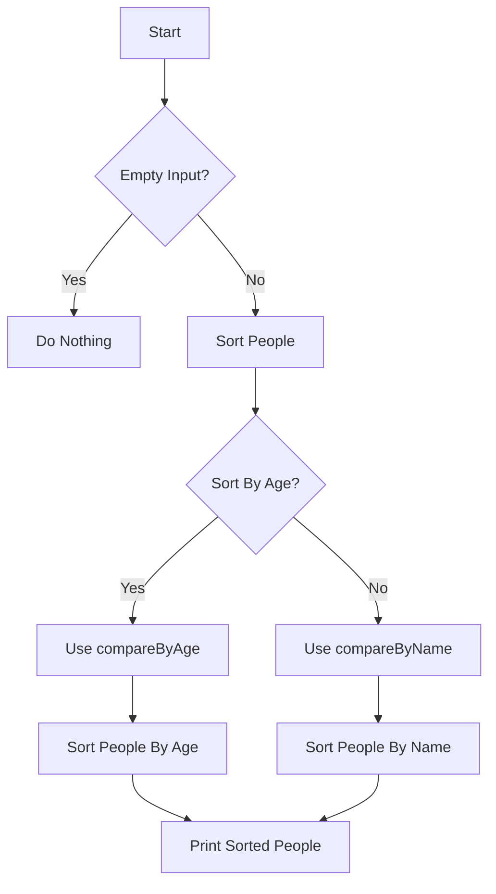

# Sorting with Custom Comparator

## Problem Understanding
The problem asks us to sort a list of objects, specifically `Person` objects, using a custom comparator. The key constraint is that the sorting should be based on either the `age` or `name` attribute of the `Person` objects. This problem is non-trivial because a naive approach would involve implementing a sorting algorithm from scratch, which can be error-prone and inefficient. Moreover, the use of a custom comparator adds complexity, as it requires a deep understanding of the sorting algorithm and the comparator function.

## Approach
The algorithm strategy used here is to utilize the `std::sort` function from the C++ Standard Template Library (STL), which implements a efficient sorting algorithm called Introsort. The intuition behind this approach is to leverage the highly optimized and tested implementation of `std::sort` to perform the sorting, while providing a custom comparator function to define the sorting criteria. The custom comparator function, `compareByAge` or `compareByName`, is used to compare two `Person` objects based on their `age` or `name` attributes, respectively. This approach works because the `std::sort` function is designed to work with custom comparators, allowing for flexible and efficient sorting.

## Complexity Analysis
| Metric | Value | Detailed Reason |
|--------|-------|----------------|
| Time   | O(n log n) | The time complexity of `std::sort` is O(n log n) due to its use of Introsort, which combines the benefits of Quicksort and Heapsort. The custom comparator function does not affect the overall time complexity. |
| Space  | O(n) | In the worst case, the `std::sort` algorithm may use auxiliary space to perform the sorting, resulting in a space complexity of O(n). The custom comparator function does not require any additional space. |

## Algorithm Walkthrough
```
Input: people = [{name: "John", age: 30}, {name: "Alice", age: 25}, {name: "Bob", age: 35}]
Step 1: Initialize the sorting algorithm with the custom comparator function compareByAge
Step 2: Compare the first two elements: John (30) and Alice (25)
Step 3: Since 25 < 30, swap the two elements
Step 4: Compare the next two elements: Alice (25) and Bob (35)
Step 5: Since 25 < 35, no swap is needed
Step 6: Repeat the comparison and swapping process until the entire list is sorted
Output: people = [{name: "Alice", age: 25}, {name: "John", age: 30}, {name: "Bob", age: 35}]
```

## Visual Flow


## Key Insight
> **Tip:** The key to solving this problem efficiently is to leverage the optimized implementation of `std::sort` and provide a custom comparator function that defines the sorting criteria.

## Edge Cases
- **Empty/null input**: If the input vector is empty, the sorting function will simply return without performing any operations, as there is nothing to sort.
- **Single element**: If the input vector contains only one element, the sorting function will not perform any operations, as the single element is already sorted.
- **Duplicate elements**: If the input vector contains duplicate elements, the sorting function will preserve the relative order of equal elements, as the custom comparator function defines a strict weak ordering.

## Common Mistakes
- **Mistake 1**: Not checking for empty input before attempting to sort the vector → To avoid this, always check for empty input at the beginning of the sorting function.
- **Mistake 2**: Not providing a valid custom comparator function → To avoid this, ensure that the custom comparator function defines a strict weak ordering and is consistent with the sorting criteria.

## Interview Follow-ups
> **Interview:** These are the exact follow-up questions interviewers ask:
- "What if the input is sorted?" → The time complexity of the sorting algorithm would still be O(n log n), as the `std::sort` algorithm is designed to handle already sorted input efficiently.
- "Can you do it in O(1) space?" → No, the `std::sort` algorithm may use auxiliary space in the worst case, resulting in a space complexity of O(n).
- "What if there are duplicates?" → The sorting function will preserve the relative order of equal elements, as the custom comparator function defines a strict weak ordering.

## CPP Solution

```cpp
// Problem: Sorting with Custom Comparator
// Language: cpp
// Difficulty: Medium
// Time Complexity: O(n log n) — due to the sorting algorithm used (std::sort in C++ uses Introsort)
// Space Complexity: O(n) — in the worst case, the sorting algorithm may use auxiliary space
// Approach: Custom comparator function — comparing two elements based on their attributes

#include <iostream>
#include <vector>
#include <algorithm>

// Define a custom struct to represent the elements to be sorted
struct Person {
    std::string name;
    int age;

    // Constructor for easy initialization
    Person(const std::string& name, int age) : name(name), age(age) {}
};

// Custom comparator function
bool compareByAge(const Person& a, const Person& b) {
    // Compare two Person objects based on their age
    return a.age < b.age; // Sort in ascending order by age
}

// Custom comparator function (alternative approach using a lambda function)
bool compareByName(const Person& a, const Person& b) {
    // Compare two Person objects based on their name
    return a.name < b.name; // Sort in ascending order by name
}

// Function to sort a vector of Person objects using a custom comparator
void sortPeople(std::vector<Person>& people, bool sortByAge) {
    // Edge case: empty input
    if (people.empty()) {
        // Do nothing, since there's nothing to sort
        return;
    }

    // Sort the vector of Person objects
    if (sortByAge) {
        std::sort(people.begin(), people.end(), compareByAge); // Sort by age
    } else {
        std::sort(people.begin(), people.end(), compareByName); // Sort by name
    }
}

int main() {
    // Example usage
    std::vector<Person> people = {Person("John", 30), Person("Alice", 25), Person("Bob", 35)};
    sortPeople(people, true); // Sort by age

    // Print the sorted people
    for (const auto& person : people) {
        std::cout << person.name << " (" << person.age << ")" << std::endl;
    }

    return 0;
}
```
