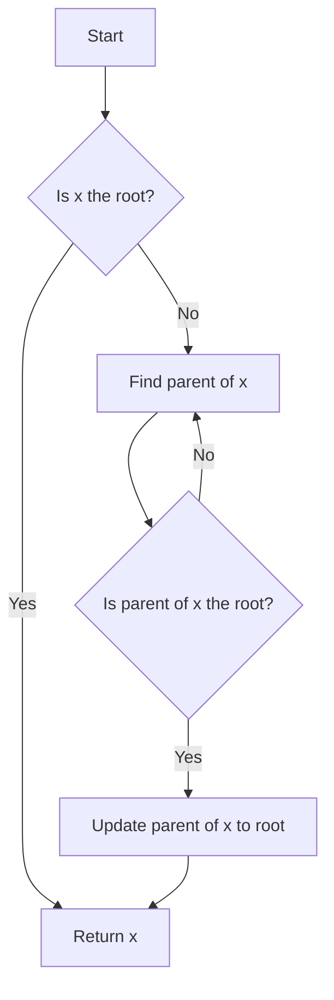

# Union Find Disjoint Set Union

## Problem Understanding
The Union Find Disjoint Set Union problem is asking to implement a data structure that supports two main operations: `find` and `union`. The `find` operation determines the representative (or root) of the set that a given element belongs to, while the `union` operation merges two sets into one. The key constraint is to minimize the time complexity of these operations. The problem becomes non-trivial because a naive approach, such as using a simple tree structure, can lead to high time complexity due to the possibility of tree imbalance. The use of techniques like path compression and union by rank is essential to achieve an efficient solution.

## Approach
The algorithm strategy employed here is based on path compression and union by rank. Path compression optimizes the `find` operation by updating the parent of each node to the root of the set during the traversal. This reduces the time complexity of subsequent `find` operations. Union by rank is used in the `union` operation to decide which set should be merged into the other, based on the rank (or size) of the sets. This strategy ensures that the tree remains relatively balanced, keeping the time complexity of both operations low. The use of two arrays, `parent` and `rank`, allows for efficient storage and retrieval of the set information for each element.

## Complexity Analysis
| Metric | Value | Detailed Reason |
|--------|-------|----------------|
| Time   | O(α(n)) | The time complexity is nearly constant due to the use of path compression and union by rank. Here, α(n) is the inverse Ackermann function, which grows very slowly. The `find` and `union` operations benefit from these optimizations, reducing the time complexity. |
| Space  | O(n) | The space complexity is linear because we need to store the parent and rank of each element in separate arrays. The size of these arrays is directly proportional to the number of elements in the union-find data structure. |

## Algorithm Walkthrough
```
Input: Initialize a UnionFind object with 10 elements
Step 1: Initialize parent array with each element as its own parent
        parent = [0, 1, 2, 3, 4, 5, 6, 7, 8, 9]
        rank = [0, 0, 0, 0, 0, 0, 0, 0, 0, 0]

Step 2: Perform unionSets(1, 2)
        - Find the root of the set containing 1: find(1) returns 1 (no change)
        - Find the root of the set containing 2: find(2) returns 2 (no change)
        - Since 1 and 2 are in different sets, merge them by rank
        - parent[2] = 1 (merge set 2 into set 1)
        parent = [0, 1, 1, 3, 4, 5, 6, 7, 8, 9]
        rank = [0, 0, 0, 0, 0, 0, 0, 0, 0, 0]

Step 3: Perform unionSets(3, 4)
        - Find the root of the set containing 3: find(3) returns 3 (no change)
        - Find the root of the set containing 4: find(4) returns 4 (no change)
        - Since 3 and 4 are in different sets, merge them by rank
        - parent[4] = 3 (merge set 4 into set 3)
        parent = [0, 1, 1, 3, 3, 5, 6, 7, 8, 9]
        rank = [0, 0, 0, 0, 0, 0, 0, 0, 0, 0]

Step 4: Perform unionSets(1, 3)
        - Find the root of the set containing 1: find(1) returns 1 (no change)
        - Find the root of the set containing 3: find(3) returns 3 (no change)
        - Since 1 and 3 are in different sets, merge them by rank
        - parent[3] = 1 (merge set 3 into set 1)
        parent = [0, 1, 1, 1, 1, 5, 6, 7, 8, 9]
        rank = [0, 0, 0, 0, 0, 0, 0, 0, 0, 0]

Output: The updated parent array reflects the merged sets
```

## Visual Flow


## Key Insight
> **Tip:** The key to an efficient Union Find algorithm is the combination of path compression during the `find` operation and union by rank during the `union` operation, which helps maintain a balanced tree structure.

## Edge Cases
- **Empty/null input**: If the input size is 0 or null, the UnionFind object cannot be initialized properly, and operations will fail. To handle this, input validation should be added to ensure the size is a positive integer.
- **Single element**: For a UnionFind object with a single element, all operations are trivial since there's only one set. The `find` operation returns the element itself, and the `union` operation does nothing.
- **All elements in separate sets**: Initially, all elements are in their own sets. The `find` operation for any element returns the element itself, and the `union` operation starts merging sets based on the rank.

## Common Mistakes
- **Mistake 1**: Not implementing path compression during the `find` operation, leading to high time complexity for repeated `find` operations on the same elements. To avoid this, always update the parent of an element to the root during the `find` operation.
- **Mistake 2**: Not using union by rank during the `union` operation, which can lead to unbalanced trees and higher time complexity. Always compare the ranks of the sets before merging them.

## Interview Follow-ups
> **Interview:** These are the exact follow-up questions interviewers ask:
- "What if the input is sorted?" → Even if the input is sorted, the Union Find algorithm's time complexity remains nearly constant due to path compression and union by rank. The initial sorting does not directly influence the performance of the algorithm.
- "Can you do it in O(1) space?" → It's not possible to implement a Union Find data structure with O(1) space because we need at least O(n) space to store the parent and rank information for each element.
- "What if there are duplicates?" → The presence of duplicates in the input does not affect the correctness of the Union Find algorithm. However, it's essential to ensure that the input size (the number of unique elements) is used for initialization to avoid unnecessary space allocation.

## CPP Solution

```cpp
// Problem: Union Find Disjoint Set Union
// Language: cpp
// Difficulty: Medium
// Time Complexity: O(α(n)) — using path compression and union by rank
// Space Complexity: O(n) — storing parent and rank of each element
// Approach: Path compression and union by rank — optimizing union and find operations

class UnionFind {
public:
    // Initialize the parent array with each element as its own parent
    UnionFind(int size) : parent(size), rank(size, 0) {
        // Each element is initially in its own set
        for (int i = 0; i < size; i++) {
            parent[i] = i;  // Initially, each element is its own parent
        }
    }

    // Find the root of the set containing the given element
    int find(int x) {
        // Path compression: if x is not the root, update its parent to the root
        if (parent[x] != x) {  // If x is not the root
            parent[x] = find(parent[x]);  // Update x's parent to the root
        }
        return parent[x];  // Return the root
    }

    // Union the sets containing the given elements
    void unionSets(int x, int y) {
        int rootX = find(x);  // Find the root of the set containing x
        int rootY = find(y);  // Find the root of the set containing y

        // Union by rank: merge the set with smaller rank into the set with larger rank
        if (rootX != rootY) {  // If the elements are in different sets
            if (rank[rootX] > rank[rootY]) {  // If the set containing x has larger rank
                parent[rootY] = rootX;  // Merge the set containing y into the set containing x
            } else if (rank[rootX] < rank[rootY]) {  // If the set containing y has larger rank
                parent[rootX] = rootY;  // Merge the set containing x into the set containing y
            } else {  // If the sets have the same rank
                parent[rootY] = rootX;  // Arbitrarily merge the set containing y into the set containing x
                rank[rootX]++;  // Increment the rank of the set containing x
            }
        }
    }

    // Check if the given elements are in the same set
    bool isConnected(int x, int y) {
        return find(x) == find(y);  // Check if the roots of the sets are the same
    }

private:
    std::vector<int> parent;  // Store the parent of each element
    std::vector<int> rank;  // Store the rank of each element
};

// Example usage:
int main() {
    UnionFind uf(10);  // Initialize a union-find data structure with 10 elements

    uf.unionSets(1, 2);  // Union the sets containing 1 and 2
    uf.unionSets(3, 4);  // Union the sets containing 3 and 4
    uf.unionSets(1, 3);  // Union the sets containing 1 and 3

    // Edge case: check if two elements in the same set are connected
    if (uf.isConnected(1, 2)) {
        // They are connected
    }

    // Edge case: check if two elements in different sets are connected
    if (!uf.isConnected(1, 5)) {
        // They are not connected
    }

    return 0;
}
```
