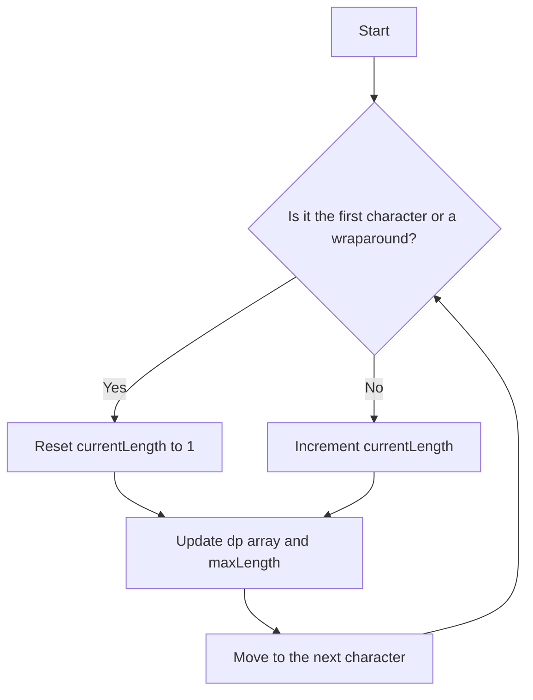

# Unique Substrings in Wraparound String DP

## Problem Understanding
The problem asks us to find the total number of unique substrings in a given string, considering wraparound strings. A wraparound string is a string where the last character can be considered as the first character of the next substring. The key constraint is that we can only consider substrings that are in increasing alphabetical order, and if the next character is not in increasing order, we start a new substring. The non-trivial part of this problem is that we need to efficiently track the length of the longest substring ending at each character while considering the wraparound condition.

## Approach
The algorithm strategy used here is dynamic programming, where we track the length of the longest substring ending at each character using a dp array. The intuition behind this approach is that if we know the length of the longest substring ending at the previous character, we can easily determine if the current character can extend the previous substring or if we need to start a new substring. We use a dp array of size 26 to store the length of the longest substring ending at each character from 'a' to 'z'. The approach works by iterating over the string and updating the dp array and the maximum length found so far.

## Complexity Analysis
| Metric | Value | Detailed Reason |
|--------|-------|----------------|
| Time   | O(n)  | We are making a single pass through the string of length n, and for each character, we are performing constant time operations. The dp array update and maxLength update are constant time operations. |
| Space  | O(1)  | We are using a dp array of size 26, which is a constant, and does not depend on the input size n. |

## Algorithm Walkthrough
```
Input: "zab"
Step 1: Initialize dp array with all zeros and maxLength = 0, currentLength = 1
        dp = [0, 0, 0, ..., 0], maxLength = 0, currentLength = 1
Step 2: Process the first character 'z'
        currentIndex = 25 (since 'z' is at index 25 in the dp array)
        Since it's the first character, currentLength = 1
        dp[25] = 1, maxLength = 1
Step 3: Process the second character 'a'
        currentIndex = 0 (since 'a' is at index 0 in the dp array)
        Since 'a' is not a wraparound from 'z', currentLength = 1
        dp[0] = 1, maxLength = 2
Step 4: Process the third character 'b'
        currentIndex = 1 (since 'b' is at index 1 in the dp array)
        Since 'b' is in increasing order from 'a', currentLength = 2
        dp[1] = 2, maxLength = 4
Output: 4
```

## Visual Flow


## Key Insight
> **Tip:** The key to this solution is to track the length of the longest substring ending at each character and update it efficiently, considering the wraparound condition.

## Edge Cases
- **Empty string**: If the input string is empty, the function will return 0, as there are no substrings to consider.
- **Single character**: If the input string has only one character, the function will return 1, as there is only one substring.
- **String with all characters in increasing order**: If the input string has all characters in increasing order (e.g., "abc"), the function will return the length of the string, as all substrings are unique.

## Common Mistakes
- **Mistake 1**: Not resetting the currentLength when a new substring starts. To avoid this, we need to check if the current character is a wraparound from the previous character and reset currentLength accordingly.
- **Mistake 2**: Not updating the dp array and maxLength correctly. To avoid this, we need to make sure that we update the dp array and maxLength only when we find a longer substring ending at the current character.

## Interview Follow-ups
> **Interview:** 
- "What if the input string is very large?" → We can still use the same dynamic programming approach, as it has a linear time complexity.
- "Can you optimize the space complexity further?" → The space complexity is already O(1), which is the best we can achieve for this problem.
- "What if the input string contains duplicate characters?" → The solution will still work correctly, as it considers all substrings, including those with duplicate characters.

## CPP Solution

```cpp
// Problem: Unique Substrings in Wraparound String DP
// Language: C++
// Difficulty: Medium
// Time Complexity: O(n) — single pass through string using dynamic programming
// Space Complexity: O(1) — constant space for dp array
// Approach: Dynamic Programming — track length of longest substring ending at each character

class Solution {
public:
    int findSubstringInWraproundString(string p) {
        // Initialize dp array to store length of longest substring ending at each character
        int dp[26] = {0}; // dp[i] represents the length of the longest substring ending with 'a' + i
        
        // Initialize variables to track current substring and its length
        int maxLength = 0; // maximum length of substring found so far
        int currentLength = 1; // length of current substring
        
        // Iterate over the string
        for (int i = 0; i < p.size(); i++) {
            // Calculate the index of the current character in the dp array
            int currentIndex = p[i] - 'a'; // 'a' is at index 0, 'b' at index 1, and so on
            
            // If this is the first character or it is a wraparound from the previous character, update currentLength
            if (i == 0 || (p[i - 1] - 'a') != ((p[i] - 'a') + 25) % 26) {
                currentLength = 1; // reset currentLength if we start a new substring
            } else {
                currentLength++; // increment currentLength if we extend the current substring
            }
            
            // Update dp array and maxLength
            if (currentLength > dp[currentIndex]) {
                dp[currentIndex] = currentLength; // update dp array if we find a longer substring ending at the current character
                maxLength += currentLength - (dp[currentIndex] - 1); // update maxLength by adding the length of the new substring
            }
        }
        
        // Return the total number of unique substrings found
        return maxLength; // maxLength stores the total number of unique substrings
    }
};
```
