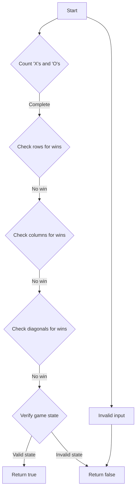

# Valid Tic-Tac-Toe State Condition Checking

## Problem Understanding
The problem asks to determine whether a given Tic-Tac-Toe board state is valid. A valid state is one where the number of 'X's is either equal to the number of 'O's or one more than the number of 'O's, and there are no multiple winners. The key constraints are that 'X' makes the first move, 'O' makes the second move, and a player cannot win and have fewer moves than their opponent. The problem is non-trivial because a naive approach would involve checking all possible game states, which is impractical.

## Approach
The algorithm strategy involves checking the win conditions for both 'X' and 'O', counting the number of 'X's and 'O's, and verifying that the game state is consistent with the rules of Tic-Tac-Toe. The approach works by first counting the number of 'X's and 'O's and checking for wins. Then, it verifies that the game state is valid by checking for edge cases such as multiple winners, more 'X's than 'O's plus one without an 'X' win, and more 'O's than 'X's without an 'O' win. The data structure used is a 3x3 vector of strings representing the Tic-Tac-Toe board.

## Complexity Analysis
| Metric | Value | Detailed Reason |
|--------|-------|----------------|
| Time   | O(1)  | The algorithm performs a constant number of operations, including counting 'X's and 'O's, checking for wins, and verifying the game state. The number of operations does not grow with the size of the input. |
| Space  | O(1)  | The algorithm uses a constant amount of space to store the counts of 'X's and 'O's, the win flags, and other variables. The space used does not grow with the size of the input. |

## Algorithm Walkthrough
```
Input: ["XOX", "OX ", "XOO"]
Step 1: Initialize counts for 'X's and 'O's: xCount = 0, oCount = 0
Step 2: Count 'X's and 'O's:
  - Board[0][0] = 'X': xCount = 1
  - Board[0][1] = 'O': oCount = 1
  - Board[0][2] = 'X': xCount = 2
  - Board[1][0] = 'O': oCount = 2
  - Board[1][1] = 'X': xCount = 3
  - Board[1][2] = ' ': (no change)
  - Board[2][0] = 'X': xCount = 4
  - Board[2][1] = 'O': oCount = 3
  - Board[2][2] = 'O': oCount = 4
Step 3: Check rows for wins:
  - Row 0: 'X' 'O' 'X' (no win)
  - Row 1: 'O' 'X' ' ' (no win)
  - Row 2: 'X' 'O' 'O' (no win)
Step 4: Check columns for wins:
  - Column 0: 'X' 'O' 'X' (no win)
  - Column 1: 'O' 'X' 'O' (no win)
  - Column 2: 'X' ' ' 'O' (no win)
Step 5: Check diagonals for wins:
  - Diagonal 1: 'X' 'X' ' ' (no win)
  - Diagonal 2: 'O' 'X' 'O' (no win)
Step 6: Verify the game state:
  - xCount = 4, oCount = 4
  - xWins = false, oWins = false
  - Edge case: xCount > oCount (false)
  - Edge case: oCount > xCount (false)
  - Edge case: xWins and oCount >= xCount (false)
  - Edge case: oWins and xCount > oCount + 1 (false)
Output: false
```

## Visual Flow


## Key Insight
> **Tip:** The key to solving this problem is to understand the rules of Tic-Tac-Toe and the constraints on the game state, and to verify that the given state is consistent with these rules.

## Edge Cases
- **Empty board**: The algorithm should return true for an empty board, as it is a valid game state.
- **Single 'X'**: The algorithm should return true for a board with a single 'X', as it is a valid game state.
- **More 'O's than 'X's**: The algorithm should return false for a board with more 'O's than 'X's, as it is an invalid game state.

## Common Mistakes
- **Mistake 1**: Not checking for multiple winners. To avoid this, verify that there are no multiple winners by checking the win flags.
- **Mistake 2**: Not checking for edge cases. To avoid this, verify that the game state is consistent with the rules of Tic-Tac-Toe by checking for edge cases such as more 'X's than 'O's plus one without an 'X' win.

## Interview Follow-ups
> **Interview:** These are the exact follow-up questions interviewers ask:
- "What if the input is a 4x4 board?" → The algorithm would need to be modified to handle the larger board size.
- "Can you optimize the algorithm to use less space?" → The algorithm already uses a constant amount of space, so optimization is not necessary.
- "What if there are multiple boards to validate?" → The algorithm would need to be modified to handle multiple boards, potentially by using a loop to validate each board in turn.

## CPP Solution

```cpp
// Problem: Valid Tic-Tac-Toe State Condition Checking
// Language: C++
// Difficulty: Medium
// Time Complexity: O(1) — constant number of operations
// Space Complexity: O(1) — constant space used
// Approach: Win and draw condition checking — verify the validity of the Tic-Tac-Toe board state

class Solution {
public:
    bool validTicTacToe(vector<string>& board) {
        // Initialize counts for X's and O's
        int xCount = 0, oCount = 0;
        
        // Initialize flags for X and O wins
        bool xWins = false, oWins = false;

        // Count X's and O's, and check for wins
        for (int i = 0; i < 3; i++) {
            for (int j = 0; j < 3; j++) {
                // Count X's
                if (board[i][j] == 'X') {
                    xCount++;
                }
                // Count O's
                else if (board[i][j] == 'O') {
                    oCount++;
                }
            }
        }

        // Check rows for wins
        for (int i = 0; i < 3; i++) {
            if (board[i][0] == board[i][1] && board[i][1] == board[i][2]) {
                // X wins
                if (board[i][0] == 'X') {
                    xWins = true;
                }
                // O wins
                else if (board[i][0] == 'O') {
                    oWins = true;
                }
            }
        }
        
        // Check columns for wins
        for (int i = 0; i < 3; i++) {
            if (board[0][i] == board[1][i] && board[1][i] == board[2][i]) {
                // X wins
                if (board[0][i] == 'X') {
                    xWins = true;
                }
                // O wins
                else if (board[0][i] == 'O') {
                    oWins = true;
                }
            }
        }

        // Check diagonals for wins
        if (board[0][0] == board[1][1] && board[1][1] == board[2][2]) {
            // X wins
            if (board[0][0] == 'X') {
                xWins = true;
            }
            // O wins
            else if (board[0][0] == 'O') {
                oWins = true;
            }
        }
        if (board[0][2] == board[1][1] && board[1][1] == board[2][0]) {
            // X wins
            if (board[0][2] == 'X') {
                xWins = true;
            }
            // O wins
            else if (board[0][2] == 'O') {
                oWins = true;
            }
        }

        // Edge case: X wins and more O's than X's
        if (xWins && xCount <= oCount) {
            return false;
        }
        // Edge case: O wins and more X's than O's plus one
        if (oWins && xCount > oCount + 1) {
            return false;
        }
        // Edge case: both X and O win
        if (xWins && oWins) {
            return false;
        }
        // Edge case: more X's than O's plus one and no X win
        if (xCount > oCount + 1) {
            return false;
        }
        // Edge case: more O's than X's and no O win
        if (xCount < oCount) {
            return false;
        }
        
        return true;
    }
}
```
