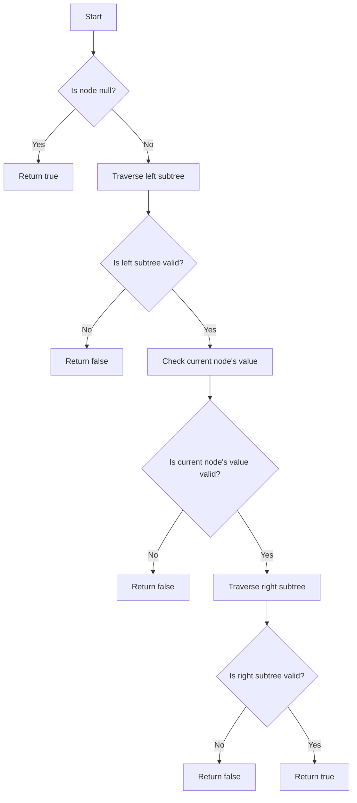

# Validate Binary Search Tree

## Problem Understanding
The problem is asking to validate whether a given binary tree is a binary search tree (BST). A BST is a tree where for every node, all elements in the left subtree are less than the node, and all elements in the right subtree are greater than the node. The key constraint is that the tree must satisfy the BST property for all nodes. This problem is non-trivial because a naive approach, such as checking each node individually, would not be efficient and would not guarantee that the tree is a valid BST.

## Approach
The algorithm strategy is to use in-order traversal, which visits nodes in ascending order, to validate if the binary tree is a BST. The intuition behind this approach is that if the tree is a valid BST, the in-order traversal will yield a sorted sequence of node values. This approach works because in-order traversal visits the left subtree, then the current node, and finally the right subtree, which corresponds to the definition of a BST. The algorithm uses a recursive helper function to perform the in-order traversal and validation. The `prevValue` variable is used to keep track of the previous node's value during the traversal.

## Complexity Analysis
| Metric | Value | Detailed Reason |
|--------|-------|----------------|
| Time   | O(n)  | The algorithm performs an in-order traversal of the binary tree, visiting each node exactly once. The time complexity is linear with respect to the number of nodes in the tree. |
| Space  | O(h)  | The algorithm uses a recursive approach, which requires space on the call stack to store the function calls. In the worst case, the tree is skewed, and the height of the tree is equal to the number of nodes, resulting in a space complexity of O(n). However, for a balanced tree, the height is logarithmic in the number of nodes, resulting in a space complexity of O(log n). |

## Algorithm Walkthrough
```
Input: 
     2
    / \
   1   3

Step 1: Initialize prevValue to LLONG_MIN
Step 2: Traverse the left subtree of node 2 (node 1)
        - prevValue is updated to 1
Step 3: Traverse the current node (node 2)
        - Check if node 2's value (2) is greater than prevValue (1)
        - Update prevValue to 2
Step 4: Traverse the right subtree of node 2 (node 3)
        - Check if node 3's value (3) is greater than prevValue (2)
        - Update prevValue to 3
Output: true (the tree is a valid BST)
```

## Visual Flow


## Key Insight
> **Tip:** The key insight is to use in-order traversal to validate the BST property, as it allows us to check if the node values are in ascending order, which is a necessary condition for a binary tree to be a BST.

## Edge Cases
- **Empty/null input**: The algorithm returns true, as an empty tree is considered a valid BST.
- **Single node**: The algorithm returns true, as a single node is a valid BST.
- **Skewed tree**: The algorithm returns true if the tree is a valid BST and false otherwise. For example, a tree with nodes 1, 2, and 3, where node 1 is the root, node 2 is the right child of node 1, and node 3 is the right child of node 2, is a valid BST.

## Common Mistakes
- **Mistake 1**: Not handling integer overflow when updating the `prevValue` variable. To avoid this, use a `long long` data type to store the previous node's value.
- **Mistake 2**: Not checking if the current node's value is greater than the previous node's value during the in-order traversal. To avoid this, add a check to ensure that the current node's value is greater than the previous node's value.

## Interview Follow-ups
> **Interview:** These are the exact follow-up questions interviewers ask:
- "What if the input is sorted?" → The algorithm will still work correctly, as it checks if the tree is a valid BST by verifying if the in-order traversal yields a sorted sequence of node values.
- "Can you do it in O(1) space?" → No, the algorithm requires at least O(h) space to store the recursive function calls, where h is the height of the tree.
- "What if there are duplicates?" → The algorithm will return false if there are duplicate values in the tree, as a BST should not have duplicate values.

## CPP Solution

```cpp
// Problem: Validate Binary Search Tree
// Language: cpp
// Difficulty: Medium
// Time Complexity: O(n) — in-order traversal of the binary search tree
// Space Complexity: O(h) — recursion stack, where h is the height of the tree
// Approach: In-order traversal with recursion — validate if in-order traversal is sorted

class Solution {
public:
    // Define a helper function to perform in-order traversal and validation
    bool isValidBST(TreeNode* root) {
        // Initialize the previous node value to negative infinity
        long long prevValue = LLONG_MIN; // Use long long to handle integer overflow
        return inOrderTraversal(root, prevValue); // Start the in-order traversal
    }

    // Helper function to perform in-order traversal
    bool inOrderTraversal(TreeNode* node, long long& prevValue) {
        // Base case: empty tree
        if (node == nullptr) return true; // An empty tree is a valid BST
        
        // Traverse the left subtree
        if (!inOrderTraversal(node->left, prevValue)) return false; // If left subtree is invalid, return false
        
        // Check if the current node's value is valid
        if (node->val <= prevValue) return false; // If the current node's value is not greater than the previous value, return false
        prevValue = node->val; // Update the previous value
        
        // Traverse the right subtree
        return inOrderTraversal(node->right, prevValue); // If the right subtree is invalid, return false
    }
};

// Edge case: empty input → return true
// Edge case: single node → return true
// Edge case: skewed tree → return true if valid, false otherwise
```
