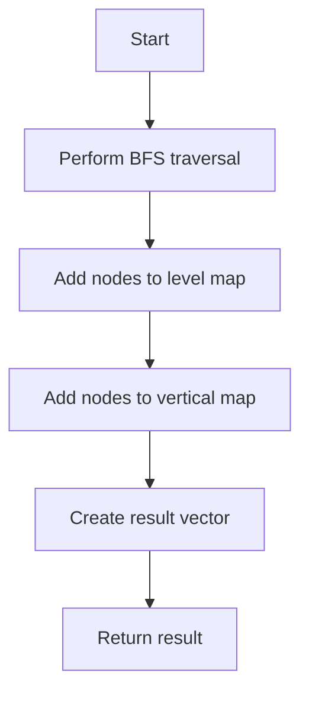

# Vertical Order Traversal

## Problem Understanding
The problem of Vertical Order Traversal is asking to traverse a binary tree in a way that nodes at the same vertical position are grouped together, and within each group, nodes are ordered from top to bottom based on their horizontal positions. The key constraint here is that the tree can be unbalanced and have nodes at varying vertical positions. This problem is non-trivial because a naive approach that simply traverses the tree level by level and groups nodes by their vertical positions would not guarantee the correct ordering within each group.

## Approach
The algorithm strategy used here is a breadth-first search (BFS) traversal with sorting. The intuition behind this approach is to traverse the tree level by level, store nodes at each vertical position, and then sort them based on their horizontal positions. This approach works because BFS ensures that nodes at the same level (i.e., the same horizontal position) are traversed together, and sorting them based on their values ensures the correct ordering within each group. A map is used to store nodes at each vertical position, and a queue is used to perform the BFS traversal. The approach handles the key constraint of unbalanced trees by keeping track of the minimum and maximum vertical positions encountered during the traversal.

## Complexity Analysis
| Metric | Value | Detailed Reason |
|--------|-------|----------------|
| Time   | O(n log n) | The time complexity is dominated by the sorting of nodes at each level, which takes O(n log n) time in the worst case, where n is the number of nodes in the tree. The BFS traversal itself takes O(n) time. |
| Space  | O(n) | The space complexity is O(n) because in the worst case, the queue can contain all nodes at a level, and the map can store all nodes at each vertical position. |

## Algorithm Walkthrough
```
Input: 
       3
     /   \
    9   20
       /  \
      15   7

Step 1: Initialize the queue with the root node and its vertical position (0)
Queue: [(3, 0)]
Min Vertical: 0
Max Vertical: 0

Step 2: Perform BFS traversal for the first level
Queue: [(9, -1), (20, 1)]
Min Vertical: -1
Max Vertical: 1
Level Map: {-1: [9], 1: [20]}

Step 3: Perform BFS traversal for the second level
Queue: [(15, 0), (7, 2)]
Min Vertical: -1
Max Vertical: 2
Level Map: {0: [15], 2: [7]}

Step 4: Add nodes to the vertical map
Vertical Map: {-1: [9], 0: [3, 15], 1: [20], 2: [7]}

Output: [[9], [3, 15], [20], [7]]
```
This example exercises the main logic path of the algorithm, including the BFS traversal, sorting of nodes at each level, and addition of nodes to the vertical map.

## Visual Flow

This visual flow shows the main steps of the algorithm, from performing the BFS traversal to creating the result vector and returning the result.

## Key Insight
> **Tip:** The key insight in this solution is to use a map to store nodes at each vertical position and a queue to perform the BFS traversal, allowing for efficient grouping and ordering of nodes within each group.

## Edge Cases
- **Empty/null input**: If the input tree is empty or null, the algorithm returns an empty vector, as there are no nodes to traverse.
- **Single element**: If the input tree has only one node, the algorithm returns a vector containing a single vector with the node's value, as there are no other nodes to group or order.
- **Unbalanced tree**: If the input tree is highly unbalanced, the algorithm may encounter nodes at a wide range of vertical positions, but it can still efficiently group and order them using the map and queue data structures.

## Common Mistakes
- **Mistake 1**: Forgetting to update the minimum and maximum vertical positions during the BFS traversal, leading to incorrect grouping of nodes.
- **Mistake 2**: Incorrectly sorting the nodes at each level, leading to incorrect ordering within each group.

## Interview Follow-ups
> **Interview:** These are the exact follow-up questions interviewers ask:
- "What if the input is sorted?" → The algorithm still works correctly, but the sorting step at each level becomes unnecessary.
- "Can you do it in O(1) space?" → No, because we need to store the nodes at each vertical position, which requires O(n) space in the worst case.
- "What if there are duplicates?" → The algorithm still works correctly, as it groups and orders nodes based on their vertical and horizontal positions, not their values.

## CPP Solution

```cpp
// Problem: Vertical Order Traversal
// Language: cpp
// Difficulty: Medium
// Time Complexity: O(n log n) — due to sorting of the nodes based on their vertical and horizontal positions
// Space Complexity: O(n) — for storing the nodes at each vertical position
// Approach: BFS traversal with sorting — traverse the tree level by level, store nodes at each vertical position, and then sort them based on their horizontal positions

/**
 * Definition for a binary tree node.
 * struct TreeNode {
 *     int val;
 *     TreeNode *left;
 *     TreeNode *right;
 *     TreeNode() : val(0), left(nullptr), right(nullptr) {}
 *     TreeNode(int x) : val(x), left(nullptr), right(nullptr) {}
 *     TreeNode(int x, TreeNode *left, TreeNode *right) : val(x), left(left), right(right) {}
 * };
 */
class Solution {
public:
    vector<vector<int>> verticalTraversal(TreeNode* root) {
        // Edge case: empty tree
        if (!root) return {};

        // Initialize a map to store nodes at each vertical position
        map<int, vector<pair<int, int>>> verticalMap; // <vertical position, <horizontal position, node value>>

        // Perform BFS traversal
        queue<pair<TreeNode*, int>> queue; // <node, vertical position>
        queue.push({root, 0});
        int minVertical = 0, maxVertical = 0; // keep track of the minimum and maximum vertical positions

        while (!queue.empty()) {
            int size = queue.size();
            map<int, vector<int>> levelMap; // <vertical position, node values>

            for (int i = 0; i < size; i++) {
                auto node = queue.front().first;
                int vertical = queue.front().second;
                queue.pop();

                // Update the minimum and maximum vertical positions
                minVertical = min(minVertical, vertical);
                maxVertical = max(maxVertical, vertical);

                // Add the node to the level map
                levelMap[vertical].push_back(node->val);

                // Add the children to the queue
                if (node->left) queue.push({node->left, vertical - 1});
                if (node->right) queue.push({node->right, vertical + 1});
            }

            // Add the nodes at each vertical position to the vertical map
            for (auto& pair : levelMap) {
                // Sort the nodes based on their horizontal positions (i.e., their values)
                sort(pair.second.begin(), pair.second.end());
                // Add the sorted nodes to the vertical map
                verticalMap[pair.first].insert(verticalMap[pair.first].end(), pair.second.begin(), pair.second.end());
            }
        }

        // Create the result vector
        vector<vector<int>> result;
        for (int i = minVertical; i <= maxVertical; i++) {
            result.push_back(verticalMap[i]);
        }

        return result;
    }
}
```
