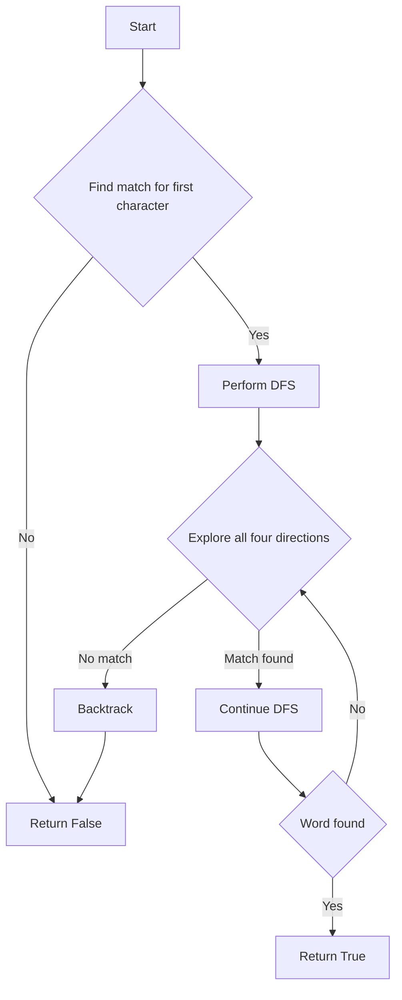

# Word Search Backtracking

## Problem Understanding
The Word Search Backtracking problem involves finding a given word in a 2D grid of characters, where the word can be constructed from letters of sequentially adjacent cells (horizontally, vertically, or diagonally is not allowed in this case, only up, down, left, right). The key constraints are that each cell can only be used once in the word, and all cells in the word must be adjacent to each other. This problem is non-trivial because a naive approach would involve checking every possible combination of cells, resulting in an inefficient solution.

## Approach
The algorithm strategy is to use a backtracking depth-first search (DFS) to explore all four directions (up, down, left, right) for each cell in the grid. The DFS function checks if the current cell matches the next character in the word and if it does, it continues the search from that cell. If it finds a match for the entire word, it returns true. The approach works by systematically exploring all possible paths from each cell, and the backtracking ensures that the search does not get stuck in an infinite loop. The data structure used is a 2D vector to represent the grid and a string to represent the word.

## Complexity Analysis
| Metric | Value | Detailed Reason |
|--------|-------|----------------|
| Time   | O(n*m*4^l) | The algorithm iterates over each cell in the grid (n*m), and for each cell, it performs a DFS that can explore up to 4 directions (4^l), where l is the length of the word. |
| Space  | O(n*m + l) | The space complexity comes from the recursion stack (l) and the space needed to store the grid (n*m). |

## Algorithm Walkthrough
```
Input: 
board = [
  ['A', 'B', 'C', 'E'],
  ['S', 'F', 'C', 'S'],
  ['A', 'D', 'E', 'E']
],
word = "ABCCED"

Step 1: 
i = 0, j = 0
board[i][j] = 'A', word[0] = 'A' (match)
Perform DFS from (0, 0)

Step 2: 
i = 0, j = 0
board[i][j] = '#', word[1] = 'B'
Explore all four directions:
- Down: i = 1, j = 0, board[i][j] = 'S' (no match)
- Up: i = -1, j = 0 (out of bounds)
- Right: i = 0, j = 1, board[i][j] = 'B' (match)
  Perform DFS from (0, 1)

Step 3: 
i = 0, j = 1
board[i][j] = '#', word[2] = 'C'
Explore all four directions:
- Down: i = 1, j = 1, board[i][j] = 'F' (no match)
- Up: i = -1, j = 1 (out of bounds)
- Right: i = 0, j = 2, board[i][j] = 'C' (match)
  Perform DFS from (0, 2)

...

Output: true
```
The algorithm continues this process until it finds a match for the entire word or exhausts all possible paths.

## Visual Flow

The flowchart shows the main logic path of the algorithm, including the DFS and backtracking.

## Key Insight
> **Tip:** The key insight is to use a backtracking DFS to explore all possible paths from each cell, and to mark visited cells to avoid revisiting them.

## Edge Cases
- **Empty/null input**: If the input grid or word is empty, the algorithm returns false.
- **Single element**: If the grid contains only one cell, the algorithm checks if the cell matches the first character of the word. If it does, it performs a DFS from that cell.
- **Word not found**: If the word is not found in the grid, the algorithm returns false after exhausting all possible paths.

## Common Mistakes
- **Mistake 1**: Not marking visited cells, which can lead to infinite loops. → To avoid this, mark visited cells with a special character.
- **Mistake 2**: Not backtracking correctly, which can lead to incorrect results. → To avoid this, ensure that the backtracking logic is correct and that all possible paths are explored.

## Interview Follow-ups
> **Interview:** These are the exact follow-up questions interviewers ask:
- "What if the input is sorted?" → The algorithm does not rely on the input being sorted, so it would work as is.
- "Can you do it in O(1) space?" → No, the algorithm requires O(n*m + l) space to store the grid and the recursion stack.
- "What if there are duplicates?" → The algorithm can handle duplicates, as it marks visited cells to avoid revisiting them.

## CPP Solution

```cpp
// Problem: Word Search Backtracking
// Language: cpp
// Difficulty: Medium
// Time Complexity: O(n*m*4^l) — where n and m are the dimensions of the board and l is the length of the word
// Space Complexity: O(n*m + l) — for the recursion stack and the board
// Approach: Backtracking depth-first search — explore all four directions for each cell

class Solution {
public:
    bool exist(vector<vector<char>>& board, string word) {
        // Edge case: empty board or word
        if (board.empty() || word.empty()) return false;
        
        int rows = board.size(); // number of rows in the board
        int cols = board[0].size(); // number of columns in the board
        
        // Iterate over each cell in the board
        for (int i = 0; i < rows; i++) {
            for (int j = 0; j < cols; j++) {
                // Check if the current cell matches the first character of the word
                if (board[i][j] == word[0]) {
                    // Perform DFS from the current cell
                    if (dfs(board, word, i, j, 0)) return true;
                }
            }
        }
        
        // If no match is found, return false
        return false;
    }
    
    // DFS function to explore all four directions
    bool dfs(vector<vector<char>>& board, string& word, int i, int j, int k) {
        // Edge case: out of bounds or mismatch
        if (i < 0 || i >= board.size() || j < 0 || j >= board[0].size() || word[k] != board[i][j]) {
            return false;
        }
        
        // If the entire word is matched, return true
        if (k == word.size() - 1) return true;
        
        // Mark the current cell as visited
        char temp = board[i][j];
        board[i][j] = '#'; // use a special character to mark visited cells
        
        // Explore all four directions
        bool found = dfs(board, word, i + 1, j, k + 1) || // down
                     dfs(board, word, i - 1, j, k + 1) || // up
                     dfs(board, word, i, j + 1, k + 1) || // right
                     dfs(board, word, i, j - 1, k + 1); // left
        
        // Unmark the current cell
        board[i][j] = temp;
        
        return found;
    }
};
```
