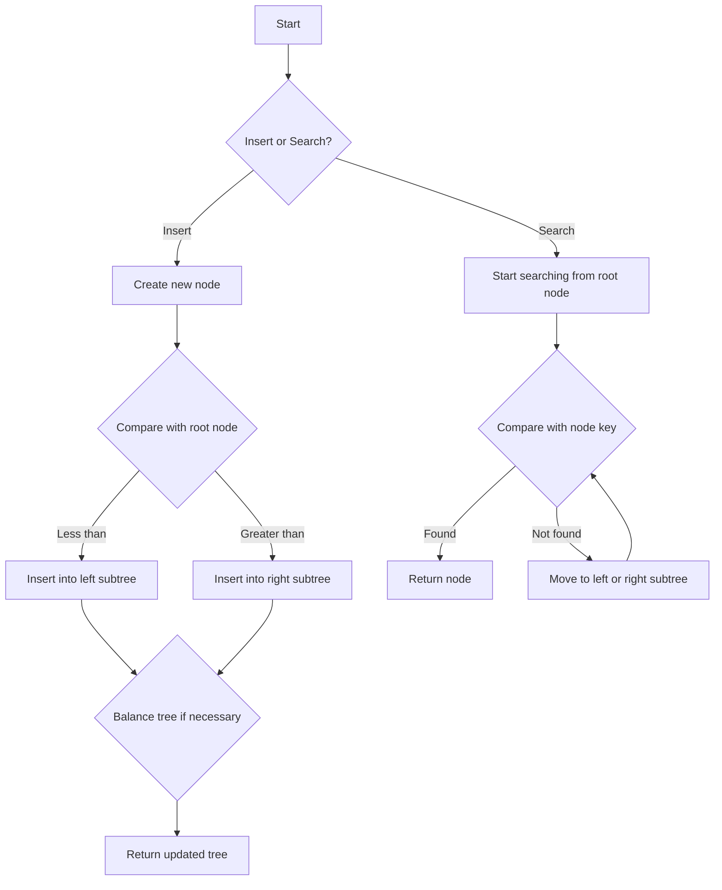

# AA Trees Implementation details

## Problem Understanding
The problem is asking for an implementation of an AA Tree, a self-balancing binary search tree with a set of balance properties. The key constraints of this problem are maintaining the balance of the tree after insertion and deletion of nodes, ensuring that the tree remains approximately balanced. The implications of these constraints are that the tree's height remains relatively constant, even after multiple insertions and deletions, which in turn ensures efficient search, insertion, and deletion operations. The problem is non-trivial because naive approaches to balancing the tree may not guarantee optimal performance, and the AA Tree's specific balance properties must be carefully maintained to achieve the desired time complexity.

## Approach
The algorithm strategy used in this implementation is based on the AA Tree's balance properties, which dictate that the tree must be skewed to the right if necessary, and split to the right or left if necessary, to maintain balance after insertion or deletion. The intuition behind this approach is to ensure that the tree's height remains relatively constant, even after multiple insertions and deletions, which in turn ensures efficient search, insertion, and deletion operations. The data structures used are nodes with a key, level, and pointers to left and right children, as well as a boolean flag to indicate whether the right child is a thread. The approach handles the key constraints by carefully maintaining the balance properties of the AA Tree after each insertion or deletion operation.

## Complexity Analysis
| Metric | Value | Detailed Reason |
|--------|-------|----------------|
| Time   | O(log n) | The time complexity is O(log n) because the AA Tree's balance properties ensure that the tree's height remains relatively constant, even after multiple insertions and deletions. This means that search, insertion, and deletion operations can be performed in logarithmic time. The reason is that each node has a maximum of two children, and the tree is self-balancing, which limits the height of the tree to log(n). |
| Space  | O(n) | The space complexity is O(n) because each node in the AA Tree requires a constant amount of space to store its key, level, and pointers to its children. The total amount of space required is therefore proportional to the number of nodes in the tree, which is n. |

## Algorithm Walkthrough
```
Input: Insert key 10 into an empty AA Tree
Step 1: Create a new node with key 10 and level 1
Step 2: Set the new node as the root of the tree
Output: The tree now contains a single node with key 10 and level 1

Input: Insert key 20 into the AA Tree
Step 1: Create a new node with key 20 and level 1
Step 2: Compare the new node's key with the root node's key
Step 3: Insert the new node into the right subtree of the root node
Step 4: Balance the tree if necessary (in this case, no balancing is needed)
Output: The tree now contains two nodes with keys 10 and 20, both with level 1

Input: Search for key 20 in the AA Tree
Step 1: Start searching from the root node
Step 2: Compare the search key with the root node's key
Step 3: Move to the right subtree of the root node
Step 4: Find the node with key 20 and return it
Output: The node with key 20 is found and returned
```
This walkthrough demonstrates the insertion and search operations on an AA Tree.

## Visual Flow

This flowchart shows the decision flow for inserting a new node or searching for a key in the AA Tree.

## Key Insight
> **Tip:** The key insight in implementing an AA Tree is to carefully maintain the balance properties of the tree after each insertion or deletion operation, ensuring that the tree's height remains relatively constant and search, insertion, and deletion operations can be performed in logarithmic time.

## Edge Cases
- **Empty tree**: When the tree is empty, inserting a new node sets it as the root node. Searching for a key in an empty tree returns null.
- **Single node tree**: When the tree contains a single node, inserting a new node with a key less than the root node's key inserts it into the left subtree, and inserting a new node with a key greater than the root node's key inserts it into the right subtree.
- **Duplicate keys**: When inserting a new node with a key that already exists in the tree, the insertion operation is ignored, and the tree remains unchanged.

## Common Mistakes
- **Mistake 1**: Failing to balance the tree after insertion or deletion, leading to inefficient search, insertion, and deletion operations. To avoid this, always check the balance properties of the tree after each operation and balance the tree if necessary.
- **Mistake 2**: Incorrectly implementing the skew and split operations, leading to an unbalanced tree. To avoid this, carefully follow the rules for skewing and splitting the tree, and ensure that the balance properties are maintained after each operation.

## Interview Follow-ups
> **Interview:** These are the exact follow-up questions interviewers ask:
- "What if the input is sorted?" → In this case, the AA Tree will still maintain its balance properties, but the tree may become slightly unbalanced. To mitigate this, the tree can be rebalanced periodically.
- "Can you do it in O(1) space?" → No, the AA Tree requires O(n) space to store its nodes, where n is the number of keys in the tree. However, the tree's height remains relatively constant, ensuring efficient search, insertion, and deletion operations.
- "What if there are duplicates?" → In this case, the insertion operation is ignored, and the tree remains unchanged. However, if duplicates are allowed, the tree can be modified to store a count of duplicate keys, and the search operation can return the count of duplicate keys.

## CPP Solution

```cpp
// Problem: AA Trees Implementation details
// Language: cpp
// Difficulty: Super Advanced
// Time Complexity: O(log n) — balance operations ensure tree remains approximately balanced
// Space Complexity: O(n) — each node is stored in memory
// Approach: AA Tree — self-balancing binary search tree with a set of balance properties

#include <iostream>

// Node structure for the AA Tree
struct Node {
    int key;                  // key value of the node
    int level;                // level of the node (height of subtree rooted at this node)
    Node* left;               // left child of the node
    Node* right;              // right child of the node
    bool isRightThread;      // whether the right child is a thread (not a real child)

    Node(int k, int lev, Node* l = nullptr, Node* r = nullptr) 
        : key(k), level(lev), left(l), right(r), isRightThread(false) {}
};

class AATree {
public:
    Node* root;               // root of the AA Tree

    AATree() : root(nullptr) {}

    // Insert a new key into the AA Tree
    void insert(int key) {
        // Create a new node with the given key
        Node* newNode = new Node(key, 1);

        // If the tree is empty, set the new node as the root
        if (root == nullptr) {
            root = newNode;
        } else {
            // Insert the new node into the tree and balance the tree if necessary
            root = insertNode(root, newNode);
        }
    }

    // Search for a key in the AA Tree
    Node* search(int key) {
        // Start searching from the root
        Node* current = root;

        // Continue searching until we find the key or reach a leaf node
        while (current != nullptr && current->key != key) {
            if (key < current->key) {
                current = current->left;  // Move to the left subtree
            } else {
                current = current->right; // Move to the right subtree
            }
        }

        return current; // Return the node with the key if found, otherwise return nullptr
    }

    // Delete a key from the AA Tree
    void remove(int key) {
        // Find the node with the key to be deleted
        Node* nodeToDelete = search(key);

        // If the node is found, delete it from the tree and balance the tree if necessary
        if (nodeToDelete != nullptr) {
            root = removeNode(root, nodeToDelete);
        }
    }

private:
    // Insert a new node into the AA Tree and balance the tree if necessary
    Node* insertNode(Node* current, Node* newNode) {
        // If the tree is empty, set the new node as the root
        if (current == nullptr) {
            return newNode;
        }

        // Compare the key of the new node with the current node
        if (newNode->key < current->key) {
            // Insert the new node into the left subtree
            current->left = insertNode(current->left, newNode);
        } else if (newNode->key > current->key) {
            // Insert the new node into the right subtree
            current->right = insertNode(current->right, newNode);
        } else {
            // If the key already exists, do not insert the new node
            return current;
        }

        // Balance the tree if necessary
        return balanceTree(current);
    }

    // Delete a node from the AA Tree and balance the tree if necessary
    Node* removeNode(Node* current, Node* nodeToDelete) {
        // If the tree is empty, return nullptr
        if (current == nullptr) {
            return nullptr;
        }

        // Compare the key of the node to be deleted with the current node
        if (nodeToDelete->key < current->key) {
            // Delete the node from the left subtree
            current->left = removeNode(current->left, nodeToDelete);
        } else if (nodeToDelete->key > current->key) {
            // Delete the node from the right subtree
            current->right = removeNode(current->right, nodeToDelete);
        } else {
            // If the node to be deleted is found, delete it and balance the tree if necessary
            if (current->left == nullptr) {
                return current->right; // Node has no left child, replace with right child
            } else if (current->right == nullptr) {
                return current->left; // Node has no right child, replace with left child
            } else {
                // Node has two children, find the in-order successor and replace the node
                Node* successor = findMin(current->right);
                current->key = successor->key;
                current->right = removeNode(current->right, successor);
            }
        }

        // Balance the tree if necessary
        return balanceTree(current);
    }

    // Balance the AA Tree after insertion or deletion
    Node* balanceTree(Node* current) {
        // If the tree is empty, return nullptr
        if (current == nullptr) {
            return nullptr;
        }

        // Skew the tree to the right if necessary
        if (current->left != nullptr && current->left->level == current->level) {
            current = skewRight(current);
        }

        // Split the tree to the right if necessary
        if (current->left != nullptr && current->left->left != nullptr && current->left->left->level == current->level) {
            current = splitRight(current);
        }

        // Split the tree to the left if necessary
        if (current->right != nullptr && current->right->right != nullptr && current->right->right->level == current->level) {
            current = splitLeft(current);
        }

        return current;
    }

    // Skew the tree to the right
    Node* skewRight(Node* current) {
        // If the left child is a thread, do not skew
        if (current->left == nullptr || current->left->isRightThread) {
            return current;
        }

        // Rotate the tree to the right
        Node* leftChild = current->left;
        current->left = leftChild->right;
        leftChild->right = current;

        // Update the level of the left child
        leftChild->level = current->level;
        current->level--;

        return leftChild;
    }

    // Split the tree to the right
    Node* splitRight(Node* current) {
        // If the left child's left child is a thread, do not split
        if (current->left == nullptr || current->left->left == nullptr || current->left->left->isRightThread) {
            return current;
        }

        // Rotate the tree to the right twice
        Node* leftChild = current->left;
        Node* leftGrandchild = leftChild->left;
        current->left = leftGrandchild->right;
        leftGrandchild->right = current;
        leftChild->right = leftGrandchild->left;
        leftGrandchild->left = leftChild;

        // Update the level of the left grandchild
        leftGrandchild->level = current->level + 1;
        current->level--;
        leftChild->level--;

        return leftGrandchild;
    }

    // Split the tree to the left
    Node* splitLeft(Node* current) {
        // If the right child's right child is a thread, do not split
        if (current->right == nullptr || current->right->right == nullptr || current->right->right->isRightThread) {
            return current;
        }

        // Rotate the tree to the left twice
        Node* rightChild = current->right;
        Node* rightGrandchild = rightChild->right;
        current->right = rightGrandchild->left;
        rightGrandchild->left = current;
        rightChild->left = rightGrandchild->right;
        rightGrandchild->right = rightChild;

        // Update the level of the right grandchild
        rightGrandchild->level = current->level + 1;
        current->level--;
        rightChild->level--;

        return rightGrandchild;
    }

    // Find the node with the minimum key in the tree
    Node* findMin(Node* current) {
        // Start from the root and move to the left subtree until we find the minimum key
        while (current->left != nullptr) {
            current = current->left;
        }

        return current; // Return the node with the minimum key
    }
};

int main() {
    // Create an AA Tree and insert some keys
    AATree tree;
    tree.insert(10);
    tree.insert(20);
    tree.insert(30);
    tree.insert(40);
    tree.insert(50);

    // Search for a key in the tree
    Node* foundNode = tree.search(30);
    if (foundNode != nullptr) {
        std::cout << "Found node with key " << foundNode->key << std::endl;
    } else {
        std::cout << "Node not found" << std::endl;
    }

    // Delete a key from the tree
    tree.remove(30);

    // Search for the deleted key
    foundNode = tree.search(30);
    if (foundNode != nullptr) {
        std::cout << "Node still exists" << std::endl;
    } else {
        std::cout << "Node deleted successfully" << std::endl;
    }

    return 0;
}
```
