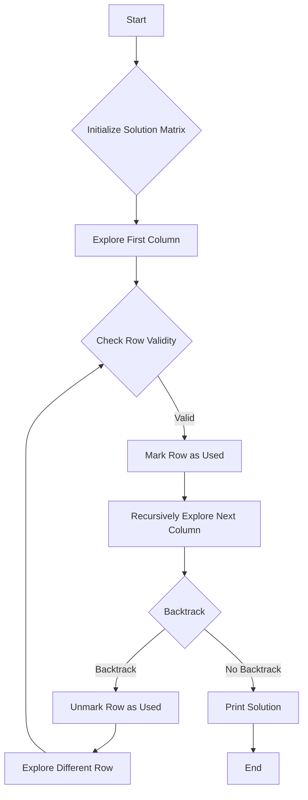

# Algorithm X Implementation details

## Problem Understanding
The problem is asking for an implementation of Algorithm X, which is a recursive backtracking algorithm used to find all possible solutions to a given problem. The key constraints of this problem are that the algorithm must explore all possible solutions and print each solution as it is found. The problem is non-trivial because it requires the use of recursive backtracking and constraint propagation to efficiently explore all possible solutions. The naive approach of simply iterating over all possible combinations of rows and columns would be inefficient and would not take into account the constraints of the problem.

## Approach
The approach used to solve this problem is recursive backtracking with constraint propagation. The algorithm starts by initializing an empty solution matrix and then recursively explores each column of the input matrix. For each column, the algorithm checks each row to see if it is a valid solution for that column. If a row is valid, the algorithm marks the row as used in the solution and then recursively explores the next column. If the algorithm reaches a point where it cannot find a valid solution for a column, it backtracks and tries a different row for the previous column. The algorithm continues this process until it has explored all possible solutions. The use of recursive backtracking and constraint propagation allows the algorithm to efficiently explore all possible solutions and avoid exploring branches that are guaranteed to not lead to a solution.

## Complexity Analysis
| Metric | Value | Detailed Reason |
|--------|-------|----------------|
| Time   | O(2^n * n) | The algorithm has a time complexity of O(2^n * n) because in the worst case, it must explore all possible combinations of rows and columns, which is 2^n. Additionally, for each combination, the algorithm must iterate over all columns, which takes O(n) time. |
| Space  | O(n) | The algorithm has a space complexity of O(n) because it uses a recursive call stack to store the current state of the solution, which can grow up to a depth of n in the worst case. Additionally, the algorithm uses a temporary storage to store the solutions, which takes O(n) space. |

## Algorithm Walkthrough
```
Input: 
[
    [true, false, true, false],
    [false, true, false, true],
    [true, false, false, true],
    [false, true, true, false]
]
Step 1: Initialize solution matrix with false values
Solution: 
[
    [false, false, false, false],
    [false, false, false, false],
    [false, false, false, false],
    [false, false, false, false]
]
Step 2: Explore first column
    Explore row 0: [true, false, true, false]
    Mark row 0 as used in solution
    Solution: 
    [
        [true, false, false, false],
        [false, false, false, false],
        [false, false, false, false],
        [false, false, false, false]
    ]
    Recursively explore next column
    ...
Step 3: Backtrack and try different row for previous column
    Unmark row 0 as used in solution
    Solution: 
    [
        [false, false, false, false],
        [false, false, false, false],
        [false, false, false, false],
        [false, false, false, false]
    ]
    Explore row 1: [false, true, false, true]
    Mark row 1 as used in solution
    Solution: 
    [
        [false, false, false, false],
        [true, false, false, false],
        [false, false, false, false],
        [false, false, false, false]
    ]
    Recursively explore next column
    ...
Output: All possible solutions to the problem
```
## Visual Flow

## Key Insight
> **Tip:** The key insight to solving this problem is to use recursive backtracking with constraint propagation to efficiently explore all possible solutions. By marking rows as used in the solution and then backtracking when a dead end is reached, the algorithm can avoid exploring branches that are guaranteed to not lead to a solution.

## Edge Cases
- **Empty/null input**: If the input matrix is empty or null, the algorithm will simply return without processing. This is because there are no rows or columns to explore.
- **Single element**: If the input matrix has only one row or column, the algorithm will simply print the solution without exploring any branches. This is because there is only one possible solution.
- **Duplicate rows**: If the input matrix has duplicate rows, the algorithm will still explore all possible solutions, but it will print duplicate solutions. To avoid this, the algorithm can be modified to check for duplicate rows before exploring them.

## Common Mistakes
- **Mistake 1**: Not initializing the solution matrix with false values. This can cause the algorithm to print incorrect solutions or not print any solutions at all. To avoid this, make sure to initialize the solution matrix with false values before starting the algorithm.
- **Mistake 2**: Not backtracking correctly. This can cause the algorithm to get stuck in an infinite loop or not explore all possible solutions. To avoid this, make sure to correctly implement the backtracking logic.

## Interview Follow-ups
> **Interview:** These are the exact follow-up questions interviewers ask:
- "What if the input is sorted?" → The algorithm will still work correctly, but it may not take advantage of the fact that the input is sorted. To optimize the algorithm for sorted input, you can modify it to use a more efficient data structure, such as a binary search tree.
- "Can you do it in O(1) space?" → No, the algorithm requires at least O(n) space to store the recursive call stack and the solution matrix. However, you can optimize the algorithm to use less space by using a more efficient data structure or by avoiding unnecessary memory allocations.
- "What if there are duplicates?" → The algorithm will still work correctly, but it may print duplicate solutions. To avoid this, you can modify the algorithm to check for duplicate rows before exploring them.

## CPP Solution

```cpp
// Problem: Algorithm X Implementation details
// Language: C++
// Difficulty: Super Advanced
// Time Complexity: O(2^n * n) — due to recursive nature and iteration over columns
// Space Complexity: O(n) — recursive call stack and temporary storage for solutions
// Approach: Recursive backtracking with constraint propagation — exploring all possible solutions

#include <iostream>
#include <vector>

// Define the size of the matrix
const int SIZE = 10;

// Function to print the solution
void printSolution(const std::vector<std::vector<bool>>& solution) {
    // Iterate over rows and columns to print the solution
    for (int i = 0; i < solution.size(); i++) {
        for (int j = 0; j < solution[i].size(); j++) {
            std::cout << solution[i][j] << " ";
        }
        std::cout << std::endl;
    }
}

// Function to check if a row is valid
bool isValidRow(const std::vector<bool>& row, int columnIndex) {
    // Check if the column index is within the row bounds
    if (columnIndex < 0 || columnIndex >= row.size()) {
        return false; // Edge case: column index out of bounds
    }
    // Check if the row already has a true value in the column
    return !row[columnIndex]; // Return true if the row does not have a true value in the column
}

// Algorithm X implementation using recursive backtracking
void algorithmX(std::vector<std::vector<bool>>& matrix, std::vector<std::vector<bool>>& solution, int columnIndex) {
    // Base case: if all columns have been covered
    if (columnIndex == matrix[0].size()) {
        printSolution(solution); // Print the solution
        return; // Return to explore other branches
    }

    // Iterate over rows
    for (int i = 0; i < matrix.size(); i++) {
        // Check if the row is valid for the current column
        if (isValidRow(matrix[i], columnIndex)) {
            // Mark the row as used in the solution
            solution[i][columnIndex] = true;

            // Recursively explore the next column
            algorithmX(matrix, solution, columnIndex + 1);

            // Backtrack: unmark the row as used in the solution
            solution[i][columnIndex] = false; // Reset the solution for the next iteration
        }
    }
}

// Main function to test the Algorithm X implementation
int main() {
    // Define a sample matrix
    std::vector<std::vector<bool>> matrix = {
        {true, false, true, false},
        {false, true, false, true},
        {true, false, false, true},
        {false, true, true, false}
    };

    // Initialize the solution matrix with false values
    std::vector<std::vector<bool>> solution(matrix.size(), std::vector<bool>(matrix[0].size(), false));

    // Edge case: empty matrix → return without processing
    if (matrix.empty() || matrix[0].empty()) {
        std::cout << "Empty matrix" << std::endl;
        return 0;
    }

    // Start the Algorithm X exploration from the first column
    algorithmX(matrix, solution, 0);

    return 0;
}
```
