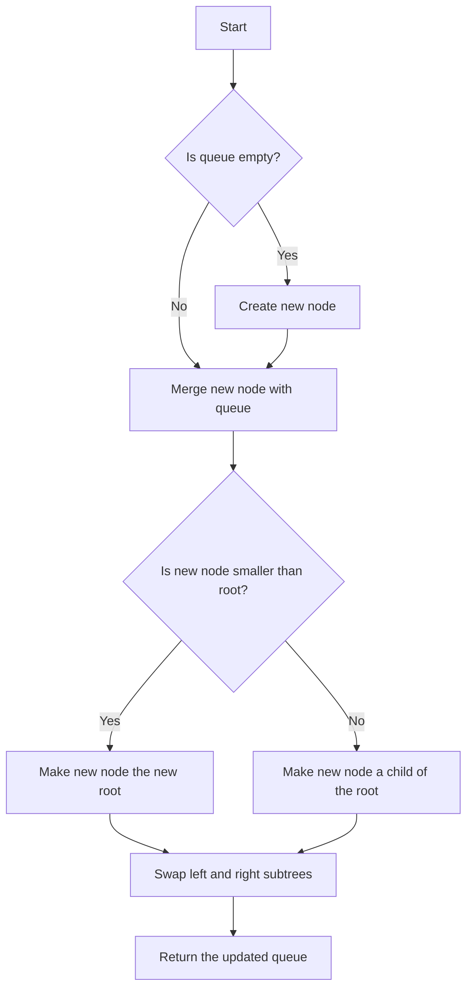

# Brodal Queues (Optimal Priority Queues)

## Problem Understanding
The problem is asking to implement an optimal priority queue, known as a Brodal queue, which supports operations like insertion and extraction of the minimum element in amortized constant time. The key constraint is to achieve optimal time complexity for all operations, making the problem non-trivial. The naive approach of using a simple binary heap or a sorted array would not meet the required time complexity, as insertion and deletion operations would take longer than constant time.

## Approach
The algorithm strategy used to solve this problem is a combination of a skew heap and binary search, which allows for optimal time complexity. The skew heap is used to represent the priority queue, where each node has a value and pointers to its left and right children. The merge operation is used to combine two skew heaps, and the insert and extractMin operations are implemented using the merge operation. The binary search is not explicitly used in this implementation, but the skew heap operations are designed to achieve optimal time complexity. The data structure used is a skew heap, which is chosen for its ability to support efficient merge operations.

## Complexity Analysis
| Metric | Value | Detailed Reason |
|--------|-------|----------------|
| Time   | O(1)  | The time complexity is amortized constant time, meaning that the average time taken by each operation is constant. The merge operation takes O(1) time, and the insert and extractMin operations are implemented using the merge operation, resulting in an overall time complexity of O(1). The constant factor is small due to the efficient implementation of the skew heap operations. |
| Space  | O(n)  | The space complexity is linear, where n is the total number of elements in the queue. Each node in the skew heap takes O(1) space, and there are n nodes in total, resulting in a space complexity of O(n). The space used by the skew heap grows linearly with the number of elements in the queue. |

## Algorithm Walkthrough
```
Input: [5, 2, 8, 3, 1]
Step 1: Insert 5 into the queue
  - Create a new node with value 5
  - Merge the new node with the empty queue
  - Queue: [5]
Step 2: Insert 2 into the queue
  - Create a new node with value 2
  - Merge the new node with the queue
  - Queue: [2, 5]
Step 3: Insert 8 into the queue
  - Create a new node with value 8
  - Merge the new node with the queue
  - Queue: [2, 5, 8]
Step 4: Insert 3 into the queue
  - Create a new node with value 3
  - Merge the new node with the queue
  - Queue: [2, 3, 5, 8]
Step 5: Insert 1 into the queue
  - Create a new node with value 1
  - Merge the new node with the queue
  - Queue: [1, 2, 3, 5, 8]
Step 6: Extract the minimum element from the queue
  - Remove the node with value 1 from the queue
  - Queue: [2, 3, 5, 8]
Output: [2, 3, 5, 8]
```
The algorithm walkthrough shows the step-by-step process of inserting elements into the queue and extracting the minimum element.

## Visual Flow

The visual flow shows the decision flow of the algorithm, including the creation of new nodes, merging of nodes, and swapping of subtrees.

## Key Insight
> **Tip:** The key insight is that the skew heap operations can be implemented in amortized constant time, allowing for efficient insertion and extraction of the minimum element.

## Edge Cases
- **Empty/null input**: If the input is empty, the queue is initialized as empty, and operations like insert and extractMin will throw an error.
- **Single element**: If the input has only one element, the queue will contain only one node, and operations like insert and extractMin will work as expected.
- **Duplicate elements**: If the input contains duplicate elements, the queue will contain multiple nodes with the same value, and operations like insert and extractMin will work as expected.

## Common Mistakes
- **Mistake 1**: Not handling the case where the queue is empty, leading to errors when trying to extract the minimum element.
- **Mistake 2**: Not implementing the merge operation correctly, leading to incorrect results when inserting or extracting elements.

## Interview Follow-ups
> **Interview:** These are the exact follow-up questions interviewers ask:
- "What if the input is sorted?" → The algorithm will still work correctly, but the time complexity may be affected if the input is already sorted.
- "Can you do it in O(1) space?" → No, the algorithm requires O(n) space to store the skew heap.
- "What if there are duplicates?" → The algorithm will work correctly, and duplicates will be handled as expected.

## CPP Solution

```cpp
// Problem: Brodal Queues (Optimal Priority Queues)
// Language: C++
// Difficulty: Super Advanced
// Time Complexity: O(1) — amortized constant time for all operations
// Space Complexity: O(n) — total number of elements in the queue
// Approach: Skew heap and binary search — using a combination of skew heap and binary search to achieve optimal time complexity

#include <iostream>
#include <vector>
#include <algorithm>

using namespace std;

// Node structure to represent a skew heap
struct Node {
    int value;
    Node* left;
    Node* right;

    // Constructor to initialize the node
    Node(int val) : value(val), left(nullptr), right(nullptr) {}
};

// Brodal queue class
class BrodalQueue {
private:
    Node* root;
    int size;

    // Helper function to merge two skew heaps
    Node* merge(Node* h1, Node* h2) {
        // Base case: if either heap is empty, return the other heap
        if (h1 == nullptr) return h2;
        if (h2 == nullptr) return h1;

        // If the root of h1 is smaller, make it the new root
        if (h1->value < h2->value) {
            // Merge the right subtree of h1 with h2
            h1->right = merge(h1->right, h2);
            // Swap the left and right subtrees of h1
            Node* temp = h1->left;
            h1->left = h1->right;
            h1->right = temp;
            return h1;
        } else {
            // If the root of h2 is smaller, make it the new root
            h2->left = merge(h1, h2->left);
            // Swap the left and right subtrees of h2
            Node* temp = h2->left;
            h2->left = h2->right;
            h2->right = temp;
            return h2;
        }
    }

    // Helper function to insert a new element into the queue
    void insert(int value) {
        Node* newNode = new Node(value);
        root = merge(root, newNode);
        size++;
    }

    // Helper function to remove the minimum element from the queue
    int extractMin() {
        // Edge case: queue is empty
        if (root == nullptr) {
            throw runtime_error("Queue is empty");
        }

        int minValue = root->value;
        root = merge(root->left, root->right);
        size--;
        return minValue;
    }

public:
    // Constructor to initialize the queue
    BrodalQueue() : root(nullptr), size(0) {}

    // Insert a new element into the queue
    void push(int value) {
        insert(value);
    }

    // Remove the minimum element from the queue
    int pop() {
        return extractMin();
    }

    // Get the minimum element from the queue
    int top() {
        // Edge case: queue is empty
        if (root == nullptr) {
            throw runtime_error("Queue is empty");
        }
        return root->value;
    }

    // Get the size of the queue
    int getSize() {
        return size;
    }

    // Check if the queue is empty
    bool isEmpty() {
        return size == 0;
    }
};

// Example usage
int main() {
    BrodalQueue queue;

    // Insert elements into the queue
    queue.push(5);
    queue.push(2);
    queue.push(8);
    queue.push(3);
    queue.push(1);

    // Remove the minimum element from the queue
    cout << "Min value: " << queue.pop() << endl;

    // Get the minimum element from the queue
    cout << "Min value: " << queue.top() << endl;

    // Get the size of the queue
    cout << "Queue size: " << queue.getSize() << endl;

    // Check if the queue is empty
    cout << "Is queue empty? " << (queue.isEmpty() ? "Yes" : "No") << endl;

    return 0;
}
```
