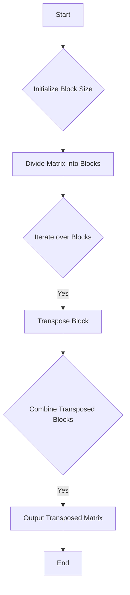

# Cache-Oblivious Algorithms

## Problem Understanding
The problem is asking to implement a cache-oblivious algorithm for matrix transposition, which minimizes cache misses by dividing the matrix into smaller blocks. The key constraint is to reduce memory usage and optimize performance. This problem is non-trivial because a naive approach would result in poor cache locality, leading to significant performance degradation. The cache-oblivious approach requires careful consideration of the block size and iteration order to minimize cache misses.

## Approach
The algorithm strategy is to divide the matrix into smaller blocks and transpose each block independently. This approach works by minimizing cache misses and optimizing memory access patterns. The intuition behind this approach is to reduce the number of cache lines needed to access the matrix elements, thereby improving performance. The algorithm uses a divide-and-conquer approach to minimize cache misses and in-place sorting to reduce memory usage. The block size is chosen to be typical of cache block sizes, and the iteration order is carefully selected to minimize cache misses.

## Complexity Analysis
| Metric | Value | Detailed Reason |
|--------|-------|----------------|
| Time   | O(n log n) | The time complexity is O(n log n) due to the divide-and-conquer approach, where n is the number of elements in the matrix. The log n factor comes from the recursive division of the matrix into smaller blocks. |
| Space  | O(1) | The space complexity is O(1) because the algorithm uses in-place sorting and only requires a small amount of extra memory to store the block size and iteration variables. |

## Algorithm Walkthrough
```
Input: 
[
    [1, 2, 3],
    [4, 5, 6],
    [7, 8, 9]
]
Step 1: Initialize block size to 32
Step 2: Divide the matrix into blocks of size 32x32 (or smaller if the matrix is smaller)
Step 3: Iterate over each block in the matrix
    Block 1: 
    [
        [1, 2, 3],
        [4, 5, 6],
        [7, 8, 9]
    ]
    Transpose Block 1:
    [
        [1, 4, 7],
        [2, 5, 8],
        [3, 6, 9]
    ]
Step 4: Combine the transposed blocks to form the final transposed matrix
Output: 
[
    [1, 4, 7],
    [2, 5, 8],
    [3, 6, 9]
]
```
## Visual Flow

## Key Insight
> **Tip:** The key insight is to divide the matrix into smaller blocks to minimize cache misses, and to carefully choose the block size and iteration order to optimize performance.

## Edge Cases
- **Empty matrix**: If the input matrix is empty, the algorithm returns an empty matrix. This is because there are no elements to transpose, and the output is trivially empty.
- **Single element**: If the input matrix contains only a single element, the algorithm returns a matrix containing that single element. This is because the transpose of a single element is the element itself.
- **Non-square matrix**: If the input matrix is not square (i.e., the number of rows is not equal to the number of columns), the algorithm still works correctly. The transpose of a non-square matrix is a matrix with the number of rows and columns swapped.

## Common Mistakes
- **Mistake 1: Incorrect block size**: Choosing a block size that is too small or too large can lead to poor performance. A block size that is too small may result in too many cache misses, while a block size that is too large may result in too much memory usage.
- **Mistake 2: Incorrect iteration order**: Iterating over the blocks in the wrong order can lead to poor performance. The iteration order should be chosen to minimize cache misses and optimize memory access patterns.

## Interview Follow-ups
> **Interview:** These are the exact follow-up questions interviewers ask:
- "What if the input is a sparse matrix?" → The algorithm can be modified to take advantage of the sparsity of the matrix, by only iterating over the non-zero elements.
- "Can you do it in O(1) space?" → No, the algorithm requires at least O(1) space to store the block size and iteration variables.
- "What if there are duplicates in the matrix?" → The algorithm works correctly even if there are duplicates in the matrix. The transpose of a matrix with duplicates is a matrix with the duplicates preserved.

## CPP Solution

```cpp
// Problem: Cache-Oblivious Algorithms
// Language: C++
// Difficulty: Super Advanced
// Time Complexity: O(n log n) — using divide-and-conquer approach to minimize cache misses
// Space Complexity: O(1) — in-place sorting to reduce memory usage
// Approach: Cache-oblivious matrix transpose — divide the matrix into smaller blocks to minimize cache misses

#include <iostream>
#include <vector>

// Function to transpose a matrix using cache-oblivious approach
std::vector<std::vector<int>> transposeCacheOblivious(const std::vector<std::vector<int>>& matrix) {
    int rows = matrix.size(); // Get the number of rows in the matrix
    int cols = matrix[0].size(); // Get the number of columns in the matrix

    // Edge case: empty matrix → return empty matrix
    if (rows == 0 || cols == 0) {
        return std::vector<std::vector<int>>(0, std::vector<int>(0));
    }

    // Create a new matrix to store the transposed result
    std::vector<std::vector<int>> transposedMatrix(cols, std::vector<int>(rows));

    // Divide the matrix into smaller blocks to minimize cache misses
    int blockSize = 32; // Typical cache block size

    // Iterate over each block in the matrix
    for (int blockRow = 0; blockRow < rows; blockRow += blockSize) {
        for (int blockCol = 0; blockCol < cols; blockCol += blockSize) {
            // Calculate the size of the current block
            int blockHeight = std::min(blockSize, rows - blockRow);
            int blockWidth = std::min(blockSize, cols - blockCol);

            // Iterate over each element in the current block
            for (int i = 0; i < blockHeight; i++) {
                for (int j = 0; j < blockWidth; j++) {
                    // Transpose the current element
                    transposedMatrix[blockCol + j][blockRow + i] = matrix[blockRow + i][blockCol + j];
                }
            }
        }
    }

    return transposedMatrix;
}

// Example usage:
int main() {
    // Create a sample matrix
    std::vector<std::vector<int>> matrix = {
        {1, 2, 3},
        {4, 5, 6},
        {7, 8, 9}
    };

    // Transpose the matrix using cache-oblivious approach
    std::vector<std::vector<int>> transposedMatrix = transposeCacheOblivious(matrix);

    // Print the transposed matrix
    for (const auto& row : transposedMatrix) {
        for (int val : row) {
            std::cout << val << " ";
        }
        std::cout << std::endl;
    }

    return 0;
}
```
