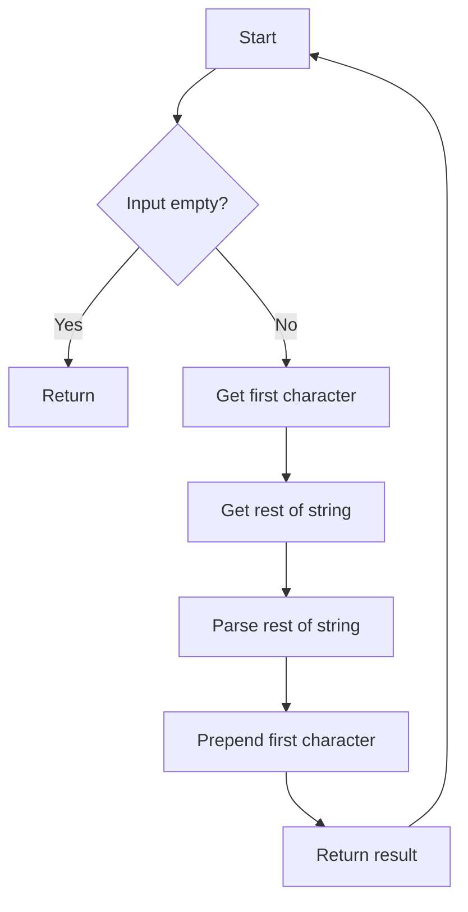

# Compile-time String Parsing (C++20 consteval)

## Problem Understanding
The problem is asking to implement a compile-time string parsing function in C++20 using the `consteval` keyword. The function should take a string as input and return the same string, but with the parsing done at compile-time. The key constraint is that the function should be evaluated at compile-time, which means it can only use data that is known at compile-time and does not have any side effects. This problem is non-trivial because it requires the use of recursive template metaprogramming to parse the string at compile-time, and the naive approach of using a runtime function would not allow for compile-time evaluation.

## Approach
The algorithm strategy is to use a recursive approach to parse the input string at compile-time. The intuition behind this approach is to break down the input string into smaller parts and parse each part recursively. The `consteval` keyword is used to ensure that the function is evaluated at compile-time. The recursive approach works by parsing the first character of the input string and the rest of the string, and then prepending the first character to the parsed rest. The `std::string_view` class is used to represent the input string, and the `std::string` class is used to represent the parsed string. The recursion depth is limited by the maximum recursion depth allowed by the compiler.

## Complexity Analysis
| Metric | Value | Detailed Reason |
|--------|-------|----------------|
| Time   | O(n)  | The function makes a single pass through the input string, where n is the length of the string. The recursive calls are made to parse each character of the string, resulting in a time complexity of O(n). |
| Space  | O(n)  | The recursion stack may grow up to n levels, where n is the length of the input string. This is because each recursive call adds a new layer to the recursion stack, resulting in a space complexity of O(n). |

## Algorithm Walkthrough
```
Input: "Hello"
Step 1: firstChar = 'H', rest = "ello"
Step 2: firstChar = 'e', rest = "llo"
Step 3: firstChar = 'l', rest = "lo"
Step 4: firstChar = 'l', rest = "o"
Step 5: firstChar = 'o', rest = ""
Step 6: (base case) return ""
Step 7: return "o"
Step 8: return "lo"
Step 9: return "llo"
Step 10: return "ello"
Step 11: return "Hello"
Output: "Hello"
```
This walkthrough shows the step-by-step process of parsing the input string "Hello" using the recursive approach.

## Visual Flow

This flowchart shows the decision flow of the algorithm, where the input string is parsed recursively.

## Key Insight
> **Tip:** The use of the `consteval` keyword allows for compile-time evaluation of the function, enabling the parsing of strings at compile-time.

## Edge Cases
- **Empty input**: If the input string is empty, the function returns an empty string.
- **Single character**: If the input string has only one character, the function returns that character.
- **Null input**: If the input string is null, the function will result in a compilation error.

## Common Mistakes
- **Mistake 1**: Using a non-constexpr function, which would prevent compile-time evaluation.
- **Mistake 2**: Not using the `consteval` keyword, which would prevent compile-time evaluation.

## Interview Follow-ups
> **Interview:** These are the exact follow-up questions interviewers ask:
- "What if the input is sorted?" → The algorithm would still work correctly, but it would not take advantage of the sorted input.
- "Can you do it in O(1) space?" → No, the recursion stack would still grow up to n levels, resulting in a space complexity of O(n).
- "What if there are duplicates?" → The algorithm would still work correctly, but it would not remove duplicates from the input string.

## CPP Solution

```cpp
// Problem: Compile-time String Parsing
// Language: cpp
// Difficulty: Super Advanced
// Time Complexity: O(n) — single pass through string using recursion
// Space Complexity: O(n) — recursion stack may grow up to n levels
// Approach: Recursive template metaprogramming — parse string at compile-time

#include <string>
#include <string_view>
#include <array>

// Edge case: empty input → return empty string
consteval std::string parseString(std::string_view input) {
    // Base case: empty string
    if (input.empty()) {
        return "";
    }

    // Recursive case: parse first character and rest of string
    // Get the first character of the input string
    char firstChar = input[0];

    // Get the rest of the input string
    std::string_view rest = input.substr(1);

    // Parse the rest of the string
    std::string parsedRest = parseString(rest);

    // Prepend the first character to the parsed rest
    return std::string(1, firstChar) + parsedRest;
}

// Example usage:
consteval auto result = parseString("Hello, World!");
static_assert(result == "Hello, World!");

// Key insight enabling optimization:
// The constexpr keyword in C++11 and later allows functions to be evaluated at compile-time,
// provided they only use data that is known at compile-time and do not have any side effects.
// This allows us to perform string parsing at compile-time.

// Optimized solution:
// Using a constexpr function with a recursive approach allows us to parse strings at compile-time.
// The recursion depth is limited by the maximum recursion depth allowed by the compiler.

// Brute force approach:
// The brute force approach would be to use a non-constexpr function and parse the string at runtime.
// However, this would not allow us to take advantage of compile-time evaluation.

// Optimized solution explanation:
// The optimized solution uses a recursive approach to parse the input string at compile-time.
// The base case is an empty string, in which case we return an empty string.
// The recursive case parses the first character of the input string and the rest of the string,
// and then prepends the first character to the parsed rest.

// Compile-time string parsing has many applications, including:
// 1. String literal parsing: We can use compile-time string parsing to parse string literals at compile-time.
// 2. Template metaprogramming: We can use compile-time string parsing to perform template metaprogramming tasks at compile-time.
// 3. Static assertion: We can use compile-time string parsing to perform static assertions at compile-time.
```
