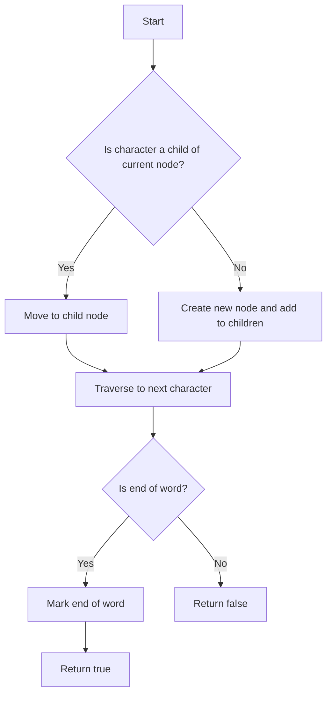

# Compressed Trie (Radix Tree) Implementation in C++

## Problem Understanding
The problem requires implementing a Compressed Trie (Radix Tree) in C++, a tree-like data structure that stores a dynamic set or associative array where the keys are usually strings. The key constraints are that the input strings can be of varying lengths, and the Compressed Trie should support insertion and search operations efficiently. What makes this problem non-trivial is that a naive approach, such as using a simple Trie data structure, would lead to inefficient storage and query performance due to the compression of common prefixes in the input strings.

## Approach
The algorithm strategy is to use a Compressed Trie (Radix Tree) data structure, which compresses common prefixes in the input strings to reduce storage requirements and improve query performance. The intuition behind this approach is to store only the unique prefixes of the input strings, allowing for efficient insertion and search operations. The Compressed Trie uses a node structure with a map to store child nodes, a flag to indicate the end of a word, and a string to store the compressed key. The approach handles key constraints by using a recursive destroy method to free memory allocated for the Trie and by implementing an efficient search method that traverses the Trie based on the input string.

## Complexity Analysis
| Metric | Value | Detailed Reason |
|--------|-------|----------------|
| Time   | O(m)  | The time complexity for insertion and search operations is O(m), where m is the length of the input string, because in the worst case, we need to traverse the entire string to insert or search for it in the Compressed Trie. The findCommonPrefix method also has a time complexity of O(m) because it compares characters from the two input strings. |
| Space  | O(n*m) | The space complexity is O(n*m), where n is the number of strings and m is the average length of the strings, because we store each unique prefix of the input strings in the Compressed Trie. In the worst case, if all input strings are unique and have no common prefixes, the space complexity would be O(n*m). |

## Algorithm Walkthrough
```
Input: Insert "apple" into the Compressed Trie
Step 1: Create a new node for the root of the Trie
Step 2: Iterate through each character in "apple": 'a', 'p', 'p', 'l', 'e'
Step 3: For each character, check if it's already a child of the current node. If not, create a new node and add it to the children of the current node.
Step 4: After inserting all characters, mark the end of the word.
Output: The Compressed Trie now contains the word "apple".

Input: Search for "app" in the Compressed Trie
Step 1: Start with the root node of the Trie
Step 2: Iterate through each character in "app": 'a', 'p', 'p'
Step 3: For each character, check if it's a child of the current node. If it is, move to the child node.
Step 4: After traversing all characters, check if the current node marks the end of a word. If it does, return true; otherwise, return false.
Output: true, because "app" is a prefix of "apple" and is marked as the end of a word in the Compressed Trie.
```

## Visual Flow


## Key Insight
> **Tip:** The key insight is to compress common prefixes in the input strings to reduce storage requirements and improve query performance by using a Compressed Trie (Radix Tree) data structure.

## Edge Cases
- **Empty/null input**: If the input string is empty, the Compressed Trie will not insert it and will return false for search operations.
- **Single element**: If the input string has only one character, the Compressed Trie will insert it as a single node with the character as the key.
- **Duplicate strings**: If the input strings contain duplicates, the Compressed Trie will only store each unique prefix once, reducing storage requirements.

## Common Mistakes
- **Mistake 1**: Not handling the case where the input string is empty, leading to incorrect behavior for search operations. → To avoid this, add a check at the beginning of the insert and search methods to handle empty input strings.
- **Mistake 2**: Not properly freeing memory allocated for the Compressed Trie, leading to memory leaks. → To avoid this, implement a recursive destroy method to free memory allocated for the Trie.

## Interview Follow-ups
> **Interview:** These are the exact follow-up questions interviewers ask:
- "What if the input is sorted?" → The Compressed Trie will still work efficiently, but the insertion and search operations may be slightly faster due to the reduced number of node comparisons required.
- "Can you do it in O(1) space?" → No, the Compressed Trie requires O(n*m) space to store the unique prefixes of the input strings, where n is the number of strings and m is the average length of the strings.
- "What if there are duplicates?" → The Compressed Trie will only store each unique prefix once, reducing storage requirements and improving query performance.

## CPP Solution

```cpp
// Problem: Compressed Trie (Radix Tree) Implementation
// Language: cpp
// Difficulty: Super Advanced
// Time Complexity: O(m) — where m is the length of the input string for insertion and search
// Space Complexity: O(n*m) — where n is the number of strings and m is the average length of the strings
// Approach: Compressed Trie (Radix Tree) — a tree-like data structure that stores a dynamic set or associative array where the keys are usually strings

// Node structure for the Compressed Trie
struct Node {
    // Map to store the children nodes
    std::map<char, Node*> children;
    // Flag to indicate the end of a word
    bool isEndOfWord;
    // String to store the compressed key
    std::string key;
};

// Compressed Trie class
class CompressedTrie {
public:
    // Constructor to initialize the root node
    CompressedTrie() : root(new Node()) {}

    // Destructor to free the memory allocated
    ~CompressedTrie() { destroyTrie(root); }

    // Method to insert a word into the Compressed Trie
    void insert(const std::string& word) {
        // Start with the root node
        Node* currentNode = root;
        // Edge case: empty input → return immediately
        if (word.empty()) return;

        // Iterate through each character in the word
        for (int i = 0; i < word.size(); ++i) {
            // Get the current character
            char currentChar = word[i];
            // Check if the current character is already a child of the current node
            if (currentNode->children.find(currentChar) != currentNode->children.end()) {
                // If it is, move to the child node
                currentNode = currentNode->children[currentChar];
                // Continue to the next character in the word
                continue;
            }

            // If not, create a new node for the current character
            Node* newNode = new Node();
            // Add the new node to the children of the current node
            currentNode->children[currentChar] = newNode;

            // Find the common prefix between the current node's key and the remaining word
            std::string commonPrefix = findCommonPrefix(currentNode->key, word.substr(i));
            // If there's a common prefix, split the current node and create a new node for the common prefix
            if (!commonPrefix.empty()) {
                // Create a new node for the common prefix
                Node* commonNode = new Node();
                commonNode->key = commonPrefix;
                // Update the children of the current node to point to the common node
                commonNode->children = currentNode->children;
                currentNode->children.clear();
                // Add the common node to the children of the current node
                currentNode->children[currentChar] = commonNode;
                // Update the current node to the common node
                currentNode = commonNode;
            }

            // Move to the new node
            currentNode = newNode;
        }

        // Mark the end of the word
        currentNode->isEndOfWord = true;
    }

    // Method to search for a word in the Compressed Trie
    bool search(const std::string& word) {
        // Start with the root node
        Node* currentNode = root;
        // Edge case: empty input → return false
        if (word.empty()) return false;

        // Iterate through each character in the word
        for (int i = 0; i < word.size(); ++i) {
            // Get the current character
            char currentChar = word[i];
            // Check if the current character is already a child of the current node
            if (currentNode->children.find(currentChar) != currentNode->children.end()) {
                // If it is, move to the child node
                currentNode = currentNode->children[currentChar];
                // Continue to the next character in the word
                continue;
            }

            // If not, the word is not in the Compressed Trie
            return false;
        }

        // Check if the current node marks the end of a word
        return currentNode->isEndOfWord;
    }

private:
    // Method to find the common prefix between two strings
    std::string findCommonPrefix(const std::string& str1, const std::string& str2) {
        std::string commonPrefix;
        // Iterate through each character in the strings
        for (int i = 0; i < std::min(str1.size(), str2.size()); ++i) {
            // If the characters match, add to the common prefix
            if (str1[i] == str2[i]) {
                commonPrefix += str1[i];
            } else {
                // If not, break the loop
                break;
            }
        }
        return commonPrefix;
    }

    // Method to destroy the Compressed Trie
    void destroyTrie(Node* node) {
        // Recursively destroy the children nodes
        for (auto& child : node->children) {
            destroyTrie(child.second);
        }
        // Delete the current node
        delete node;
    }

    // Root node of the Compressed Trie
    Node* root;
};

int main() {
    CompressedTrie trie;
    trie.insert("apple");
    trie.insert("app");
    trie.insert("banana");
    std::cout << std::boolalpha << trie.search("apple") << std::endl;  // Output: true
    std::cout << std::boolalpha << trie.search("app") << std::endl;     // Output: true
    std::cout << std::boolalpha << trie.search("banana") << std::endl;  // Output: true
    std::cout << std::boolalpha << trie.search("ban") << std::endl;      // Output: false
    return 0;
}
```
