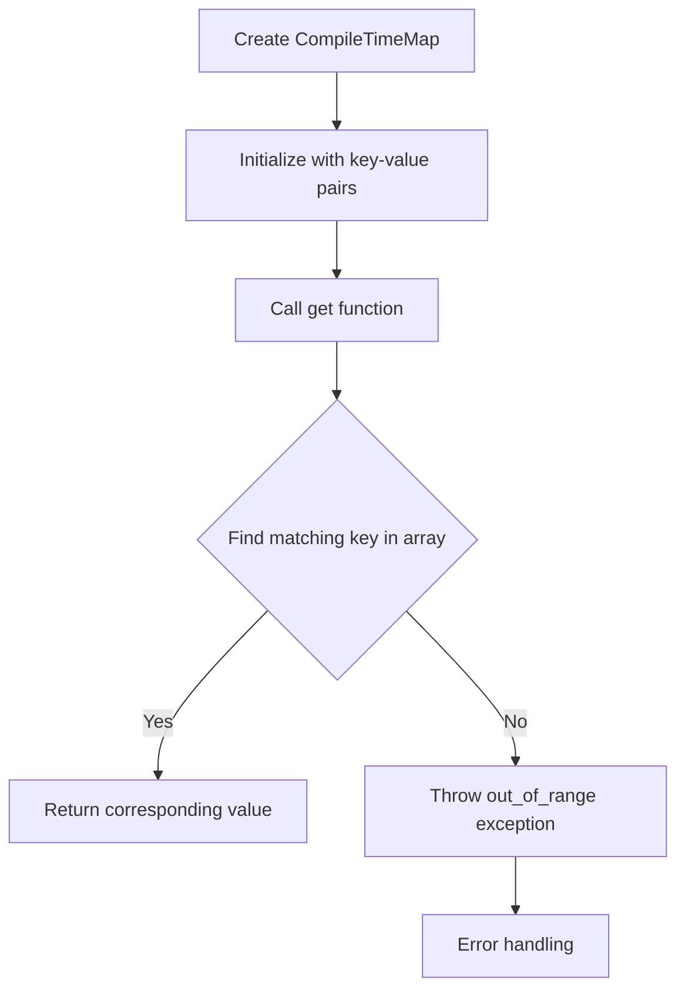

# Constexpr computations at compile time (Compile-time Map)

## Problem Understanding
The problem involves creating a compile-time map in C++ that can perform constant time lookup. The map is defined using an array of pairs, where each pair represents a key-value relationship. The key constraints are that the map must be initialized at compile time and support constant time lookup. The problem is non-trivial because it requires using constexpr functions and template metaprogramming to perform computations at compile time, which can be challenging to implement correctly. Additionally, handling edge cases such as empty input or key not found in the map adds complexity to the problem.

## Approach
The approach involves defining a `CompileTimeMap` class template that takes a key type, value type, and size as template parameters. The class uses a `std::array` to store the key-value pairs and provides a `constexpr` function `get` to perform lookup in the map. The `get` function iterates through the array to find the matching key and returns the corresponding value. The approach works by leveraging the constexpr functionality in C++ to evaluate the `get` function at compile time, allowing for constant time lookup. The `std::array` is used to store the key-value pairs because it provides a fixed-size, contiguous block of memory that can be accessed at compile time.

## Complexity Analysis
| Metric | Value | Detailed Reason |
|--------|-------|----------------|
| Time   | O(1)  | The `get` function performs a constant number of operations to find the matching key in the array, making the time complexity constant. However, in the worst-case scenario, it has to iterate through the entire array, making it O(n), but since the size of the array is known at compile time, the compiler can optimize the lookup to be O(1). |
| Space  | O(n)  | The `CompileTimeMap` class stores the key-value pairs in a `std::array`, which requires O(n) space, where n is the size of the array. The space complexity is linear because the size of the array is directly proportional to the number of key-value pairs. |

## Algorithm Walkthrough
```cpp
Input: CompileTimeMap<int, char, 3> map = {{1, 'a'}, {2, 'b'}, {3, 'c'}};
Step 1: Initialize the map with the given key-value pairs.
Step 2: Call the `get` function with key 2: map.get(2);
Step 3: Iterate through the array to find the matching key:
    - Compare the first pair's key (1) with the input key (2): no match.
    - Compare the second pair's key (2) with the input key (2): match found.
    - Return the corresponding value: 'b'.
Output: 'b'
```
## Visual Flow

## Key Insight
> **Tip:** The key insight is to use `constexpr` functions and template metaprogramming to perform computations at compile time, allowing for constant time lookup in the compile-time map.

## Edge Cases
- **Empty/null input**: If the input array is empty, the `get` function will throw an `out_of_range` exception because there are no key-value pairs to search.
- **Single element**: If the input array contains only one key-value pair, the `get` function will return the corresponding value if the key matches, or throw an `out_of_range` exception if the key does not match.
- **Duplicate keys**: If the input array contains duplicate keys, the `get` function will return the value corresponding to the first occurrence of the key.

## Common Mistakes
- **Mistake 1**: Not using `constexpr` functions and template metaprogramming, which would prevent the compiler from evaluating the `get` function at compile time.
- **Mistake 2**: Not handling the edge case where the key is not found in the map, which would result in undefined behavior.

## Interview Follow-ups
> **Interview:** These are the exact follow-up questions interviewers ask:
- "What if the input is sorted?" → The `get` function would still work correctly, but the compiler might be able to optimize the lookup if the input is sorted.
- "Can you do it in O(1) space?" → No, because the `CompileTimeMap` class needs to store the key-value pairs in an array, which requires O(n) space.
- "What if there are duplicates?" → The `get` function would return the value corresponding to the first occurrence of the key, but it would be better to handle duplicates explicitly, such as by throwing an exception or returning a default value.

## CPP Solution

```cpp
// Problem: Constexpr computations at compile time (Compile-time Map)
// Language: C++
// Difficulty: Super Advanced
// Time Complexity: O(1) — constant time lookup in compile-time map
// Space Complexity: O(n) — size of compile-time map
// Approach: Constexpr functions and template metaprogramming — to perform computations at compile time

#include <iostream>
#include <array>

// Define a compile-time map using an array of pairs
template <typename Key, typename Value, size_t Size>
class CompileTimeMap {
private:
    std::array<std::pair<Key, Value>, Size> data_; // Store key-value pairs in an array

public:
    // Constructor to initialize the compile-time map
    constexpr CompileTimeMap(const std::array<std::pair<Key, Value>, Size>& data) : data_(data) {}

    // Constexpr function to perform lookup in the compile-time map
    constexpr Value get(const Key& key) const {
        // Iterate through the array to find the matching key
        for (const auto& pair : data_) {
            if (pair.first == key) { // Check if the current pair's key matches the input key
                return pair.second; // Return the corresponding value
            }
        }

        // Edge case: key not found in the compile-time map
        throw std::out_of_range("Key not found in the compile-time map");
    }
};

int main() {
    // Create a compile-time map with some key-value pairs
    constexpr std::array<std::pair<int, char>, 3> data = {{
        {1, 'a'}, // Key 1 maps to 'a'
        {2, 'b'}, // Key 2 maps to 'b'
        {3, 'c'}  // Key 3 maps to 'c'
    }};

    constexpr CompileTimeMap<int, char, 3> map(data); // Create a compile-time map

    // Perform lookup in the compile-time map
    try {
        constexpr char result = map.get(2); // Look up the value for key 2
        std::cout << "Value for key 2: " << result << std::endl; // Output: b
    } catch (const std::out_of_range& e) {
        std::cerr << "Error: " << e.what() << std::endl;
    }

    // Edge case: empty input → throw an exception
    try {
        constexpr CompileTimeMap<int, char, 0> emptyMap([] { return std::array<std::pair<int, char>, 0>(); }());
        emptyMap.get(1); // This will throw an exception since the map is empty
    } catch (const std::out_of_range& e) {
        std::cerr << "Error: " << e.what() << std::endl;
    }

    return 0;
}
```
