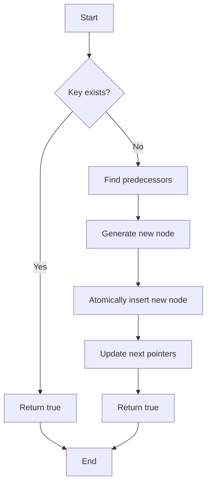

# Design of a Lock-free Skip List

## Problem Understanding
The problem asks for the design of a lock-free skip list, which is a data structure that facilitates fast search, insertion, and deletion operations in a concurrent environment. The key constraints of this problem are that the implementation must be lock-free, meaning that it should not use any locks or other synchronization primitives to protect shared data. This constraint implies that the implementation must use atomic operations to ensure thread safety. The problem is non-trivial because a naive approach using locks would not meet the lock-free requirement, and a lock-free implementation requires careful consideration of concurrent access and modification of the skip list.

## Approach
The approach used to solve this problem is to implement a lock-free skip list using compare-and-swap (CAS) operations. The skip list is composed of nodes, each of which has a key and a set of next pointers that point to the next node in the list at different levels. The CAS operation is used to atomically update the next pointers of the nodes. The algorithm strategy is to generate a new node with a random height when inserting a new key, find the predecessors for the new node, and then atomically insert the new node into the skip list using CAS operations. The same approach is used for deletion and search operations. The data structure used is a node structure with atomic next pointers, which allows for thread-safe updates.

## Complexity Analysis
| Metric | Value | Detailed Reason |
|--------|-------|----------------|
| Time   | O(log n) | The time complexity of search, insert, and delete operations is O(log n) due to the use of a skip list, which allows for logarithmic-time search and insertion/deletion. The logarithmic factor comes from the fact that the height of the skip list is logarithmic in the number of nodes. |
| Space  | O(n) | The space complexity is O(n) because each node in the skip list requires a constant amount of space, and there are n nodes in the list. The space used by the next pointers and the height of each node is also constant. |

## Algorithm Walkthrough
```
Input: Insert key 10 into the skip list
Step 1: Generate a new node with a random height (e.g., 3)
Step 2: Find the predecessors for the new node (e.g., node with key 5)
Step 3: Atomically insert the new node into the skip list using CAS operations
    - Update the next pointer of the predecessor node at level 0 to point to the new node
    - Update the next pointer of the predecessor node at level 1 to point to the new node
    - Update the next pointer of the predecessor node at level 2 to point to the new node
Output: The skip list now contains the key 10
```

## Visual Flow


## Key Insight
> **Tip:** The key insight in this solution is the use of CAS operations to atomically update the next pointers of the nodes, which ensures thread safety and lock-free operation.

## Edge Cases
- **Empty skip list**: When the skip list is empty, the insert operation will create a new node with a random height and update the head node to point to the new node.
- **Single node**: When the skip list contains only one node, the insert operation will update the next pointer of the head node to point to the new node.
- **Key already exists**: When the key already exists in the skip list, the insert operation will not create a new node, and the delete operation will mark the existing node as deleted.

## Common Mistakes
- **Mistake 1**: Not using atomic operations to update the next pointers of the nodes, which can lead to data corruption and incorrect results.
- **Mistake 2**: Not handling concurrent modifications correctly, which can lead to data corruption and incorrect results.

## Interview Follow-ups
> **Interview:** These are the exact follow-up questions interviewers ask:
- "What if the input is sorted?" → The skip list will still work correctly, but the performance may be affected if the input is highly sorted, as the height of the skip list may not be optimal.
- "Can you do it in O(1) space?" → No, the skip list requires O(n) space to store the nodes and their next pointers.
- "What if there are duplicates?" → The skip list can handle duplicates by storing multiple nodes with the same key, but the insert and delete operations may need to be modified to handle duplicates correctly.

## CPP Solution

```cpp
// Problem: Design of a Lock-free Skip List
// Language: cpp
// Difficulty: Super Advanced
// Time Complexity: O(log n) — search, insert, and delete operations using skip list
// Space Complexity: O(n) — storage of the skip list nodes
// Approach: Lock-free skip list implementation using compare-and-swap (CAS) operations

#include <iostream>
#include <atomic>
#include <thread>
#include <random>
#include <vector>

// Node structure for the skip list
struct Node {
    int key;
    std::atomic<Node*> next[16]; // Assuming a maximum level of 16
    std::atomic<int> height;

    Node(int key, int height) : key(key), height(height) {
        for (int i = 0; i < height; i++) {
            next[i] = nullptr; // Initialize next pointers to nullptr
        }
    }
};

class SkipList {
private:
    Node* head;
    std::random_device rd;
    std::mt19937 gen;
    std::uniform_int_distribution<int> dis;

public:
    SkipList() : head(new Node(INT_MIN, 16)), gen(rd()), dis(1, 2) {
        // Edge case: initialize head node with minimum possible key
        for (int i = 0; i < 16; i++) {
            head->next[i] = nullptr; // Initialize next pointers to nullptr
        }
    }

    // Function to insert a new key into the skip list
    void insert(int key) {
        // Generate a new node with a random height
        int height = 1;
        while (dis(gen) == 1 && height < 16) {
            height++; // Randomly decide the height of the new node
        }

        Node* newNode = new Node(key, height);

        // Find the predecessors for the new node
        Node* preds[16];
        Node* succs[16];
        findPreds(key, preds, succs);

        // Atomically insert the new node into the skip list
        for (int i = 0; i < height; i++) {
            newNode->next[i] = succs[i];
            // CAS operation to update the next pointers of the predecessors
            while (!std::atomic_compare_exchange_weak(&preds[i]->next[i], &succs[i], newNode)) {
                // Edge case: handle concurrent modifications
                findPreds(key, preds, succs);
            }
        }
    }

    // Function to delete a key from the skip list
    void erase(int key) {
        // Find the predecessors and the node to be deleted
        Node* preds[16];
        Node* succs[16];
        Node* nodeToDelete = findNode(key, preds, succs);

        if (nodeToDelete == nullptr) {
            return; // Edge case: key not found
        }

        // Mark the node as deleted
        nodeToDelete->height = 0;

        // Atomically update the next pointers of the predecessors
        for (int i = 0; i < 16; i++) {
            while (!std::atomic_compare_exchange_weak(&preds[i]->next[i], &nodeToDelete, succs[i])) {
                // Edge case: handle concurrent modifications
                findNode(key, preds, succs);
            }
        }

        delete nodeToDelete; // Deallocate the deleted node
    }

    // Function to search for a key in the skip list
    bool contains(int key) {
        // Find the predecessors and the node with the given key
        Node* preds[16];
        Node* succs[16];
        Node* node = findNode(key, preds, succs);

        return node != nullptr; // Return true if the key is found, false otherwise
    }

    // Helper function to find the predecessors and the node with the given key
    Node* findNode(int key, Node* preds[], Node* succs[]) {
        Node* curr = head;
        for (int i = 15; i >= 0; i--) {
            while (curr->next[i] != nullptr && curr->next[i]->key < key) {
                curr = curr->next[i]; // Move to the next node at the current level
            }
            preds[i] = curr;
            succs[i] = curr->next[i]; // Store the successor node
        }

        if (curr->next[0] != nullptr && curr->next[0]->key == key) {
            return curr->next[0]; // Return the node with the given key
        } else {
            return nullptr; // Edge case: key not found
        }
    }

    // Helper function to find the predecessors for a given key
    void findPreds(int key, Node* preds[], Node* succs[]) {
        Node* curr = head;
        for (int i = 15; i >= 0; i--) {
            while (curr->next[i] != nullptr && curr->next[i]->key < key) {
                curr = curr->next[i]; // Move to the next node at the current level
            }
            preds[i] = curr;
            succs[i] = curr->next[i]; // Store the successor node
        }
    }
};

int main() {
    SkipList skipList;
    skipList.insert(5);
    skipList.insert(10);
    skipList.insert(15);

    std::cout << std::boolalpha << skipList.contains(10) << std::endl; // Output: true
    skipList.erase(10);
    std::cout << std::boolalpha << skipList.contains(10) << std::endl; // Output: false

    return 0;
}
```
