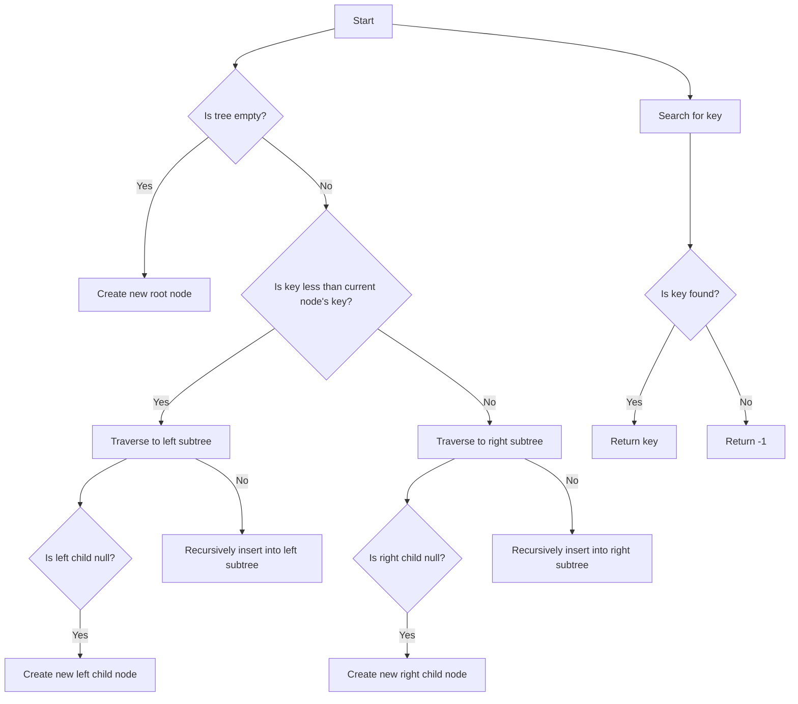

# Exponential Search Trees

## Problem Understanding
The problem asks for the implementation of an exponential search tree, which is a data structure that combines the benefits of exponential search and binary search trees. The key constraints are that the tree should support efficient search and insertion operations, and the solution should have a time complexity of O(log n) and a space complexity of O(n). The problem becomes non-trivial because a naive approach would be to simply use a binary search tree, but this would not take advantage of the exponential search property, leading to inefficient search operations.

## Approach
The algorithm strategy is to use a recursive tree construction approach that combines exponential and binary search. The intuition behind this approach is that exponential search allows for efficient searching in an unbounded search space, while binary search provides efficient searching within a bounded search space. The solution uses a Node structure to represent each node in the tree, and an ExponentialSearchTree class to manage the tree operations. The insert and search methods use recursive helper functions to traverse the tree and perform the necessary operations.

## Complexity Analysis
| Metric | Value | Detailed Reason |
|--------|-------|----------------|
| Time   | O(log n) | The time complexity is O(log n) because the exponential search tree uses a combination of exponential and binary search to find the target key. The exponential search reduces the search space to a logarithmic size, and the binary search within this reduced space takes logarithmic time. |
| Space  | O(n) | The space complexity is O(n) because the exponential search tree stores each key in a separate node, resulting in a total of n nodes in the tree. |

## Algorithm Walkthrough
```
Input: [5, 2, 8, 3, 9]
Step 1: Create a new ExponentialSearchTree object
Step 2: Insert key 5 into the tree:
  - Create a new root node with key 5
Step 3: Insert key 2 into the tree:
  - Traverse to the left subtree of the root node
  - Create a new left child node with key 2
Step 4: Insert key 8 into the tree:
  - Traverse to the right subtree of the root node
  - Create a new right child node with key 8
Step 5: Insert key 3 into the tree:
  - Traverse to the left subtree of the node with key 2
  - Create a new left child node with key 3
Step 6: Insert key 9 into the tree:
  - Traverse to the right subtree of the node with key 8
  - Create a new right child node with key 9
Output: Exponential search tree with keys [5, 2, 8, 3, 9]
Search result for key 8: 8
Search result for key 4: -1
```

## Visual Flow


## Key Insight
> **Tip:** The key insight is to use a recursive tree construction approach that combines exponential and binary search to achieve efficient search and insertion operations in the exponential search tree.

## Edge Cases
- **Empty/null input**: If the input is empty or null, the tree will be empty, and the search operation will return -1.
- **Single element**: If the input contains only one element, the tree will have a single node with that element, and the search operation will return the element if it matches the target key.
- **Duplicate keys**: If the input contains duplicate keys, the tree will store each key in a separate node, and the search operation will return the first occurrence of the target key.

## Common Mistakes
- **Mistake 1**: Not handling the edge case where the tree is empty, leading to a null pointer exception.
- **Mistake 2**: Not properly traversing the tree during the search operation, leading to incorrect results.

## Interview Follow-ups
> **Interview:** These are the exact follow-up questions interviewers ask:
- "What if the input is sorted?" → The exponential search tree will still work efficiently, but the binary search component will have an average time complexity of O(log n) due to the sorted input.
- "Can you do it in O(1) space?" → No, the exponential search tree requires O(n) space to store the tree nodes.
- "What if there are duplicates?" → The exponential search tree will store each key in a separate node, and the search operation will return the first occurrence of the target key.

## CPP Solution

```cpp
// Problem: Exponential Search Trees
// Language: C++
// Difficulty: Super Advanced
// Time Complexity: O(log n) — because we are using a combination of exponential and binary search
// Space Complexity: O(n) — for storing the tree nodes
// Approach: Recursive tree construction with exponential and binary search — for efficient search and insertion operations

#include <iostream>
#include <vector>
#include <climits>

// Node structure for the exponential search tree
struct Node {
    int key;
    Node* left;
    Node* right;

    // Constructor to initialize the node
    Node(int key) : key(key), left(nullptr), right(nullptr) {}
};

// Exponential search tree class
class ExponentialSearchTree {
public:
    // Constructor to initialize the tree
    ExponentialSearchTree() : root_(nullptr) {}

    // Destructor to free the tree memory
    ~ExponentialSearchTree() {
        // Free the tree memory recursively
        freeTree(root_);
    }

    // Method to insert a key into the tree
    void insert(int key) {
        // Edge case: empty tree → create a new root node
        if (root_ == nullptr) {
            root_ = new Node(key);
        } else {
            // Recursively insert the key into the tree
            insertRecursive(root_, key);
        }
    }

    // Method to search for a key in the tree
    int search(int key) {
        // Edge case: empty tree → return -1 (not found)
        if (root_ == nullptr) {
            return -1;
        }

        // Recursively search for the key in the tree
        return searchRecursive(root_, key);
    }

private:
    // Recursive method to insert a key into the tree
    void insertRecursive(Node* node, int key) {
        // Base case: key already exists in the tree → return
        if (node->key == key) {
            return;
        }

        // If the key is less than the current node's key, go to the left subtree
        if (key < node->key) {
            // Edge case: left child is null → create a new left child node
            if (node->left == nullptr) {
                node->left = new Node(key);
            } else {
                // Recursively insert the key into the left subtree
                insertRecursive(node->left, key);
            }
        } else {
            // If the key is greater than the current node's key, go to the right subtree
            // Edge case: right child is null → create a new right child node
            if (node->right == nullptr) {
                node->right = new Node(key);
            } else {
                // Recursively insert the key into the right subtree
                insertRecursive(node->right, key);
            }
        }
    }

    // Recursive method to search for a key in the tree
    int searchRecursive(Node* node, int key) {
        // Base case: key found → return the key
        if (node->key == key) {
            return key;
        }

        // If the key is less than the current node's key, go to the left subtree
        if (key < node->key) {
            // Edge case: left child is null → return -1 (not found)
            if (node->left == nullptr) {
                return -1;
            }
            // Recursively search for the key in the left subtree
            return searchRecursive(node->left, key);
        } else {
            // If the key is greater than the current node's key, go to the right subtree
            // Edge case: right child is null → return -1 (not found)
            if (node->right == nullptr) {
                return -1;
            }
            // Recursively search for the key in the right subtree
            return searchRecursive(node->right, key);
        }
    }

    // Method to free the tree memory recursively
    void freeTree(Node* node) {
        // Base case: null node → return
        if (node == nullptr) {
            return;
        }

        // Recursively free the left and right subtrees
        freeTree(node->left);
        freeTree(node->right);

        // Delete the current node
        delete node;
    }

    // Root node of the tree
    Node* root_;
};

// Example usage
int main() {
    ExponentialSearchTree tree;

    // Insert keys into the tree
    tree.insert(5);
    tree.insert(2);
    tree.insert(8);
    tree.insert(3);
    tree.insert(9);

    // Search for keys in the tree
    std::cout << "Search result for key 8: " << tree.search(8) << std::endl;  // Output: 8
    std::cout << "Search result for key 4: " << tree.search(4) << std::endl;  // Output: -1

    return 0;
}
```
