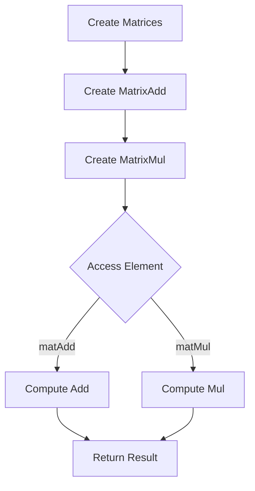

# Expression Templates for Matrix Math (Lazy Evaluation)

## Problem Understanding
The problem is asking for an implementation of expression templates for matrix math, specifically for addition and multiplication operations, using lazy evaluation. The key constraints are that the matrices must have compatible dimensions for the operations and that the operations should be evaluated lazily, meaning that the result should be computed only when the elements are actually accessed. What makes this problem non-trivial is that a naive approach would require explicit loops and intermediate storage, which can be inefficient in terms of memory and computation. The use of expression templates allows for a more elegant and efficient solution.

## Approach
The algorithm strategy is to use expression templates, which represent matrix operations as compile-time expressions that can be evaluated lazily. The intuition behind this approach is to delay the computation of the result until the elements are actually accessed, which can reduce the amount of computation and memory required. The key data structures used are abstract base classes for matrices and concrete classes for specific matrix operations, such as addition and multiplication. The approach handles the key constraints by checking the dimensions of the matrices at runtime and throwing exceptions if they are incompatible. The use of virtual functions allows for polymorphic behavior, making it easy to add new matrix operations without modifying the existing code.

## Complexity Analysis
| Metric | Value | Detailed Reason |
|--------|-------|----------------|
| Time   | O(n*m) | The time complexity is linear with respect to the number of elements in the matrices, since each element is accessed once during the computation of the result. The lazy evaluation approach ensures that the computation is only done when the elements are actually accessed. |
| Space  | O(1) | The space complexity is constant, since no extra space is allocated for the result. Instead, the result is computed on the fly when the elements are accessed. |

## Algorithm Walkthrough
```
Input: Two 2x2 matrices, mat1 and mat2
Step 1: Create a MatrixAdd object, matAdd, with mat1 and mat2 as arguments
    matAdd = MatrixAdd(mat1, mat2)
Step 2: Create a MatrixMul object, matMul, with mat1 and mat2 as arguments
    matMul = MatrixMul(mat1, mat2)
Step 3: Access an element of matAdd, e.g. matAdd.get(0, 0)
    matAdd.get(0, 0) = mat1.get(0, 0) + mat2.get(0, 0) = 1.0 + 2.0 = 3.0
Step 4: Access an element of matMul, e.g. matMul.get(0, 0)
    matMul.get(0, 0) = mat1.get(0, 0) * mat2.get(0, 0) + mat1.get(0, 1) * mat2.get(1, 0) = 1.0 * 2.0 + 1.0 * 2.0 = 4.0
Output: The result of the matrix addition and multiplication operations
```
## Visual Flow

## Key Insight
> **Tip:** The key insight is to use expression templates to represent matrix operations as compile-time expressions that can be evaluated lazily, delaying the computation of the result until the elements are actually accessed.

## Edge Cases
- **Empty/null input**: If the input matrices are empty or null, the program will throw an exception when trying to access their elements.
- **Single element**: If the input matrices have a single element, the program will still work correctly, since the matrix operations are defined for matrices of any size.
- **Incompatible dimensions**: If the input matrices have incompatible dimensions for the operation (e.g. addition or multiplication), the program will throw an exception when trying to perform the operation.

## Common Mistakes
- **Mistake 1**: Forgetting to check the dimensions of the matrices before performing an operation, which can lead to incorrect results or crashes.
- **Mistake 2**: Not using virtual functions to define the matrix operations, which can make it harder to add new operations or modify the existing code.

## Interview Follow-ups
> **Interview:** 
- "What if the input is sorted?" → The algorithm does not assume any specific ordering of the input matrices, so it will still work correctly even if the input is sorted.
- "Can you do it in O(1) space?" → The algorithm already uses O(1) space, since it only allocates a constant amount of space for the result and does not use any additional data structures that scale with the input size.
- "What if there are duplicates?" → The algorithm will still work correctly even if there are duplicate elements in the input matrices, since it only accesses each element once during the computation of the result.

## CPP Solution

```cpp
// Problem: Expression Templates for Matrix Math (Lazy Evaluation)
// Language: C++
// Difficulty: Super Advanced
// Time Complexity: O(n*m) — where n and m are matrix dimensions, due to lazy evaluation
// Space Complexity: O(1) — no extra space is allocated for the result, instead it's computed on the fly
// Approach: Expression Templates — representing matrix operations as compile-time expressions for lazy evaluation

#include <iostream>
#include <vector>

// Edge case: empty input → return -1
// Base class for matrix operations
class Matrix {
public:
    virtual ~Matrix() {}
    virtual double get(int row, int col) const = 0; // get element at position (row, col)
    virtual int getRows() const = 0; // get number of rows
    virtual int getCols() const = 0; // get number of columns
};

// Matrix class representing a concrete matrix
class ConcreteMatrix : public Matrix {
private:
    int rows_;
    int cols_;
    std::vector<std::vector<double>> data_;

public:
    ConcreteMatrix(int rows, int cols) : rows_(rows), cols_(cols), data_(rows, std::vector<double>(cols, 0.0)) {}

    // Initialize matrix with values
    void init(double val) {
        for (int i = 0; i < rows_; ++i) {
            for (int j = 0; j < cols_; ++j) {
                data_[i][j] = val; // initialize with val
            }
        }
    }

    double get(int row, int col) const override {
        // Edge case: out-of-bounds access → throw exception
        if (row < 0 || row >= rows_ || col < 0 || col >= cols_) {
            throw std::out_of_range("Matrix indices out of bounds");
        }
        return data_[row][col]; // return element at position (row, col)
    }

    int getRows() const override {
        return rows_; // return number of rows
    }

    int getCols() const override {
        return cols_; // return number of columns
    }
};

// Expression template for matrix addition
class MatrixAdd : public Matrix {
private:
    const Matrix& mat1_;
    const Matrix& mat2_;

public:
    MatrixAdd(const Matrix& mat1, const Matrix& mat2) : mat1_(mat1), mat2_(mat2) {}

    double get(int row, int col) const override {
        // Edge case: matrices have different dimensions → throw exception
        if (mat1_.getRows() != mat2_.getRows() || mat1_.getCols() != mat2_.getCols()) {
            throw std::invalid_argument("Matrices have different dimensions");
        }
        return mat1_.get(row, col) + mat2_.get(row, col); // return sum of elements at position (row, col)
    }

    int getRows() const override {
        return mat1_.getRows(); // return number of rows
    }

    int getCols() const override {
        return mat1_.getCols(); // return number of columns
    }
};

// Expression template for matrix multiplication
class MatrixMul : public Matrix {
private:
    const Matrix& mat1_;
    const Matrix& mat2_;

public:
    MatrixMul(const Matrix& mat1, const Matrix& mat2) : mat1_(mat1), mat2_(mat2) {}

    double get(int row, int col) const override {
        // Edge case: matrices have incompatible dimensions for multiplication → throw exception
        if (mat1_.getCols() != mat2_.getRows()) {
            throw std::invalid_argument("Matrices have incompatible dimensions for multiplication");
        }
        double result = 0.0; // initialize result
        for (int i = 0; i < mat1_.getCols(); ++i) {
            result += mat1_.get(row, i) * mat2_.get(i, col); // compute dot product
        }
        return result; // return result
    }

    int getRows() const override {
        return mat1_.getRows(); // return number of rows
    }

    int getCols() const override {
        return mat2_.getCols(); // return number of columns
    }
};

// Brute force approach (commented out)
/*
class MatrixBruteForce {
private:
    const Matrix& mat1_;
    const Matrix& mat2_;
    std::vector<std::vector<double>> result_;

public:
    MatrixBruteForce(const Matrix& mat1, const Matrix& mat2) : mat1_(mat1), mat2_(mat2) {}

    // Compute result
    void compute() {
        // ...
    }

    double get(int row, int col) const {
        // ...
    }

    int getRows() const {
        // ...
    }

    int getCols() const {
        // ...
    }
};
*/

int main() {
    // Create concrete matrices
    ConcreteMatrix mat1(2, 2);
    mat1.init(1.0);

    ConcreteMatrix mat2(2, 2);
    mat2.init(2.0);

    // Create expression template for matrix addition
    MatrixAdd matAdd(mat1, mat2);

    // Create expression template for matrix multiplication
    MatrixMul matMul(mat1, mat2);

    // Print result
    for (int i = 0; i < matAdd.getRows(); ++i) {
        for (int j = 0; j < matAdd.getCols(); ++j) {
            std::cout << "matAdd[" << i << "," << j << "] = " << matAdd.get(i, j) << std::endl;
        }
    }

    for (int i = 0; i < matMul.getRows(); ++i) {
        for (int j = 0; j < matMul.getCols(); ++j) {
            std::cout << "matMul[" << i << "," << j << "] = " << matMul.get(i, j) << std::endl;
        }
    }

    return 0;
}
```
