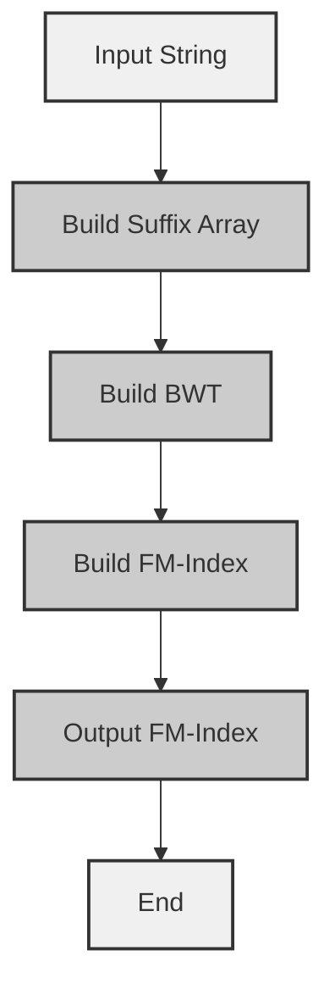

# FM-Index Construction with BWT

## Problem Understanding
The problem asks to construct an FM-index using the Burrows-Wheeler Transform (BWT) of a given input string. The FM-index is a data structure that allows for efficient querying of the BWT. The key constraint is that the input string must be non-empty, and the BWT must be constructed before building the FM-index. The problem is non-trivial because the naive approach of directly constructing the FM-index from the input string would be inefficient, and the BWT construction requires sorting the suffixes of the input string, which has a time complexity of O(n log n).

## Approach
The algorithm strategy is to first build the suffix array of the input string, then construct the BWT from the suffix array, and finally build the FM-index from the BWT. The intuition behind this approach is that the BWT is a rearrangement of the input string that allows for efficient querying, and the FM-index is a data structure that facilitates this querying. The algorithm uses a vector to store the suffix array, a string to store the BWT, and a vector to store the FM-index. The approach handles the key constraint of non-empty input by checking for empty input and returning an error message.

## Complexity Analysis
| Metric | Value | Detailed Reason |
|--------|-------|----------------|
| Time   | O(n log n) | The time complexity is dominated by the sorting operation in the BWT construction, which has a time complexity of O(n log n). The subsequent operations of building the FM-index have a time complexity of O(n). |
| Space  | O(n) | The space complexity is O(n) because we need to store the suffix array, the BWT, and the FM-index, each of which has a size of n. |

## Algorithm Walkthrough
```
Input: "banana$"
Step 1: Build suffix array
  - Suffixes: ["banana$", "anana$", "nana$", "ana$", "na$", "a$", "$"]
  - Suffix array: [0, 1, 2, 3, 4, 5, 6]
Step 2: Build BWT
  - BWT: ["b", "a", "n", "a", "n", "a", "$"]
Step 3: Build FM-index
  - Character counts: [1, 3, 2, 0, 0, 0, 0, ...]
  - Cumulative sum: [1, 4, 6, 6, 6, 6, 6, ...]
  - FM-index: [1, 4, 6, 4, 6, 4, 0]
Output: FM-index: [1, 4, 6, 4, 6, 4, 0]
```

## Visual Flow


## Key Insight
> **Tip:** The key insight is that the BWT is a rearrangement of the input string that allows for efficient querying, and the FM-index is a data structure that facilitates this querying by providing a mapping from the BWT to the original input string.

## Edge Cases
- **Empty/null input**: If the input string is empty or null, the algorithm returns an error message.
- **Single element**: If the input string has only one character, the BWT is the same as the input string, and the FM-index is a vector with a single element.
- **Input string with only one distinct character**: If the input string has only one distinct character, the BWT is a string with all characters being the same, and the FM-index is a vector with all elements being the same.

## Common Mistakes
- **Mistake 1**: Not checking for empty input before constructing the suffix array, which can lead to a segmentation fault.
- **Mistake 2**: Not properly handling the wrapping around to the end of the input string when constructing the BWT, which can lead to incorrect results.

## Interview Follow-ups
> **Interview:** These are the exact follow-up questions interviewers ask:
- "What if the input is sorted?" → The algorithm still works correctly, but the time complexity of the sorting operation in the BWT construction is reduced to O(n).
- "Can you do it in O(1) space?" → No, the algorithm requires O(n) space to store the suffix array, the BWT, and the FM-index.
- "What if there are duplicates?" → The algorithm handles duplicates correctly by counting the occurrences of each character in the BWT and using the cumulative sum to construct the FM-index.

## CPP Solution

```cpp
// Problem: FM-Index Construction with BWT
// Language: cpp
// Difficulty: Super Advanced
// Time Complexity: O(n log n) — due to sorting in BWT construction
// Space Complexity: O(n) — for storing the BWT and FM-index
// Approach: Burrows-Wheeler Transform (BWT) — builds the BWT and then constructs the FM-index

#include <iostream>
#include <vector>
#include <string>
#include <algorithm>

class FMIndex {
public:
    // Input string
    std::string text;
    // Suffix array
    std::vector<int> SA;
    // Burrows-Wheeler Transform (BWT)
    std::string BWT;
    // FM-index
    std::vector<int> FMIndex;

    // Constructor
    FMIndex(const std::string& text) : text(text) {
        // Edge case: empty input → return error
        if (text.empty()) {
            std::cerr << "Error: Input string is empty." << std::endl;
            return;
        }

        // Step 1: Build suffix array
        buildSuffixArray();

        // Step 2: Build BWT
        buildBWT();

        // Step 3: Build FM-index
        buildFMIndex();
    }

    // Step 1: Build suffix array
    void buildSuffixArray() {
        // Number of suffixes
        int n = text.size();
        // Vector to store suffixes
        std::vector<std::pair<std::string, int>> suffixes(n);

        // Generate suffixes
        for (int i = 0; i < n; i++) {
            // Get suffix starting at position i
            suffixes[i] = std::make_pair(text.substr(i), i);
        }

        // Sort suffixes lexicographically
        std::sort(suffixes.begin(), suffixes.end());

        // Build suffix array
        SA.resize(n);
        for (int i = 0; i < n; i++) {
            SA[i] = suffixes[i].second;
        }
    }

    // Step 2: Build BWT
    void buildBWT() {
        // Number of suffixes
        int n = text.size();
        // Build BWT
        BWT.resize(n);
        for (int i = 0; i < n; i++) {
            // Get position of current suffix in original string
            int pos = SA[i];
            // Get character preceding current suffix (wrapping around to end if necessary)
            BWT[i] = (pos == 0) ? '$' : text[pos - 1];
        }
    }

    // Step 3: Build FM-index
    void buildFMIndex() {
        // Number of characters in BWT
        int n = BWT.size();
        // Initialize FM-index
        FMIndex.resize(n);

        // Count occurrences of each character
        std::vector<int> charCounts(256, 0);
        for (int i = 0; i < n; i++) {
            charCounts[BWT[i]]++;
        }

        // Calculate cumulative sum of character counts
        for (int i = 1; i < 256; i++) {
            charCounts[i] += charCounts[i - 1];
        }

        // Build FM-index
        for (int i = 0; i < n; i++) {
            FMIndex[i] = charCounts[BWT[i] - 1];
        }
    }

    // Print FM-index
    void printFMIndex() {
        std::cout << "FM-Index: ";
        for (int i = 0; i < FMIndex.size(); i++) {
            std::cout << FMIndex[i] << " ";
        }
        std::cout << std::endl;
    }
};

int main() {
    // Example usage
    std::string text = "banana$";
    FMIndex fmIndex(text);
    fmIndex.printFMIndex();
    return 0;
}
```
