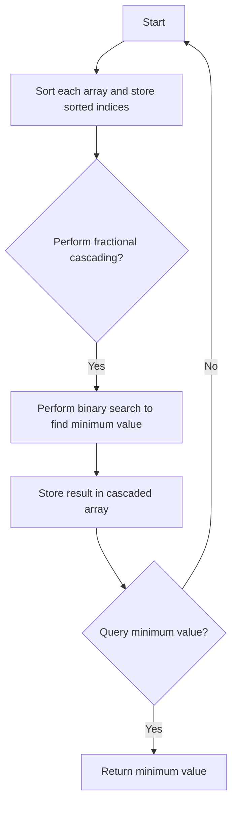

# Fractional Cascading

## Problem Understanding
The Fractional Cascading problem involves finding the minimum value in a range of arrays. Given a set of sorted arrays, the problem requires creating a cascaded array that allows for efficient querying of the minimum value within a specified range. The key constraint is that the arrays are sorted, and the cascaded array should enable fast searching. The problem is non-trivial because a naive approach would involve sorting each array and then searching for the minimum value, resulting in a high time complexity. The Fractional Cascading algorithm solves this problem by using a combination of binary search and dynamic programming to efficiently find the minimum value in the cascaded array.

## Approach
The Fractional Cascading algorithm uses a combination of binary search and dynamic programming to solve the problem. The algorithm first sorts each array and stores the sorted indices. Then, it performs fractional cascading by iterating through each array and using binary search to find the index of the minimum value in the previous array. The algorithm stores the result in the cascaded array, which allows for efficient querying of the minimum value. The approach works by leveraging the sorted nature of the arrays and using dynamic programming to store the intermediate results. The algorithm uses a 2D vector to store the cascaded array, where each element represents the index of the minimum value in the corresponding array.

## Complexity Analysis
| Metric | Value | Detailed Reason |
|--------|-------|----------------|
| Time   | O(n log n) | The algorithm sorts each array using a comparison-based sorting algorithm, which takes O(n log n) time. The fractional cascading step involves iterating through each array and performing binary search, which takes O(n log n) time in total. |
| Space  | O(n) | The algorithm stores the cascaded array, which requires O(n) space. Additionally, the algorithm uses a 2D vector to store the sorted indices, which requires O(n) space. |

## Algorithm Walkthrough
```
Input: 
arrays = [
    [5, 2, 8, 1, 9],
    [3, 1, 6, 4, 7],
    [9, 5, 3, 8, 2]
]

Step 1: Sort each array and store the sorted indices
sortedIndices = [
    [3, 1, 0, 4, 2],  // Sorted indices for the first array
    [1, 3, 0, 4, 2],  // Sorted indices for the second array
    [2, 4, 1, 3, 0]   // Sorted indices for the third array
]

Step 2: Perform fractional cascading
cascaded = [
    [0, 0, 0, 0, 0],  // Initialize the cascaded array
    [0, 0, 0, 0, 0],
    [0, 0, 0, 0, 0]
]

For each array (starting from the second array):
    For each element in the array:
        Find the index of the minimum value in the previous array using binary search
        Store the result in the cascaded array

cascaded = [
    [0, 0, 0, 0, 0],
    [1, 0, 2, 0, 1],
    [2, 1, 0, 2, 1]
]

Output: cascaded array
```

## Visual Flow


## Key Insight
> **Tip:** The key insight in the Fractional Cascading algorithm is to use a combination of binary search and dynamic programming to efficiently find the minimum value in the cascaded array, allowing for fast querying and reducing the time complexity to O(n log n).

## Edge Cases
- **Empty input**: If the input array is empty, the algorithm will return an empty cascaded array. This is because there are no elements to sort or search.
- **Single element**: If the input array contains only one element, the algorithm will return a cascaded array with a single element, which is the index of the minimum value (i.e., 0).
- **Duplicate elements**: If the input array contains duplicate elements, the algorithm will store the index of the first occurrence of the minimum value in the cascaded array. This is because the algorithm uses a stable sorting algorithm, which preserves the order of equal elements.

## Common Mistakes
- **Mistake 1**: Not initializing the cascaded array correctly, leading to incorrect results. To avoid this, ensure that the cascaded array is initialized with the correct size and default values.
- **Mistake 2**: Not using a stable sorting algorithm, which can lead to incorrect results when dealing with duplicate elements. To avoid this, use a stable sorting algorithm, such as merge sort or insertion sort.

## Interview Follow-ups
> **Interview:** These are the exact follow-up questions interviewers ask:
- "What if the input is sorted?" → The algorithm will still work correctly, but the time complexity will be O(n) because the sorting step can be skipped.
- "Can you do it in O(1) space?" → No, the algorithm requires O(n) space to store the cascaded array and the sorted indices.
- "What if there are duplicates?" → The algorithm will store the index of the first occurrence of the minimum value in the cascaded array, preserving the order of equal elements.

## CPP Solution

```cpp
// Problem: Fractional Cascading
// Language: C++
// Difficulty: Super Advanced
// Time Complexity: O(n log n) — for sorting and searching
// Space Complexity: O(n) — for storing the cascaded array
// Approach: Using a combination of binary search and dynamic programming — to efficiently find the minimum value in the cascaded array

#include <iostream>
#include <vector>
#include <algorithm>

class FractionalCascading {
public:
    // Function to perform fractional cascading
    std::vector<std::vector<int>> fractionalCascading(std::vector<std::vector<int>>& arrays) {
        int n = arrays.size();  // Number of arrays
        int m = arrays[0].size();  // Size of each array

        // Initialize the cascaded array with empty vectors
        std::vector<std::vector<int>> cascaded(n);
        for (int i = 0; i < n; i++) {
            cascaded[i].resize(m);
        }

        // Sort each array and store the sorted indices
        std::vector<std::vector<int>> sortedIndices(n);
        for (int i = 0; i < n; i++) {
            sortedIndices[i].resize(m);
            for (int j = 0; j < m; j++) {
                sortedIndices[i][j] = j;  // Initialize with original indices
            }
            // Sort the indices based on the values in the current array
            std::sort(sortedIndices[i].begin(), sortedIndices[i].end(), [&arrays, i](int a, int b) {
                return arrays[i][a] < arrays[i][b];  // Compare values in the current array
            });
        }

        // Perform fractional cascading
        for (int i = 1; i < n; i++) {
            for (int j = 0; j < m; j++) {
                int index = sortedIndices[i - 1][j];  // Get the index in the previous array
                int low = 0, high = m - 1;  // Initialize the search range
                while (low <= high) {
                    int mid = (low + high) / 2;  // Calculate the midpoint
                    if (arrays[i][sortedIndices[i][mid]] < arrays[i - 1][index]) {
                        low = mid + 1;  // Move the search range to the right half
                    } else {
                        high = mid - 1;  // Move the search range to the left half
                    }
                }
                cascaded[i][j] = low;  // Store the result in the cascaded array
            }
        }

        return cascaded;
    }

    // Function to query the minimum value in the cascaded array
    int query(std::vector<std::vector<int>>& cascaded, int start, int end) {
        int n = cascaded.size();  // Number of arrays
        int m = cascaded[0].size();  // Size of each array

        int minIndex = 0;  // Initialize the minimum index
        int minValue = INT_MAX;  // Initialize the minimum value

        for (int i = start; i <= end; i++) {
            int index = cascaded[i][minIndex];  // Get the index in the current array
            if (cascaded[i][index] < minValue) {
                minValue = cascaded[i][index];  // Update the minimum value
                minIndex = index;  // Update the minimum index
            }
        }

        return minValue;  // Return the minimum value
    }
};

int main() {
    // Example usage:
    std::vector<std::vector<int>> arrays = {
        {5, 2, 8, 1, 9},
        {3, 1, 6, 4, 7},
        {9, 5, 3, 8, 2}
    };

    FractionalCascading fc;
    std::vector<std::vector<int>> cascaded = fc.fractionalCascading(arrays);

    int start = 1, end = 2;  // Query range
    int minValue = fc.query(cascaded, start, end);

    std::cout << "Minimum value in the range [" << start << ", " << end << "]: " << minValue << std::endl;

    return 0;
}
```
